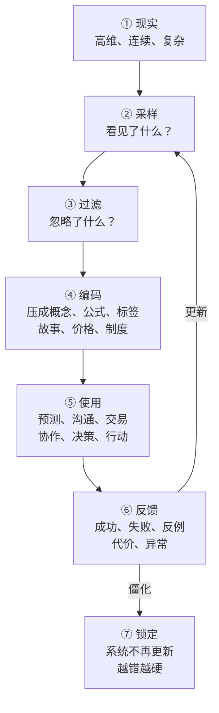
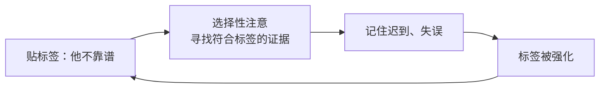
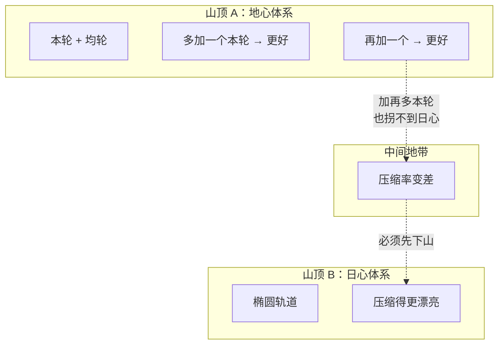
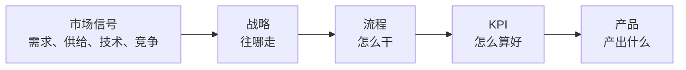
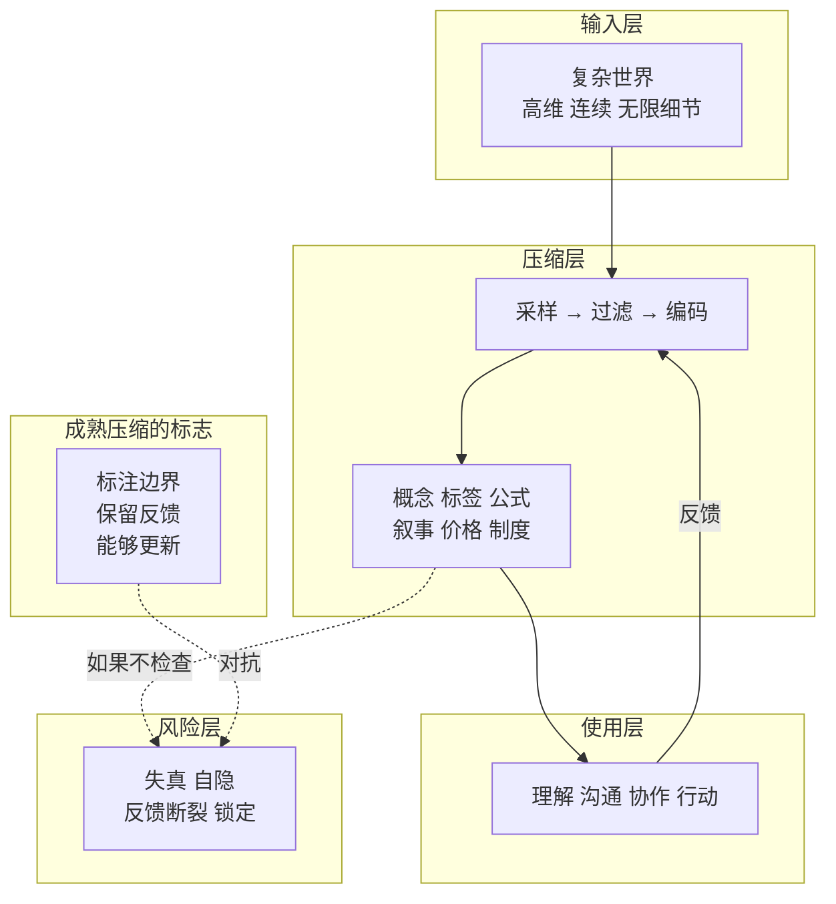

# 压缩：人类理解世界的底层机制

**从智能、知识、创新到科学和社会分工，复杂世界如何被压成可行动的模型。**

---

AI 圈有一句话：**智能的本质是压缩 + 泛化。** 从信号里提取规律（压缩），把规律用到新场景（泛化）。

这个观点来自 Yann LeCun、Schmidhuber 等人，但它打开的窗户比 AI 大得多——顺着它往下拆，你会发现压缩不只是算法：**它是人类理解世界、组织社会、创造知识、推动创新的底层机制。**

但压缩也有自己的边界和故障。这篇文章想做的事是：把压缩当成一个完整系统来理解——它为什么必须存在、怎么运行、怎么失真、怎么修正。

---

## 一、为什么必须压缩？

系统性问题先用第一性原理问：**这个系统为什么存在？**

答案是带宽不匹配。


世界是无限细节的。人脑是有限带宽的。语言、组织和行动通道一个比一个窄。

所以人必须压缩。不是因为喜欢简单，而是因为：

> **不压缩，就无法理解。不压缩，就无法沟通。不压缩，就无法协作。不压缩，就无法行动。**

这是整个框架的地基。

---

## 二、什么是"压缩系统"？

系统不是一堆零件的集合。系统是**元素 + 关系 + 输入 + 输出 + 反馈 + 边界**。

把"压缩"从"变短"扩展成系统，长这样：



这张图是全文的主模型。之后所有讨论，都回到这七个节点。

每个节点对应一个关键问题：

| 节点 | 问题 | 最常见的故障 |
|---|---|---|
| 采样 | 你看见了什么？没看见什么？ | 样本偏差 |
| 过滤 | 哪些信息被当成噪音扔掉了？ | 扔掉了重要信号 |
| 编码 | 压成了什么形式？ | 过度简化 |
| 使用 | 用来做什么？ | 把模型当现实 |
| 反馈 | 错了有信号回来吗？ | 反馈断裂 |
| 更新 | 系统能改吗？ | 锁定僵化 |

---

## 三、一个压缩系统的质量怎么判断？

四个指标：

| 指标 | 问什么 | 高 | 低 |
|---|---|---|---|
| 压缩率 | 用多短的东西表示多复杂的世界？ | 省认知成本 | 但容易失真 |
| 保真度 | 压完后关键结构还在吗？ | 地图接近领土 | 标签"内向"可能保真度很低 |
| 泛化能力 | 能用到没见过的情况吗？ | 预测未来 | 只能解释过去 |
| 更新能力 | 错了能改吗？ | 越用越准 | 越错越硬 |

**最成熟的压缩系统不是压缩率最高的那个，是四个指标平衡的那个。**

标签压缩率极高，但保真度低、更新能力差。科学公式压缩率高、保真度高、泛化好，而且明确标注失效条件和更新方式。

---

## 四、人类压缩工具箱：九种方法

在进行压缩之前，先看清人类有哪些压缩工具。

### 逻辑三件套

**归纳：多个实例 → 一条规则。** 一万只白天鹅 → "天鹅是白的"。从下往上压。

**演绎：规则 + 前提 → 结论。** 严格说演绎不创造新压缩——它只是把已经压好的东西解包展开。

**溯因：观察 → 最佳解释。** 草地湿了 → 可能下过雨。在无数可能解释中选最省的那个。侦探破案、医生诊断用的都是溯因。

### 结构操作

**类比：跨域借用压缩包。** "电流像水流"——把水流的整套规律直接搬到电学。法拉第靠它建了电场概念。

**抽象：往上走一层。** 苹果、香蕉、橘子 → 水果。扔掉具体差异，找更高层的不变性。

**分类：水平划界 + 命名。** 无穷个体差异 → 几个类别。有了"猫"这个类，不需要重新认识每一只猫。

**公理化：找最少的那几条。** 欧几里得把整个几何压成五条公理。压缩率最高的操作。

### 经验压缩

**叙事：时间维度的压缩。** 无数人生事件 → "出身贫寒，坚持读书，遇到伯乐"。因果链留下，噪声扔掉。

**直觉：经验压进潜意识。** 象棋大师扫一眼棋盘，"感到"最好的一步。压缩过程本身也被压缩了——你只看到结果，看不到它怎么来的。

---

## 五、压缩系统的四个层级

现在把主模型放进四个层级。从个体到社会，每一层的问题和故障都不同。

---

## 第一层：个体认知压缩

人脑处理世界的压缩形式包括：**概念、标签、叙事、直觉、启发式、分类、类比。**

### 标签：压缩率最高，也最危险

```
一个活人，几十年经历、矛盾、变化、上下文
    ↓ 压缩进一两个字符
"内向" / "卷王" / "直男" / "不靠谱"
```

标签的危险不在压缩本身，而在**三个系统故障叠加**：

**故障一：自隐。** "他不靠谱"不再是一个判断——它变成你眼中的事实。你透过标签看人，但看不到标签本身。

**故障二：正反馈回路。** 符合标签的证据被记住（迟到→果然不靠谱），不符合的被归为偶然（这次准时→太阳从西边出来了）。做再多好事也洗不掉。



**故障三：不标失效条件。** 同一个人，A 场景不靠谱，B 场景极其可靠。标签把条件依赖全压没了。

但这里有个关键：**你不用标签，根本活不下去。** 你的认知带宽只能深度理解极少数人。对楼下便利店的收银员，你需要"收银员"这个标签快速交互。

所以不是"撕掉所有标签"——那是另一个极端。而是：

> **记住它是标签。你看到的不是那个人，是那个人经过你脑子里的压缩算法剩下来的几个字。中间的损失，你看不见。**

---

## 第二层：知识压缩

知识当然是对世界信息的压缩。F=ma 是对无限运动观测的压缩。但完整知识不止一层：

```
规律：        F=ma
适用条件：    宏观、低速
失效条件：    接近光速、强引力场
置信度：      极高（大量实验验证）
来源：        牛顿力学 / 可推导
更新方式：    被相对论包含为特例
```

核心要点：

> **压缩告诉你"什么是什么"，但它不标注"这个压缩在什么条件下会失效"。**

你知道 F=ma 只在宏观低速下成立——但这个"知道"不是压缩产生的。它来自教科书、实验失败、老师警告。压缩本身不生成失效条件、置信度校准和来源追溯。

没有这三样，你分不清"地球是圆的"和"雷声是神在发怒"——两个都是对世界信息的压缩，哪个更好？压缩率本身不告诉你。

> **知识 = 压缩 + 适用边界 + 置信度 + 来源 + 更新机制**

---

## 第三层：创新压缩

先说结论：**创新就是压缩。** 牛顿把天体+地上运动压成 F=ma，爱因斯坦把时空压成曲率。都是重新压缩。

但这个"重新压缩"为什么这么难？从系统模型看，三个障碍。

### ① 压缩自隐：旧模型变成了"常识"

好压缩会让你透过它看世界，但看不到它自己。牛顿宇宙里的人说"物体自然趋向静止"——他不觉得自己在"使用牛顿力学"，他觉得这是事实。旧压缩被设计成透明的。

### ② 路径依赖：旧压缩活得越久，越难换

旧压缩已经生成了语言、工具、教材、职业、制度、利益。不是"想换就能换"。整个系统在抗拒相变。

### ③ 没有平滑梯度：两个最优解之间隔着低质量中间态



**在一个范式内部做梯度下降，走不到另一个范式。** 地心体系多加一个本轮就更好——但加再多本轮，永远不会自己拐到日心。两个山顶之间没有平滑路径。

> **创新事后看是压缩，事前看是跳崖。它能让你精益求精，但不能让你革命。革命之后回头看，还是压缩。但站在旧山顶上的你，眼前没有通往新山顶的梯度。那一步，你得自己跳。**

---

## 第四层：社会压缩

把镜头拉远——整个现代社会本身就建在压缩之上。

### 分工：能力压缩成角色

```
原始社会：一个人要会打猎、生火、搭房子、缝衣服
         → 脑子装整个世界的生存知识

现代社会：你会写代码 → 拿工资 → 买一切
         → 只需要一个压缩包
```

医生把人体压成诊断路径。程序员把业务逻辑压成代码。会计把资金流动压成报表。你用他们压缩好的东西，不需要看见背后的原材料。

分工提高效率，但也制造盲区：**每个人只看见自己的局部，整个社会的压缩架构对个体几乎不可见。**

### 公司：市场信号压缩成组织行动



层级越高，压缩率越高。CEO 看的不是具体操作，是整个公司压成的一张报表。系统风险在 KPI——Goodhart 定律：

> 当一个指标变成目标，它就不再是好指标。

回路是这样的：


KPI 本身没错。但指标成为唯一现实之后，系统开始围绕压缩物运转，而不是围绕真实目标运转。

### 货币：终极压缩

```
无穷多样的劳动、资源、创造力、时间、风险
    ↓ 压缩成一个数字
价格
```

价格是人类社会压缩率最高的符号。效率极高——你用一个数字做所有交易决策。但它的问题也最大：

> **价格只压缩能定价的东西。不能定价的东西会被遮蔽：空气、尊严、生态、长期风险、关系信任。**

清洁的空气价格为零，所以工业社会把它当成无限资源——这个压缩误差差点要了地球的命。

---

## 六、科学：最高级的压缩系统

科学当然也是压缩。无限观测 → 理论。

但科学和普通压缩有一个本质区别：

| | 常识、迷信、标签 | 科学 |
|---|---|---|
| 输出 | "规律是 X" | "在条件 Y 下，规律是 X；如果实验 Z 不通过，规律要被修改" |
| 对待反例 | 当噪音扔掉 | 反例比规律更珍贵 |
| 边界标注 | 无 | 明确标注适用条件和失效条件 |
| 更新机制 | 缺乏或抵抗 | 内置推翻按钮 |
| 自我感知 | 看不见自己是压缩 | 明知自己是近似模型 |

迷信、直觉、常识——也是压缩。但它们不标失效条件，不欢迎推翻。

科学的独特不在压缩这一步，在**压缩完之后的那一步**：它明说这个压缩是可以撕的，并且告诉你撕的方法。

科学方法本身就是一种压缩：人类几千年试错和迷路，被压成一套规则——"假设→实验→验证→推翻→再来"。普通人掌握这套规则，也能生产可靠知识。

科学史就是不断换压缩算法的历史：

```
亚里士多德：万物有目的（压缩率低，很多东西解释不了）
    ↓
牛顿：万物是力（把亚里士多德压成了子集）
    ↓
爱因斯坦：万物是几何（又把牛顿压成了特例）
    ↓
量子力学：万物是概率（还在和引力对不齐）
```

每一步都是"怀疑旧压缩不够全局 → 跳到新空间 → 发现新压缩把旧压缩变成了子集"。同样的模式：精益求精靠梯度，革命靠跳跃。

---

## 七、压缩系统的常见故障

系统性的文章不能只写好处。必须写故障模式。

| 故障 | 症状 | 例子 |
|---|---|---|
| 过度压缩 | 压缩率太高，保真度太低 | 一个人 → "坏人" |
| 错误采样 | 输入就偏了 | 只接触失败案例 → "这事肯定不行" |
| 压缩自隐 | 模型变成常识，不再被审视 | "这行一直这么做" |
| 反馈断裂 | 行动后的结果回不到模型里 | 上层定指标，下层承受后果，中间过滤 |
| 单一压缩垄断 | 只有一个解释框架 | 一切都是钱/制度/个人努力/技术的问题 |

---

## 八、怎么提升压缩系统的质量？

六个操作原则：

**1. 先问输入。** 我看见了什么？没看见什么？样本偏了吗？

**2. 再问损失。** 这次压缩扔掉了什么？被扔掉的重要吗？

**3. 标注边界。** 这个判断在什么条件下成立？什么条件下不成立？

**4. 保留多种压缩。** 同一个问题，至少从经济、心理、系统、历史、技术五个角度各压一次。单模型最危险。

**5. 建立反馈。** 如果我错了，什么信号会出现？谁能告诉我？

**6. 定期解压。** 回到原始现实——看用户原话、看一线现场、看失败案例、看反例。这是防止模型自隐最关键的一步。

---

## 收束



**压缩是人类理解世界、组织社会、创造知识的底层机制。它把复杂现实变成概念、标签、公式、价格和理论，让我们能够理解、沟通、协作和行动。**

**但压缩不是现实本身。每一次压缩都会选择、过滤、失真。**

**所以真正成熟的思维，不是更会压缩——而是知道自己正在压缩，知道压掉了什么，知道什么时候该更新，什么时候该换一种压缩。**

> **压缩让世界可理解。边界让压缩不变成幻觉。反馈让压缩保持生命力。**

---

*用到的思维框架：第一性原理、系统思维、模型路由、地图-领土、反馈回路、思想实验、杠杆点*
