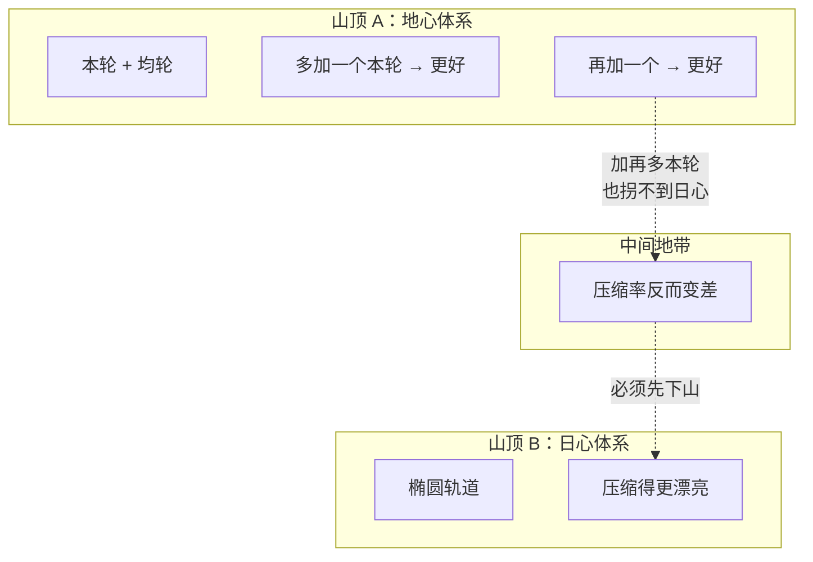
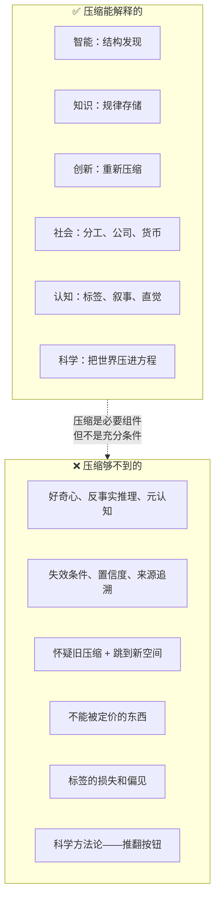

# 万物皆压缩：用第一性原理拆开智能、知识、创新和社会的底牌

AI 圈有一句话：**智能的本质是压缩 + 泛化。** 从信号里提取规律（压缩），把规律用到新场景（泛化）。

听起来只是技术圈的一个观点。但顺着它往下拆——智能、知识、创新、社会分工、标签、科学——发现它们背后是同一件事。而这件事的边界，比这件事本身更有意思。

---

## 压缩是什么

信息论里：**用更少表示更多。** 给定数据，找到表示方式，让信息量远小于原始数据。

牛顿把天体和地上的运动压成三条定律。元素周期表把物质多样性压成一张表。达尔文把几亿年的物种史压成自然选择。

> **压缩 = 找到不变性，扔掉细节。**

人能活在这个世界上，靠的就是这个能力。没有压缩，每一个苹果你都重新认识一遍，每一天太阳升起你都要重新理解。

---

## 压缩有哪些方法

在往下拆之前，先把人类做压缩的方法理一遍。这些方法按一个维度可以分成两类：**压缩过程可见的，和压缩过程不可见的。**

### 逻辑三件套

**归纳：多个实例 → 一条规则。** 一万只白天鹅 → "天鹅是白的"。把重复观测往上压。

**演绎：规则 + 前提 → 结论。** 人皆有一死 + 苏格拉底是人 → 他会死。演绎不产生新压缩——它只是把已经压好的东西解包。

**溯因：一个观察 + 背景知识 → 最优解释。** 草地湿了 → 可能下过雨。在无限可能的解释里，选最省的那个。侦探破案、医生诊断，都是溯因。

### 结构操作

**类比：跨域借用压缩包。** "电流像水流"——把水流的整套规律直接搬到电学，不需要从零建。这是最省力的压缩方式。法拉第靠它建了电场概念，虽然他连数学都不太会。

**抽象：往上走一层。** 苹果、橘子、香蕉 → 水果。哺乳动物、鸟、鱼 → 脊椎动物。抽象扔掉更多细节，找到更高层的不变性。好几类不同的东西，其实是一个东西的不同投影。

**分类：水平方向划界。** 无穷的个体差异 → 分成几个类 → 每个类一个名字。有了"猫"这个类，你不需要重新认识每一只猫。

**公理化：找最少的那几条。** 欧几里得把整个几何压成五条公理。从一堆定理里找到最少的出发点，其余全是推导。压缩率最高的操作。

### 经验压缩

**叙事：时间维度的压缩。** 一个人一生有无数事件，压成一段故事——"出身贫寒，坚持读书，遇到伯乐"。因果链留下，噪声扔掉。历史、传记、新闻都是这种压缩。危险在于太容易产生——任何一串随机事件你都能事后压出一个"故事"来。

**直觉：压缩过程自己被压了。** 象棋大师扫一眼棋盘，不用算，直接"感到"最好的一步。老医生看一眼病人，"说不上来，但我觉得不对"。大量经验压进了潜意识——你拿到的是压缩结果，但过程不可见。

**启发式：显式的经验规则。** "买指数别买个股""先救离出口最近的"。决策经验压成一条规则。跟直觉的区别是——启发式是显式的，你可以检查和批评它。

---

## 智能：压缩覆盖了大概 40%

把智能拆到最底层，它是五样东西的复合体：

| 能力 | 是什么 | 是压缩吗 |
|---|---|---|
| 结构发现 | 从信号里提取不变性 | ✅ 高度重叠 |
| 反事实模拟 | "如果我这样做，会怎样？" | ❌ 需要生成，不是压缩 |
| 元认知 | 知道自己知道什么、不知道什么 | ❌ 压缩不标注自己的边界 |
| 主动采样 | 设计实验填补知识空白 | ❌ 压缩不会主动找新数据 |
| 价值判断 | 判断什么重要什么不重要 | ❌ 先有价值方向，压缩才有目标 |

一个思想实验：假设你有一个完美的压缩+泛化机器（GPT-∞）。它能通过所有考试。但它会不会自己冒出"我想知道 X 是怎么回事"的冲动？能不能区分数据相关性 vs 物理因果？

**一个只做压缩的系统，永远不会主动去采样那些还没被压缩的数据。** 好奇心、主动实验、反事实推理——智能体与非智能体的分水岭——不在压缩的范畴内。

---

## 知识：压缩覆盖了大概 60%

物理定律当然是对观测的压缩。但知识的完整结构不止一层：

```
普通记忆：        "太阳东升西落"
压缩后的知识：    F = G·M·m / r²
失效条件标签：    接近光速 / 强引力场时失效
置信度标签：      极高（大量验证）
来源标签：        牛顿力学 / 推导 / 非假设
```

**压缩告诉你"什么是什么"，但它不标注"这个压缩在什么条件下会失效"。**

你知道 F=ma 只在宏观低速下成立。但这个"知道"不是压缩产生的——它来自教科书、老师警告、实验失败。压缩本身不生成失效条件、置信度校准和来源追溯。

没有这三样，你分不清"地球是圆的"和"雷声是神在发怒"——两个都是对世界信息的压缩。哪个更好？压缩率本身不告诉你答案。

---

## 创新：是压缩，但压缩不教你那关键的一步

先说结论：**创新就是压缩。** 牛顿把世界压成 F=ma，爱因斯坦把时空压成曲率。都是换个方向重新压缩。

那为什么"发现另一种压缩"这么难？

### ① 旧压缩是自隐的

一个好压缩会让你透过它看世界，但看不到它自己。

牛顿宇宙里的人说"物体自然趋向静止"。他不觉得自己在"使用牛顿力学"。他觉得这是**事实**。旧压缩被设计成透明的。要发现新压缩，先要看见旧压缩的存在——但它已经压成了常识。

### ② 两个最优解之间没有梯度



**在一个范式内部做梯度下降，走不到另一个范式。** 地心体系多加一个本轮就更好——但加再多本轮，永远不会自己拐到日心。两个山顶之间隔着低质量的中间状态。不是爬山，是从一座山顶跳到另一座。

### ③ 怀疑旧压缩不够好——压缩不教你这一步

压缩告诉你：给定数据 D，找最小表示 f(D)。

但压缩不告诉你：**我现在用的这个 f，是不是全局最优？被扔掉的那 99.9999% 的信号里，哪个值得捡回来？往哪个方向找另一个 f？**

哥白尼做的第一件事不是压缩。是**先怀疑旧的压缩不够好**。"本轮越加越多，这系统太复杂了"。这个怀疑，压缩推导不出来。

> **压缩能让你精益求精，但不能让你革命。革命之后回头看，还是压缩。但站在旧山顶上的你，眼前没有通往新山顶的梯度。那一步，你得自己跳。**

---

## 社会也是压缩

把镜头拉远——整个现代社会都建在压缩之上。

### 分工就是把复杂性压进角色

```
原始社会：你要活 → 打猎、生火、搭房子、缝衣服
         → 一个人脑子里装整个世界

现代社会：你会写代码 → 拿工资 → 买一切
         → 只需要一个压缩包
```

每个职业都是一份对世界某个切面的有损压缩。医生把人体压成诊断路径。程序员把业务逻辑压成代码。你吃的是面包，不是小麦——面粉厂、酵母厂、面包师傅已经把小麦压好了。

### 公司是一个压缩算法

市场有无穷信号（需求、供给、技术、法规、竞争）。公司把这些压进：战略（往哪走）→ 流程（怎么干）→ KPI（怎么算好）→ 产品（产出什么）。

层级越高，压缩率越高。CEO 看的不再是具体操作，是整个公司压成的一张报表。员工不需要看见全部信号——只需要执行自己被分配的那一小块。

### 货币是终极压缩

```
无穷多样的劳动、资源、创造力、时间
    ↓ 压缩成一个数字
价格
```

效率极高——你用一个数字做所有交易决策。但反过来，价格也**丢掉了所有不能被定价的东西**。清洁的空气价格为零，被工业社会当成无限资源。这个压缩误差差点要了地球的命。

---

## 标签是日常生活中压缩率最高、也最危险的一种

```
一个活人，几十年经历、矛盾、变化、上下文
    ↓ 压缩
"内向" / "卷王" / "直男" / "不靠谱"
```

无限维度压到一两个字符。然后完美命中那三个坑：

**自隐**——"他不靠谱"不再是一个判断，是你眼中的事实。你透过标签看人，但看不到标签。

**无梯度**——你注意他迟到的每一次（强化标签），忽略他靠谱的每一次（与标签不符，归为偶然）。做再多好事也洗不掉。

**不标失效条件**——同一个人，A 场景不靠谱，B 场景极其可靠。标签把条件依赖全扔了。

但不用标签，你活不下去。你的认知带宽只能深度理解极少数人。对楼下便利店的收银员，你需要"收银员"这个标签快速交互。

**关键不是撕掉标签，是记住它是标签——你看到的不是那个人，是你脑子里的压缩算法剩下来的几个字。中间的损失，你看不见。**

---

## 科学也是压缩——但带了一个推翻按钮

科学本质上就是人类集体做压缩。F=ma 是压缩，元素周期表是压缩，自然选择也是压缩。奥卡姆剃刀就是选压缩率更高的那个。

但科学跟其他压缩体系有一个本质区别：

| | 迷信、直觉、常识 | 科学 |
|---|---|---|
| 输出 | "规律是 X" | "规律是 X，条件 Y 下失效，推翻方法：做实验 Z" |
| 对待反例 | 当噪音扔掉 | 反例比规律更珍贵 |
| 自己能不能被看见 | 看不见自己 | 明说"这可能是错的" |

宗教、迷信、直觉——这些也是压缩。但它们不标失效条件，不欢迎推翻。

科学的独特不在压缩这一步，在**压缩完之后的那一步**：它明说这个压缩是可以撕的，并且告诉你撕的方法。科学方法本身就是一种压缩——人类几千年试错、迷路、碰运气，压成一套规则："假设→实验→验证→推翻→再来"。普通人也能靠这套规则生产可靠知识。

科学史就是不断换压缩算法的历史：

```
亚里士多德：万物有目的（压缩率低）
    ↓
牛顿：万物是力（把亚里士多德压成了子集）
    ↓
爱因斯坦：万物是几何（又把牛顿压成了特例）
    ↓
量子力学：万物是概率（还在和引力对不齐）
```

每一步都是"怀疑旧压缩不够全局 → 跳到新空间 → 发现新压缩把旧压缩变成了子集"。

---

## 收束



| 领域 | 压缩的功劳 | 压缩的盲区 |
|---|---|---|
| 智能 | 从信号提取规律 | 好奇心、反事实、不知道时依然行动 |
| 知识 | 用规律表示无限数据 | 不标失效条件、不标可信度 |
| 创新 | 在新空间重新压缩 | 怀疑旧压缩不够好、在两个山顶之间跳跃 |
| 社会 | 分工、公司、货币的高效协作 | 默认脚本不可见、不能被定价的东西 |
| 标签 | 用最少信息快速交互 | 单向强化、条件依赖全丢 |
| 科学 | 把世界压进方程 | 推翻按钮——它不在压缩的范畴内 |

> **压缩是保守力——决定你能走多远。**
> **创新是非保守力——决定你能不能换一条路。**
>
> **而那个让你换路的"怀疑"——觉得旧压缩不够美、相信另一个山头存在、在看不见梯度时依然敢跳——不是压缩能推导的。它是对压缩的元判断。**

---

*用到的思维框架：第一性原理、思想实验、苏格拉底追问、地图-领土、模型路由、系统思维、贝叶斯推理*
