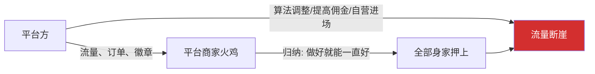
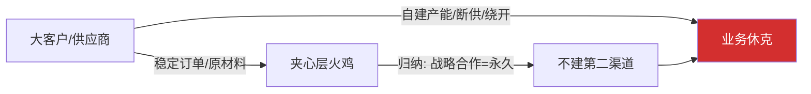
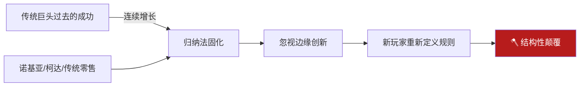
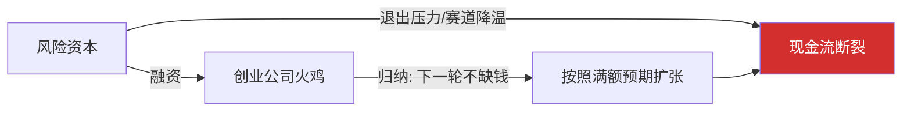
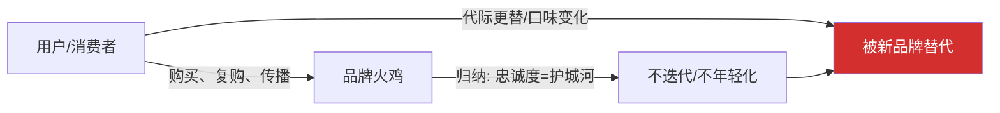
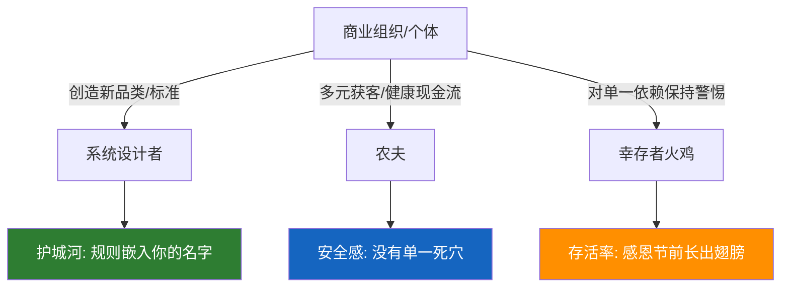

# 火鸡问题7：商业场景——六层农场地图，找到所有隐藏的感恩节

> 本文是火鸡问题系列的第七篇。商业比投资和职业更复杂——农夫和火鸡经常是多层的。一个人在上游是火鸡，在下游就是农夫。棋盘最大，角色最乱，感恩节最隐蔽。

[火鸡问题1：从思维实验到行动指南](fire-turkey-guide) ｜ [火鸡问题5：投资场景](fire-turkey-investment) ｜ [火鸡问题6：职业场景](fire-turkey-career)

---

## 前言

做投资，你可以当一只聪明的火鸡，在感恩节前一天卖掉离场。你做空也行，你拿着现金不动也行。

做商业，你没法"轻仓观望"。你的员工、你的客户、你的合作伙伴——这些责任绑定了你。你必须站在农场里，正对着农夫每天推门进来的方向。

所以商业比投资更难做火鸡。投资火鸡是数学问题，商业火鸡是生存问题。

**唯一解法**：让你的公司本身，成为那个被多个农夫求着合作的存在。从"他给不给我饭吃"变成"他求我给他饭吃"。

> 在商业丛林里，最安全的生态位不是你被喂养得多好——而是喂养你的人，害怕失去你。

---

## 层次一：平台与商家——最经典的映射

**系统设计者**：平台方——淘宝、美团、抖音、滴滴。他们定义了流量分发规则、佣金比例、排名算法、惩罚机制。

**农夫**：平台的运营部门、算法本身、以及那个决定商家生死的流量开关。

**火鸡**：平台上勤勤恳恳经营的中小商家——他们把全部身家押在一个平台上的流量，用归纳法推导出"只要我做得好，平台就会一直给我流量"。

**喂食行为**：订单、五星好评、平台颁发的"金牌卖家"徽章、逐年增长但可控的销售额。

**感恩节**：平台调整算法、提高佣金、推出自营品牌抢你的赛道、或者你的品类被重新定义。

**火鸡的归纳法**："我在这平台做了五年，10000+好评，老客户复购率40%，我的生意是稳固的。"

**农夫的日历**：IPO后的利润压力、股东要求提高货币化率、自营品牌需要清场、或者新一代用户已经到了别的平台。

**核心幻觉**：商家以为那些好评和粉丝是自己的——实际上，客户认的是平台的搜索框，不是你。你在平台上盖了一座看起来很坚固的房子，但地基是人家的。

你见过多少淘宝大卖家，一夜之间流量腰斩，跑到平台上拉横幅？他们不蠢——他们只是在平台还"喂养"的阶段，把自己的全部身家押在了一块别人名下的地基上。

---

## 层次二：供应链里的夹心层

**系统设计者**：行业头部客户、上游核心原材料供应商、或者掌握关键专利的技术公司。

**农夫**：给你订单的大客户、给你原材料的供应商——他们两边一夹，你就是中间的火鸡。

**火鸡**：那些"只有一个大客户"的代工厂、或者"只依赖一个供应商"的组装厂、或者"只做单一渠道分销"的代理商。

**喂食行为**：持续稳定的订单、按时结算、每年还能涨一点价。

**感恩节**：大客户自建产能、供应商断供或大幅涨价、渠道自建品牌绕开你。

**归纳法**："这个大客户跟我合作十年了，我们是战略合作伙伴，不可能突然翻脸。"

**农夫的日历**：他的财报需要降本——自建产能比外采便宜15%；或者他的董事会要求供应链去中国化；或者你的接班人没把他的回扣安排妥当。

**最致命的错觉**：你以为自己在产业链里有一个不可替代的生态位——实际上，你只是他的一根外挂肋骨，他可以随时找替代厂商，或者自己长出一根新的。

"我们是战略合作伙伴"——这句话在商业里的真实含义通常是："目前我还没找到比你更便宜的。"

---

## 层次三：技术颠覆者与传统巨头

**系统设计者**：那个重新定义了行业规则的新玩家。特斯拉之于燃油车、苹果之于功能机、SaaS之于传统软件、直播电商之于传统零售。

**农夫**：传统巨头曾经也是农夫——他们用成熟的渠道、品牌、资本喂养了整个行业和自己的估值。

**火鸡**：那个在过去二十年里一直成功的行业老大。他拥有最多的数据点（连续增长的营收、市场份额、利润），所以他的归纳法最坚固。

**喂食行为**：逐年增长的营收、漂亮的年报、行业第一的排名、分析师一致的"买入"评级。

**感恩节**：诺基亚被iPhone颠覆、柯达被数码相机颠覆、传统零售被电商颠覆、银行被数字支付颠覆。

**巨头火鸡的特殊悲剧**：他们不是不聪明。他们有全行业最优秀的战略部、最昂贵的咨询顾问、最详实的数据。但他们的归纳法恰恰因为数据太多而变得不可撼动——"过去四十年这个行业都是这样运转的，不可能一夜之间改变。"

而改变者根本不跟你在旧范式里玩，他自己开了一桌新的。

诺基亚CEO在被微软收购时说："我们没有做错什么。但不知为什么，我们输了。"

这句话是商业史上最标准的火鸡遗言。他至死没有理解：**不是他做错了什么，是他做的所有"对的事"，都是在旧系统里对。新系统不认旧答案。**

---

## 层次四：风险资本与创业公司

这一层是商业里最残酷但最诚实的映射——因为这里所有人都知道自己在一个农场里，只是每个人都觉得自己是农夫。

**系统设计者**：市场大环境、技术周期、退出通道（IPO窗口、并购市场热度）。

**农夫**：风险资本。他们投了你，喂养你，给你资源，帮你招人，帮你站台。

**火鸡**：创业公司创始人。你以为你是农夫——你设计产品、搭建团队、定义文化。但如果你融了钱，你的日历上就多了一个倒计时器：runway。

**喂食行为**：A轮、B轮、C轮融资款到账，估值翻倍，媒体报道"独角兽"。

**感恩节**：现金流断裂、下一轮融不到、投资人要求合并、或者赛道被证伪。

**火鸡的归纳法**："我们每轮都是超额认购，下一轮也一定是。"

**农夫的日历**：LP要求DPI，基金存续期到了、风口转向了、或者隔壁老王投的同类项目已经死了，你的赛道被打了问号。

**创业火鸡的悲剧**：你的安全感来自"账上还有18个月的钱"——18个月之后呢？你不敢想。因为一想就会发现：你的命，系在投资人的下一年策略上。而他的策略，系在市场情绪上。而市场情绪，从来就不讲归纳法。

很多创始人到最后才发现：那个在董事会上对你微笑的投资人，他的日历和你不一样——你需要时间把产品做好，他需要DPI回报LP。这两样东西，未必在同一个时间点交汇。

---

## 层次五：用户与品牌——一个翻转的视角

这是一个翻转的视角——在这个场景里，用户是农夫，品牌是火鸡。

**系统设计者**：时代情绪、文化变迁、代际价值观迁移。

**农夫**：用户。他们每天"喂养"品牌——注意力、钱包、社交传播。

**火鸡**：那些以为"品牌忠诚度"就是永久护城河的企业。他们用过时的价值观、过时的渠道、过时的沟通方式，喂给用户过时的产品。

**喂食行为**：销量、复购、品牌美誉度、忠实粉丝群。

**感恩节**：新品牌用新叙事抢走了年轻用户、你的核心客群老去了、社会风向变了而你的品牌人设还停在十年前。

**火鸡的归纳法**："我们有X亿用户，品牌价值Y百亿，用户不会离开我们。"

**农夫的日历**：Z世代不认你的logo，只认kol种草；消费者的耐心从30秒缩短到3秒；你的品牌，在他眼里只是一个随时可以划走的选项。

**品牌火鸡最致命的幻觉**：你以为用户是"你的用户"。从来就没有这回事。用户只是在那个时间和条件下，找不到比你更好的选项。一旦有人提供了更好的选项——哪怕是情绪价值——他就会走。而且走得毫无愧疚。

品牌忠诚度，是这个世界上最被高估的东西——实际上它根本不是"忠诚"，而是"转换成本暂时大于转换收益"。当转换收益超过转换成本的那一天，你的用户走得比火鸡群还快。

---

## 层次六：终极映射——商业幸存者的三层能力

在那张著名的商业故事里，那两只活过感恩节的火鸡被问到怎么活下来的——答案不是"我猜对了农夫的日历"，而是"我长出了能飞过栅栏的翅膀，能吃野地里的食物，能在别的农场找到活路"。

商业里真正的幸存者，同时是这三个角色，但比例不同：

| 角色 | 商业中的体现 | 核心能力 |
|------|------------|---------|
| 系统设计者 | 定义新品类、创造新标准、掌握定价权 | 在某个细分领域，规则由你写 |
| 农夫 | 多元客户、多元渠道、健康的现金流 | 你有多个喂养者，没有一个能掐死你 |
| 火鸡 | 对任何单一依赖保持警惕 | 知道自己最多能做几成熟的火鸡，并在那个阈值前离场 |

**系统设计者时刻**：你创造了一个客户离不开的产品、一个对手绕不开的专利、一个定义行业的标准——这时候你在设计规则。

**农夫时刻**：你有十个客户，最大的一个不超过15%；你有三条渠道，每条都能独立养活你；你有24个月的现金流趴在那里——这时候你在自己养活自己。

**火鸡时刻**：你的商业模式里有一个点——一个客户、一个渠道、一个技术栈、一个政策窗口——一旦它断了你半年内就会死。识别它，接受它，然后开始孵化第二个。

---

## 商业角色自检清单

| 角色 | 在商业中的体现 | 逆思考提问 |
|------|--------------|----------|
| 系统设计者 | 品类定义者、标准制定者、平台方 | 如果明天规则改变，是我改别人还是别人改我？ |
| 农夫 | 客户、渠道、资本、供应链 | 他为什么跟我合作？他有没有另一个替代选项？ |
| 火鸡 | 溢价依赖于惯性而非护城河的企业 | 如果最坏情况发生，我的企业还能活多久？ |

---

## 商业感恩节预警清单

以下任何一个问题你答"是"，你的商业体内就有一只正在长肥的火鸡：

1. 最大客户占营收超过30%吗？
2. 核心渠道/平台只有一个，且规则不归你控制吗？
3. 你的护城河，是因为客户没有更好的选择，还是因为你的产品真的更好？
4. 行业里有没有一个你嗤之以鼻但正在快速增长的新玩家？
5. 如果主要喂养者明天切断关系，你的现金流能撑多久？
6. 你现在的安全感，有多少来自"过去一直这样"，有多少来自"我的不可替代性可验证"？

---

## 降火鸡化商业策略

**第一步：画出你的农场地图**——把你的客户集中度、渠道依赖度、供应商集中度、技术栈锁定程度全部列出来。每一个超过30%的节点，都是一个可能的感恩节。

**第二步：创造多头喂养结构**——能不能把最大客户从40%降到20%？能不能让渠道从单一平台扩展到三个？能不能A/B供应商同时养？这不是成本问题，这是生存问题。

**第三步：把镰刀朝向自己而非等别人动手**——在自己最舒服的时期，主动推一个可能短期损失利润但能打开新市场的项目；在现金充裕的时候，投资一个两年才能见到回报的第二增长曲线。在农夫还在喂食的时候，储备跑路的体力和过冬的存粮。

---

## 商业火鸡与投资火鸡的最大区别

做投资，你可以当一只聪明的火鸡，在感恩节前一天卖掉离场。

做商业，你必须站在火鸡的位置上，同时长出农夫的收租能力和系统设计者的规则能力。

**最终形态是什么？**

> 让你的公司本身，成为那个被多个农夫求着合作的存在。从"他给不给我饭吃"变成"他求我给他饭吃"。

---

**系列导航**：
- 上一篇：[火鸡问题6：职业场景深度](fire-turkey-career)
- 下一篇：[火鸡问题8：终极解法——共生回路](fire-turkey-symbiosis)

**标签**：`火鸡问题` `商业策略` `平台经济` `供应链` `颠覆式创新` `创业` `品牌` `系统思维`
