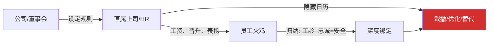
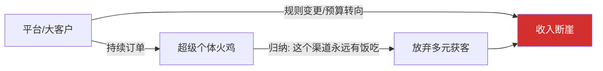
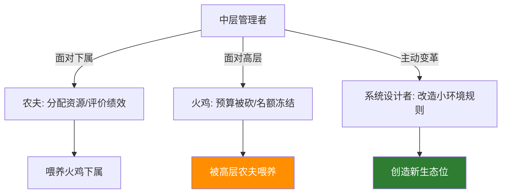
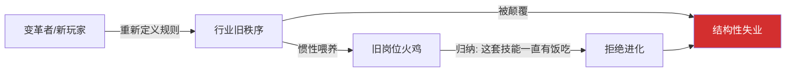
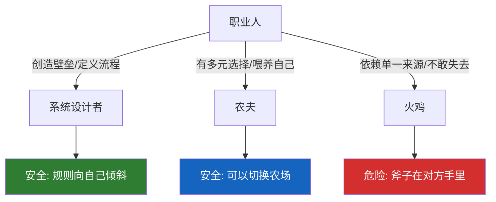

# 火鸡问题6：职业场景——你的工龄是护城河还是棺材钉

> 本文是火鸡问题系列的第六篇。上一篇拆了投资，这一篇拆职业——这是我们大多数人作为"火鸡"待得最久、陷得最深、觉醒最晚的农场。

[火鸡问题1：从思维实验到行动指南](fire-turkey-guide) ｜ [火鸡问题5：投资场景深度](fire-turkey-investment)

---

## 前言

投资火鸡是数学问题——你可以在感恩节前一天清仓离场。

职业火鸡是生存问题——你的员工身份、你的房贷、你的孩子学费、你十年建立的专业身份，全部绑在一个农场里。你没法"轻仓观望"。

而且职业火鸡有一个最致命的幻觉：**你把喂养你的农夫当成了自己的家人。**

---

## 层次一：公司与员工——最经典的映射

**系统设计者**：创始人、CEO、董事会。他们设定了游戏规则——KPI体系、晋升阶梯、薪酬带宽、末尾淘汰。

**农夫**：直属上司、HR、公司制度本身。他们每天"喂养"你——工资、奖金、表扬、晋升承诺。

**火鸡**：把"工龄""忠诚""辛苦"当成安全筹码的员工。

**喂食行为**：每年的涨薪、季度奖金、领导在全员会上说的"你们是我们最宝贵的资产"、年终评优的奖杯。

**感恩节**：业务线裁撤、组织架构调整、35岁优化、或者你发现自己的技能在公司外部根本卖不上价。

**火鸡的归纳法**："我已经在这家公司干了八年，每年都涨薪，去年还拿了优秀员工，我很安全。"

**农夫的日历**：财报压力、股东要求的降本增效、AI替代人力的时间表、或者新来的VP要带自己的人。

**核心错觉**：火鸡以为自己是"资产"，农夫其实一直把它当"成本项"——成本项的性质是：一旦有更便宜、更听话、更年轻的替代品，你就会进入被优化的候选名单。

你有没有意识到：你简历上"在同一家公司服务10年"——在下一个雇主眼里，可能不是忠诚的勋章，而是"离开舒适区还能不能活"的疑问。

---

## 层次二：超级个体与平台

**系统设计者**：你——对，如果你是主动构建自己护城河的人。

**农夫**：也是你——你在喂养自己的多重收入来源、多元技能树、外部人脉网络。

**火鸡**：那些把所有精力都押在一条业务线上的超级个体——他们看起来是自由职业者，但其实只有一个客户、一个平台、一个流量来源。

**喂食行为**：单一平台给的稳定订单、一个大客户每年贡献80%收入、朋友圈生意一直很顺。

**感恩节**：平台规则改变、算法调整、大客户换了对接人且带着预算跑了、或者行业风向一夜转向。

**火鸡的归纳法**："这个平台过去三年给我的单子一年比一年多，所以它是我的终身饭票。"

**农夫的日历**：平台的商业化节点（前期补贴养鱼，后期收网变现）、大客户自己的降本压力、行业监管政策的变化。

**最隐蔽的陷阱**：超级个体往往以为自己是农夫——因为没人给他们发工资。但实际上，如果你的客户集中度超过某个阈值，你就是那只被单一农场主喂养的火鸡，只不过农场主不叫"老板"，叫"平台"或"大客户"。

自由职业的自由，不在于没人管你——而在于任何一个农夫断了粮，你还有别的碗。

---

## 层次三：中层管理者——最尴尬的角色

这个群体值得单独拆。中层管理者在工作日里其实是这样的：

**上午你是农夫**：你给下属安排任务、批预算、在绩效表上打分。你的话，决定团队里年轻火鸡的生存质量。你甚至享受这种"被需要"的感觉。

**下午你是火鸡**：你参加VP主持的会议，被告知部门预算砍了30%、HC冻结。你抬头看VP——VP也在舔更上面的农夫。

**晚上你偶尔是系统设计者**：你写了一份跨部门协同的新流程提案，或者推动了一个效率工具，你改了小环境里的规则。

**中层最惨的感恩节**：公司要精简层级。你在中间层，既没有一线执行的不可替代性，又没有高层战略的决策权。农夫（高层）的日历上，有一页写着"扁平化裁员"。

很多中层在裁员潮里第一次清醒：原来我上午喂养的那群火鸡，到了下午，和我一样——都是农夫日历上的一行数字。

---

## 层次四：职业变革者与旧组织

**系统设计者 & 农夫**：那个率先掌握了新技能、看到新市场、或者创造了新工具的人。

**火鸡**：守着旧流程、旧技能、旧关系网络，等着组织继续"喂养"的人。

**喂食行为**：旧组织给的火鸡食——论资排辈的晋升、年头到了就加的工资、不用学习新东西也能混下去的舒适区。

**感恩节**：新技术全面替代旧岗位、行业逻辑被颠覆、或者公司被并购后文化洗牌。

**经典的职业感恩节**：2010年代，一批传统媒体编辑看着流量被新媒体抢走，他们的归纳法是"深度报道永远有读者"，但系统设计者——那些做了公众号、短视频的先行者——早已重新定义了游戏规则。旧媒体火鸡们不是不努力，他们只是在旧系统里努力；而旧系统本身，是那头即将被宰的火鸡。

"我在这个行业干了二十年"——这句话可以是护城河，也可以是棺材钉。区别不在年数，在那些年里你是在加固旧模型，还是在持续更新你的 $\boldsymbol{\theta}$。

---

## 层次五：终极映射——你同时是这三个角色

在这套框架里，一个人的职业安全感的底层公式是：

> **系统设计者含量 = 你能把游戏规则往自己这边改多少**

> **农夫含量 = 你在多大程度上可以挑选和切换喂养者**

> **火鸡含量 = 你在多大程度上只能等一个喂养者继续发善心**

**你在某个维度是系统设计者**：当你创建了不可替代的经验壁垒、当你维护着一套只有你能高效运转的工作流、当你掌握着客户直接认你名字的信任资产——你在设计一小块规则，别人得按你的方式玩。

**你在某个维度是农夫**：当你积累到可以挑选公司而不是被公司挑选时；当你有副业、有投资收入、有外部认可——你在喂养自己的选择权，而不是只被喂养。

**你在某个维度是火鸡**：任何一个你不敢失去的东西，都是你的农夫——那份不敢辞的工作、那个不敢得罪的老板、那个不敢放手的客户。你对它们的安全感，建立在"它们没动手"上，而不是建立在"你不需要它们"上。

---

## 职业角色自检清单

| 角色 | 在职场中的体现 | 逆思考提问 |
|------|--------------|----------|
| 系统设计者 | 行业标准制定者、技术先驱、流程创造者 | 我在哪个层面上可以改规则而不是遵守规则？ |
| 农夫 | 上级、HR、客户、平台规则 | 他为什么给我现在的待遇？他的KPI和我的存在一致吗？ |
| 火鸡 | 依赖工龄、平台惯性、单一技能的从业者 | 我的安全感，是因为我有选择，还是因为暂时没被动手？ |

---

## 感恩节预警清单

以下任何一个问题你答"是"，你就处在一个职业火鸡的位置上：

1. 你现在的薪资，如果拿到外部市场，同等水平能找到吗？还是这是"公司年资溢价"？
2. 你最大的客户/平台，贡献了你收入的多少？超过50%吗？
3. 你有多久没学过新东西了？你的技能树里，最后一根新枝是什么时候长出来的？
4. 你的直属上司如果要优化你，他能找到几个替代者？几天能招到？
5. 你能不能明天就离职，生活质量不受影响？

---

## 降火鸡化三步走

**第一步：识别农场**——把你现在的收入来源、技能依赖、平台绑定全部列出来，每一个都是一个农夫。哪个农夫手里有斧子？

**第二步：建立多头喂养**——副业、第二技能、行业外的认可、可迁移的作品集、直接属于你的客户关系。目标是：任何一个农夫断了粮，你都还有别的碗。

**第三步：升级为系统设计者**——在这个领域里，有什么规则是"默认如此"但你发现其实可以更好的？做一个工具、写一套方法论、建立一个标准、定义一个细分品类。当规则里嵌着你的名字时，你就不再是火鸡。

---

> 别把你的安全感，建立在"公司暂时需要我"上。
>
> 你和公司的关系，不是你和你妈的关系。你妈不会因为你贵就换一个便宜的孩子。但公司会。
>
> 这不是说公司坏。这是说——你在用家庭的逻辑理解商业系统。而商业系统从来不用家庭的逻辑运转。
>
> 职场安全感的最高形式，不是你被一家公司深爱——而是你不需要被任何一家公司深爱。

---

**系列导航**：
- 上一篇：[火鸡问题5：投资场景深度](fire-turkey-investment)
- 下一篇：[火鸡问题7：商业场景——六层农场地图](fire-turkey-business)

**标签**：`火鸡问题` `职业规划` `中层管理` `超级个体` `职场安全` `系统思维` `查理·芒格`
