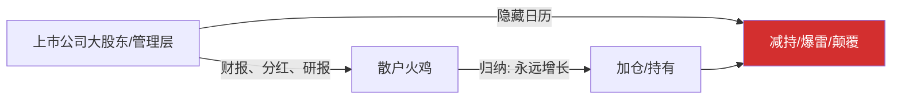
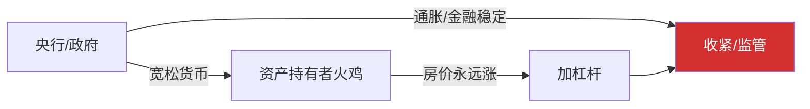
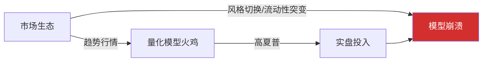
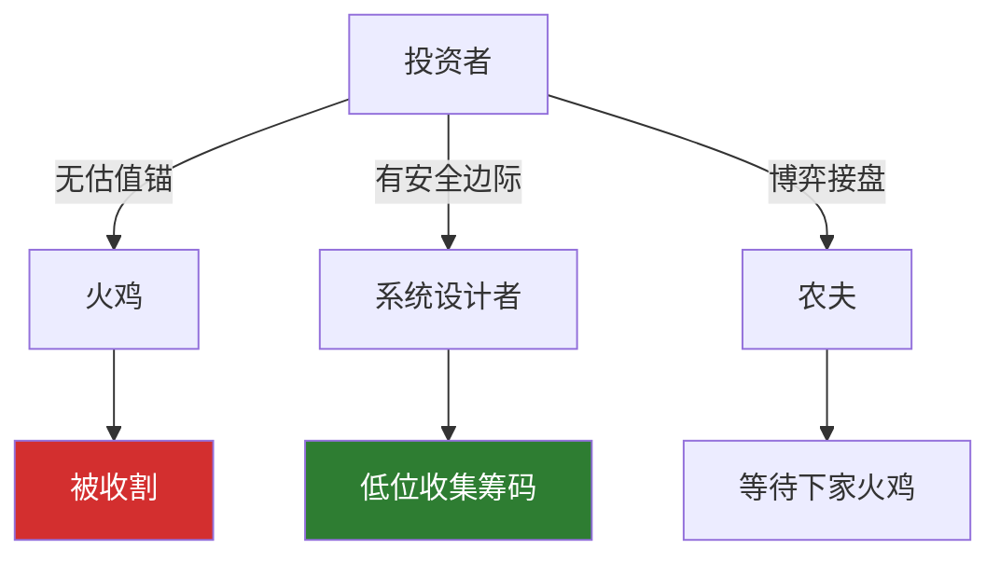

# 火鸡问题5：投资场景——你"永远涨"的信仰背后站着谁

> 本文是火鸡问题系列的第五篇。前四篇建立了理论框架，这一篇把镜头对准投资——这个火鸡最多、农夫最隐蔽、感恩节最惨烈的战场。

[火鸡问题1：从思维实验到行动指南](fire-turkey-guide) ｜ [火鸡问题2：归纳法的失效](fire-turkey) ｜ [火鸡问题3：成为系统设计者](fire-turkey-solution) ｜ [火鸡问题4：三张图复盘](fire-turkey-visual)

---

## 前言

做投资，你可以当一只聪明的火鸡，在感恩节前一天卖掉离场。你做空也行，你拿着现金不动也行。

但前提是——你得先知道感恩节是哪一天。

投资市场里的火鸡比任何地方都多，因为这里的"喂养"是真实的金钱回报。每一次盈利都在加固你的归纳模型。而农夫的日历，藏在K线图看不见的地方。

下面，我们把投资场景的棋盘摊开，看看这个生态里谁在喂谁、谁在养肥谁、谁又在等感恩节。

---

## 层次一：上市公司与散户

**系统设计者 & 农夫**：大股东、管理层、投行/做市商

**火鸡**：只盯着"连涨""稳定分红"的散户

**喂食**：漂亮财报、高股息、券商推荐

**感恩节**：大股东减持、增发、财务爆雷、行业逻辑颠覆

散户的归纳法："这家公司连续十年利润增长，所以它会一直好下去。"

但农夫的日历上写着解禁期、融资需求、行业天花板——他比你更早看到终点。

你有没有想过：当券商给你推荐一只股票的时候，他们是在喂你，还是在喂他们自己即将解禁的仓位？

---

## 层次二：宏观政策与资产持有者

**系统设计者 & 农夫**：央行、政府、全球宏观力量

**火鸡**：坚信"核心资产永远涨"的投资者

**喂食**：长期货币宽松、低利率、信贷扩张

**感恩节**：加息、流动性收紧、监管重拳、黑天鹅

归纳法："过去二十年放水就涨，所以任何回调都是上车机会。"

但农夫的日历上写着通胀目标、汇率稳定、系统性风险——当这些与资产价格冲突时，他会毫不犹豫拧紧水龙头。

2008年次贷危机里的购房者、2021年教培行业里的投资者——他们不蠢，他们只是把央行的"喂养窗口"当成了"永久规律"。火鸡的数据里只有降息周期，没有加息周期。

---

## 层次三：市场生态与趋势交易者

**系统设计者 & 农夫**：市场复杂适应系统（聪明钱、算法、流动性潮汐）

**火鸡**：依赖历史回测的趋势交易者/量化模型

**喂食**：策略连续盈利、回测曲线完美

**感恩节**：风格切换、波动率突变、流动性枯竭

这种火鸡做了所有统计验证——夏普比率2.0，最大回撤5%，胜率65%。所有指标都在说："这个模型是安全的。"

但它不知道"数据采集条件"已经变了。市场没有意图，但有结构性突变——这些突变在历史数据里要么缺失，要么埋在最深的噪声里。

量化火鸡是最悲剧的一种：它拿着一份统计完美的报告走向感恩节，而农夫——那个叫"市场风格切换"的东西——甚至不知道自己有日历。

---

## 层次四：你同时是农夫和火鸡

这是投资这个棋盘最妙的地方——同一个你，同一天，同时扮演三个角色：

- 当你买入并期待涨给下一个人——**你是农夫**，在喂养下一个火鸡
- 当你被贪婪和恐惧驱动追涨杀跌——**你是火鸡**，被市场这个更大的农夫饲养
- 当你有清晰估值锚、安全边际、逆向布局的纪律——**你才是系统设计者**，在等火鸡们送来便宜货

> 芒格和巴菲特："牌桌上如果前半小时你没认出谁是买单的倒霉蛋，那你就是。"

你的每一笔交易，都在选择自己今天的角色。

---

## 投资角色自检清单

| 角色 | 在投资中的体现 | 逆思考提问 |
|------|--------------|----------|
| 系统设计者 | 政策、制度、产业周期、信息优势 | 规则为谁而定？谁有能力改变规则？ |
| 农夫 | 资金优势、信息优势、周期主导者 | 他为什么现在给我"食物"（高回报/高股息/推荐）？ |
| 火鸡 | 被归纳法和线性外推喂养的投资者 | 我的收益，是因为我真看懂价值了，还是因为我碰巧在场？ |

---

## 终极推演

如果你此刻有一个让自己很舒服的投资——连续赚钱、回撤极小、人人羡慕——请做一次弗兰克清晨推演：

**推门进来的，手里是玉米桶，还是一把斧子？**

- 你的盈利，有多少来自能力，多少来自你恰好处于某个周期的正确一侧？
- 如果明天这个周期翻转，你的模型还成立吗？
- 你的安全感，是因为有安全边际，还是因为"它过去一直在涨"？

---

> 在投资丛林里，最危险的时刻不是亏钱的时候——亏钱至少说明你知道自己错了。
>
> 最危险的时刻，是你连续赚钱、信心爆棚、认为"这次不一样"或者"这次永远一样"的时候。
>
> 因为那时候，你和火鸡弗兰克的处境完全相同：数据完美，模型精确，置信度 99.7%。
>
> 而感恩节，从来不会提前通知。

---

**系列导航**：
- 上一篇：[火鸡问题4：三张图看清从陷阱到破局](fire-turkey-visual)
- 下一篇：[火鸡问题6：职业场景——你的工龄是护城河还是棺材钉](fire-turkey-career)

**标签**：`火鸡问题` `投资` `归纳法` `黑天鹅` `安全边际` `查理·芒格` `系统思维`
