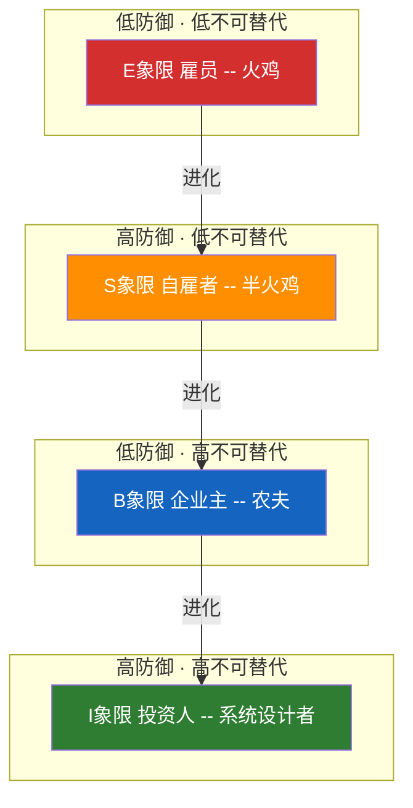

# 火鸡问题10：打工、存钱、买房，穷爸爸教你的每一件事都在养肥农夫

> 读完《富爸爸穷爸爸》冒出一个念头：穷人和中产就是火鸡，富人就是农夫。工资、储蓄、买房——这些被"穷爸爸"教了一辈子的"正确的事"，恰好是农夫在围栏里精心撒下的食物。火鸡们吃得很香，直到感恩节。

[火鸡问题1：系列总纲](fire-turkey-guide) ｜ [火鸡问题2：诊断工具箱](fire-turkey) ｜ [火鸡问题3：三层进化](fire-turkey-solution)

---

## 一、故事：两只火鸡走进围栏

穷爸爸火鸡读过好大学，毕业后进了一家大农场打工。农夫每月准时投喂——工资15号到账，13薪、五险一金、还有企业年金。穷爸爸很自律，每月把工资的20%存进银行，准备存够首付就买一套鸡舍。

"这是最稳妥的路。我父母这样做，同事这样做，所有人都这样做。"

富爸爸火鸡在围栏边观察了三年。他发现了三件事：

1. 投喂的粮食袋上印着一行小字——"扣税后"。吃之前，30%已经没了。
2. 存进银行的粮食，每年被"通胀"吃掉3%。存了十年，买力和七年前差不多。
3. 买鸡舍的火鸡签了30年合同。合同最后一页：银行在30年里拿走的粮食，差不多等于鸡舍价格的两倍。

富爸爸开始做一件所有火鸡都觉得疯了的事——减少给农夫打工的时间，在鸡舍外面种了一小片自己的玉米地。三年后，那片玉米地产出的粮食比他打工挣的还多。他把多余粮食借给别的火鸡，收取利息。十年后，他买下了半个农场。

穷爸爸被裁员了。存款够活两年。但他的鸡舍——那个供了八年的鸡舍——今年跌了20%。他不是净资产少了20%，是净资产里的80%在那一个东西上。

---

## 二、标准的火鸡结构

| 火鸡元结构 | 穷爸爸的火鸡陷阱 |
|-----------|----------------|
| 系统设计者 | 税法制定者、央行、大资本 |
| 农夫 | 雇主、银行、理财顾问、房产中介 |
| 火鸡 | 打工拿工资的雇员、存钱的储户、供房贷的"房主" |
| 投喂的食物 | 工资、年终奖、退税、信用卡额度、房贷预批 |
| 感恩节 | 裁员、通胀、金融危机、房产崩盘、退休金不够 |

清崎的四象限就是火鸡的生态位地图：

---

# 第一部分：诊断层

## 生物学：食物链，不是共生

穷爸爸的叙事是："我努力工作，公司给我工资——公平交换。"

生物学事实是：雇主雇你，因为你产出的价值大于你的工资。差价叫利润。雇主的利益不是"让你过得好"，而是**最大化差价的同时确保你不会走**。这不是共生。每一级都在吃下一级——资本吃企业、企业吃雇员、通胀吃储蓄。

清崎最狠的一刀："你的房子并非资产。"在生物学框架里——资产是给你持续产出东西的（果树），负债是持续从你身上汲取资源的（寄生虫）。自住房每月吃掉你的物业费、维修费、房贷利息——它是寄生虫。你以为你是房主，你是管家。

**诊断问题**：你的收入中，有多少是"拿命直接换的"（工资、计时收费），有多少是"不需要你的生命时间也能持续产出的"？

---

## 经济学：激励、税收与通胀

**第一层：谁在投喂你？他的激励是什么？**

| 农夫 | 投喂的食物 | 他真正的激励 |
|------|----------|------------|
| 雇主 | 工资、奖金、职级 | 用最低成本获取最大产出，直到可以替换你 |
| 银行 | 房贷、信用卡、消费贷 | 让你付30年利息。你不违约就行——房子是你的，利息是它的 |
| 房产中介 | "现在是上车最好时机" | 交易佣金。涨跌他都赚钱 |
| 理财顾问 | "这只基金年化15%" | 管理费。赚了分他，赔了你全担 |
| 政府 | 退税、社保、养老金 | 从你工资预扣，几十年后还你一个被通胀吃掉大半的版本 |

**第二层：税——两套规则。**

清崎的核心发现：富人不是因为赚得多才交税少。是**税法本身为资产收入留了后门，而工资收入无路可逃**。

火鸡（雇员）的收入流：工资 → 先交税 → 剩下的再花
富人（投资人）的收入流：资产增值 → 税前抵扣折旧、利息、运营成本 → 卖的时候按资本利得交税（比工资税低得多）→ 或者不卖——借出来花（借钱不用交税）

同一本税法。两套规则。不是漏洞——是系统设计。

**第三层：通胀——最安静的收割机。**

印钱 → 储蓄缩水 → 被迫"投资"对抗通胀 → 钱进了金融市场 → 富人资产价格上涨。通胀不是自然现象。它是一个从储蓄者到资产拥有者的财富转移机器。火鸡站在错的接收端。

> 经济学诊断的核心：你的钱从哪个口进来？那个口的税率是多少？那个口的主人是谁？

---

## 历史学：感恩节反复上演

穷爸爸的历史数据是："我工作了二十年，每年涨薪。房子买了十年，每年升值。存款利息每月准时到。"

但数据集里缺了这些：

- 1997年亚洲金融危机：白领火鸡一夜之间一半被裁
- 2008年美国次贷危机：房子资不抵债，存款见底，养老金腰斩
- 2022-2023年科技裁员潮：大厂十万火鸡同一天失去投喂
- 每一次降息周期 → 资产暴涨，富人翻倍。每一次加息周期 → 房贷飙升，火鸡月供翻倍

**每一次危机都是一次感恩节。每一次危机过后，财富从中产向富人转移了一次。而火鸡用"这只是暂时的"解释了一切。**

**诊断问题**：你的财务经验跨越了几个完整经济周期？你经历过利率从0%涨到5%吗？没经历过，凭什么觉得不会发生？

---

## 心理学：穷爸爸火鸡的核心偏误

| 芒格的误判倾向 | 穷爸爸火鸡的表现 |
|--------------|----------------|
| 奖励超级反应 | 每月工资到账——"做得对，继续这样" |
| 社会认同倾向 | "大家都这样理财"——存钱、买房、供房贷、等退休 |
| 简单联想倾向 | 房子升值 = 我很有钱。实际上你只有一套，卖了你住哪？ |
| 避免不一致倾向 | "我都供了八年房贷了，现在说买错了怎么面对家人" |
| 过度乐观倾向 | "公司不会裁我的"，"房价长期看涨"，"养老金肯定够" |

（完整 25 种误判 × 财务场景见[火鸡问题特辑：二十五种误判倾向全解析](fire-turkey-25-biases)）

---

## 概率论：40年工薪模型 = 364天投喂模型

穷爸爸的归纳法："努力工作 → 涨工资 → 存钱 → 买房 → 等升值 → 退休有保障。"

这条链的每一个箭头都锚定在"系统结构不变"上。但税法会改、利率会变、产业会被颠覆、货币会贬值。任何一环变化，整条链一起断。

> 火鸡弗兰克的364天投喂模型。穷爸爸火鸡的40年工薪模型。同一种归纳法错误。时间尺度不同，死亡方式相同。

---

### 诊断总结

| 模型 | 结论 |
|------|------|
| 生物学 | E 象限是食物链底端——你的时间比你的劳动值钱，你的劳动比资产增值的税率高 |
| 经济学 | 每一个投喂你的人都在从你身上换取更多。税法是给资产写的，通胀是给储蓄者挖的 |
| 历史学 | 每一次危机都是财富从火鸡到农夫的转移。你没经历过的结构断点，正在路上 |
| 心理学 | 社会认同 + 避免不一致 + 奖励超级反应，三力合奏，让你把牢笼当安全屋 |
| 概率论 | 40年工薪稳定模型 = 364天投喂模型。系统结构不可假设为不变 |

**穷爸爸火鸡的生态位 = 高依赖 × 低防御 × 高税率 × 零资产。**

---

# 第二部分：解法层

## 防御：资产重分类——你拥有的到底是不是资产？

防御的目标不是"辞职创业"。防御是在你还拿工资的时候，挖第一条地道。

**清崎对资产的定义只有一句话：资产是把钱装进你口袋的东西。负债是把钱从你口袋拿走的东西。**

| 你以为的资产 | 实际上是 |
|------------|---------|
| 自住房 | 负债——每月从你口袋拿走房贷、物业、维修 |
| 银行存款 | 慢性出血——每年被通胀吃掉2%-4% |
| 车 | 折旧机器——落地贬值20% |
| 养老金账户 | 税金递延——退休取出时还是要交税，且那时可能是你一生最高税率 |

防御的第一步不是行动，是**诚实分类**。把你名下每一样"资产"拿出来，问一句话：它每月把钱装进我口袋，还是从我口袋拿走？

**防御清单**：

| 维度 | 穷爸爸火鸡 | 防御后 |
|------|----------|--------|
| 收入 | 唯一工资 | 工资 + 副业 + 投资收入 |
| 支出 | 先消费，剩下的存 | 先支付自己（投资），剩下的消费 |
| 知识 | 不看、不懂、靠顾问 | 读税表、读财报、理解复利和杠杆 |
| 退出能力 | 零个月——停薪就停摆 | 六个月生活费在现金账户里 |

---

## 进攻：从 E 走到 S，再走到 B

防御让你不被一次感恩节收割干净。进攻让你长出自己能产粮的能力。

**清崎的进攻路线图：E → S → B → I**

| 象限 | 火鸡角色 | 收入性质 | 税收待遇 |
|------|---------|---------|---------|
| E（雇员） | 火鸡 | 工资——先交税 | 最高税率，几乎无抵扣 |
| S（自雇） | 半火鸡 | 自己干——税后花 | 有抵扣，但还是用时间换钱 |
| B（企业主） | 农夫 | 系统替你赚钱——花前抵扣 | 大量合法抵扣项 |
| I（投资人） | 系统设计者 | 资产替你赚钱——资本利得税 | 最低税率，可无限抵扣 |

**进攻的核心：买真正的资产，一个就够。**

收租的房产是资产。分红到账的股票是资产。自动运转的小企业是资产。你在睡觉它也在给你挣钱的——才叫资产。

**一个通信程序员能做什么？**
- 周末写一个工具，卖给需要的人（S 象限入门）
- 把公司某个重复流程用自动化替代，然后把这个工具授权给其他公司（从 S 到 B）
- 拿 S 或 B 产生的现金流，去买指数基金或收租房产（从 B 到 I）

每一步都在从"拿命换钱"里抽离出来。每一步都在建立你越来越不需要"被农夫投喂"的结构。

---

## 共生：用农夫的规则，走四条车道

清崎最颠覆的观点是这个：

> "穷人和中产努力工作、存钱、交税——然后抱怨富人交税少。富人在游戏规则里找到了四条车道，而穷人和中产只看到了一条，还骂走四条车道的人不公平。"

火鸡的终极进化不是从农场逃跑。是**搞懂农夫的税收日历，然后自己也走上那四条车道**。

| 火鸡的旧规则 | 富人的新规则（共生） |
|------------|-----------------|
| 打工挣钱 → 先交税 → 再花剩下的 | 开公司 → 先花（抵扣成本）→ 剩下的才交税 |
| 存钱进银行，吃0.5%利息 | 存钱在资产里——让通胀帮你还债 |
| 用自己的钱投资 | 用 OPM（别人的钱）——银行贷款、投资人资金去投资 |
| 卖资产要交税 | 不卖——借出来花。借钱不用交税 |

共生不等于"变成你憎恨的那种富人"。共生是——你理解了游戏规则，你不再是被规则收割的那一方。

---

# 第三部分：完整进化图

| 阶段 | 角色 | 核心动作 |
|------|------|---------|
| 原始 | E 象限火鸡 | — |
| 防御 | 觉醒火鸡 | 停止把负债叫资产，先付自己，建六个月退出能力 |
| 进攻 | S → B 农夫 | 用业余时间建第一个不需你亲自在场的收入系统 |
| 共生 | I 系统设计者 | 玩富人的规则，走富人的车道——杠杆、抵扣、资本利得 |

---

## 自检清单

| 维度 | 自检问题 | 危险信号 |
|------|---------|---------|
| 收入来源 | 你只有一个收入来源吗？ | "我的收入很稳定" |
| 资产分类 | 你的房子每月净流出多少？ | "房子是最好的投资" |
| 税收位置 | 你的收入是先交税还是先花再交税？ | "退税是好事" |
| 金融知识 | 你算得清30年房贷总利息吗？ | "我相信银行给的方案" |
| 退出能力 | 明天被裁，没工资，能活多久？ | "公司不会裁我的" |
| 时间换钱 | 你的全部收入都需要你亲自出现？ | "我还能再干二十年" |

---

> 清崎和芒格在同一个结论上握手：
>
> "学校体系永远不会教你怎么赚钱。它只教你怎么成为一个好雇员。"
>
> 一个好雇员，在清崎眼里——在火鸡问题的框架里——就是一只被训练得最好的火鸡。每天准时出现在围栏边，等着农夫投喂。从不问农夫为什么愿意喂它。只想着多存几粒玉米，好在感恩节那天——发现玉米已经被通胀吃掉了一半。
>
> 你不是穷爸爸火鸡。你读到了这里。

---

**系列导航**：
- [火鸡问题1：系列总纲](fire-turkey-guide)
- [火鸡问题2：诊断工具箱](fire-turkey)
- [火鸡问题3：三层进化](fire-turkey-solution)
- [火鸡问题5：投资场景](fire-turkey-investment)
- [火鸡问题特辑：二十五种误判倾向](fire-turkey-25-biases)

**标签**：`火鸡问题` `富爸爸穷爸爸` `清崎` `财务自由` `四象限` `资产vs负债` `税收` `通胀` `系统思维`
