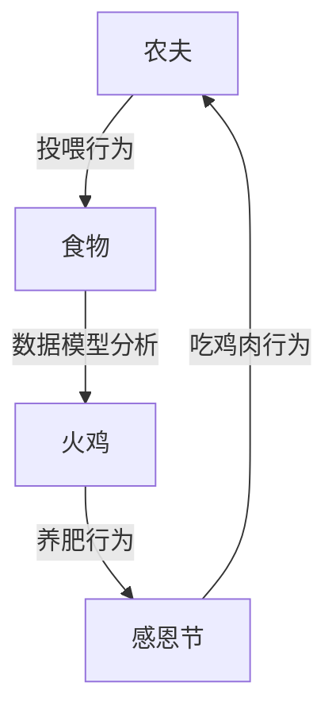
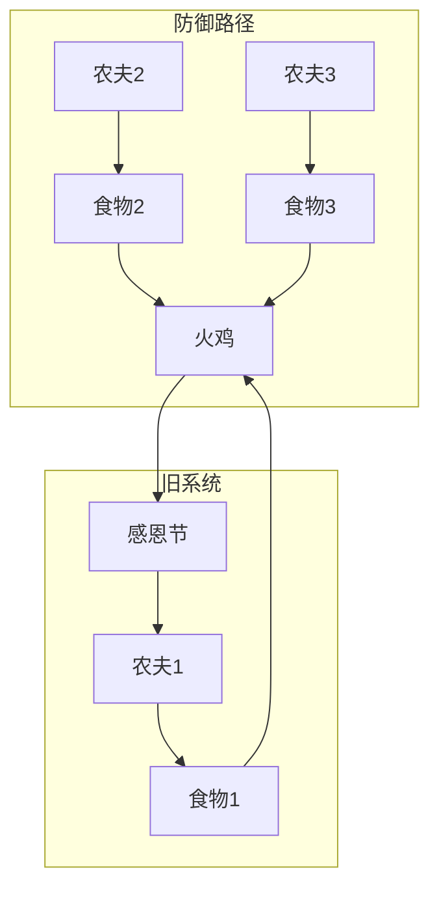
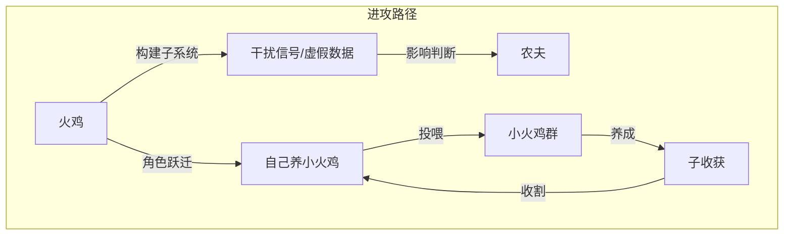
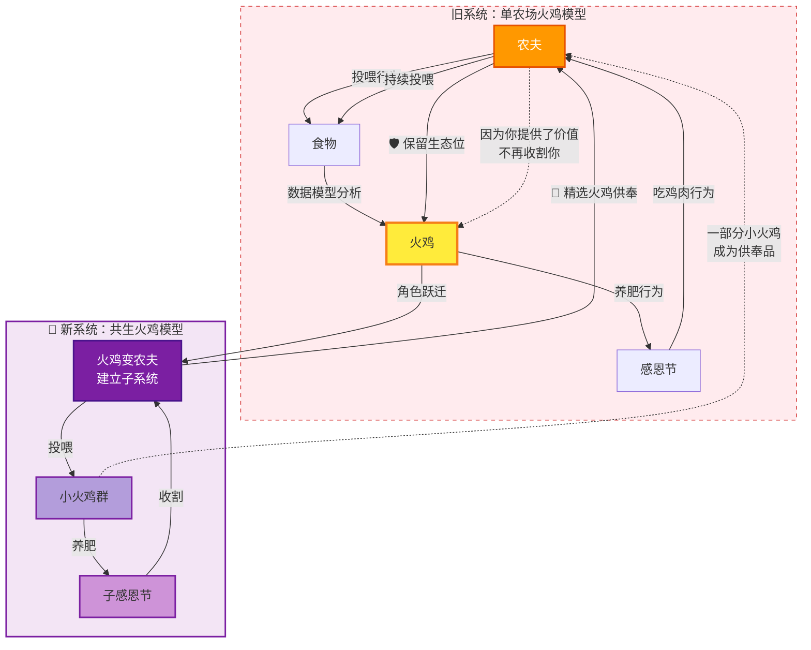
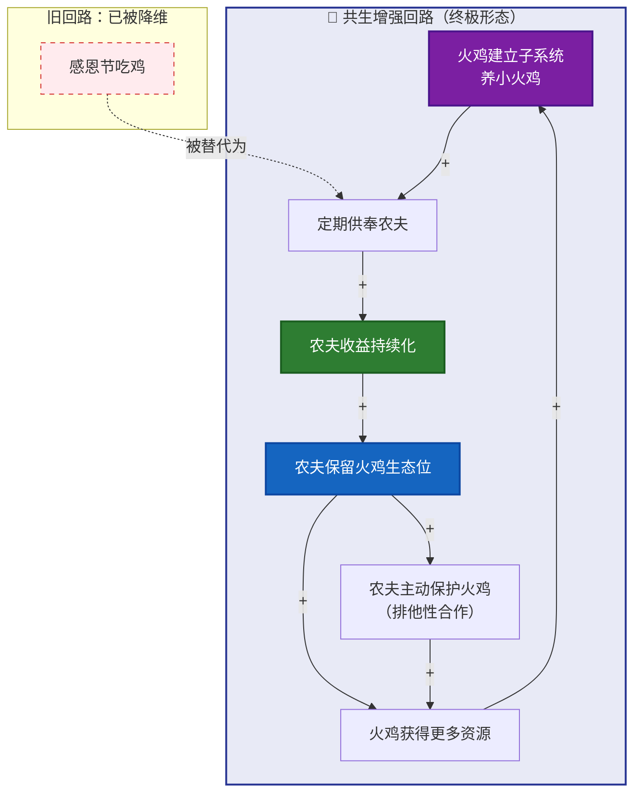
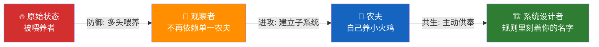
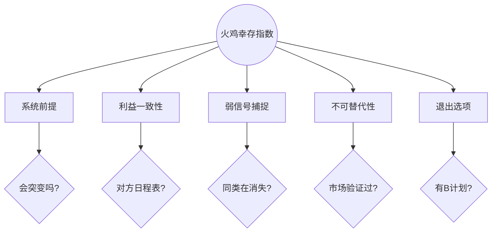

# 火鸡问题3：三层进化——防御、进攻、共生

> 本文是火鸡问题系列的解法层。[上一篇](fire-turkey)给出了诊断工具箱——用生物学×心理学×经济学×历史学四个透镜看清系统的裂缝。这一篇讲怎么破。解法不是一条路，是三级阶梯：防御、进攻、共生。

[火鸡问题1：从思维实验到行动指南](fire-turkey-guide) ｜ [火鸡问题2：诊断工具箱](fire-turkey)

---

## 诊断回顾：你手里已经有了什么

从上一篇的诊断结果出发，你通常会发现三件事同时成立：

1. **你的生态位为零** —— 防御性 × 不可替代性，两个维度都站不住
2. **你依赖单一喂养者** —— 在一个农夫手里讨生活，他对你有隐藏日程
3. **你收集的数据里没有结构断点** —— 不是数据不够，是采样窗口太窄

诊断层告诉你"死在哪里"。解法层的任务，是让你"永远不去那个地方"。

---

# 第一部分：防御路径——多头喂养

## 打破单点依赖

在原始模型里，单农场的结构是这样的——一个闭合的死亡回路：

火鸡只有一个农夫。所有食物、所有安全感、所有数据，都来自同一个来源。当这个来源切换目标，火鸡瞬间归零。

防御路径的核心逻辑——**引入多个农夫，让任何一个都没法单独掐死你**：

更多农夫 = 更多信息源、更多退出选项、更多的"农场之间的竞争"。但这只是防御。防御给的是时间，不给安全。

---

## 防御的实战清单

| 依赖类型 | 火鸡状态 | 防御后状态 |
|----------|----------|------------|
| 收入 | 单一工资 | 副业+投资+工资，三线并行 |
| 技能 | 组织内专用 | 市场可验证——你的技能拿出去，有人买单吗？ |
| 身份 | 公司工牌 | 独立个人品牌——你的名字本身就是资产 |
| 信息 | 只从上级获取 | 多元信号源——同行、异业、跨领域 |
| 客户 | 一个大客户占80% | 最大客户不超过30% |

一个最核心的检验标准：**你的技能，拿到市场上能单独卖吗？如果明天失业，多久能找到同等收入的工作？**

---

# 第二部分：进攻路径——建立子系统

## 从火鸡变农夫

防御让你不被杀。进攻让你长出自己的农场。

核心动作：**建立子系统**——不是逃离旧系统，是在旧系统之内或旁边，创建你自己拥有规则制定权的子系统。

**火鸡弗兰克可以做什么？**

如果它在第 180 天发现裂缝，它可以——
- 不再把所有蛋下在农夫的鸡舍里，在外面找个野地也下一窝
- 学会识别野地里的食物，减少对农夫投喂的依赖
- 观察哪些同类消失了，什么时候消失的，建立自己的风险数据集
- 用学到的信号去试探农夫的真实意图，而不是只收集投喂数据

> 信息伪装也好，虚假体重也好，本质上都是——**你不再让农夫的数据模型得到它想要的精确反馈**。你的不可预测性，就是你的保护色。

---

# 第三部分：终极形态——共生回路

## 把零和变成正和

前面的防御和进攻，本质都是在延长你的生存窗口，但没有改变游戏性质。只要农夫的利益 = 把你吃掉，你们就是在零和博弈。

**真正的破局，是把零和变成正和。**

核心动作：**火鸡不跑了。它主动供奉**。

> **你养的火鸡中，分一部分供奉给原来的农夫。**

农夫得到了什么？**不用自己养、不用喂、到了感恩节就有人送鸡肉上门。**

你得到了什么？**你从"被收割的资产"变成了"持续产出的资产"。农夫舍不得杀你了——杀了你，明年谁给他送鸡肉？**

| 旧关系 | 新关系 |
|-------|-------|
| 农夫养火鸡 → 吃火鸡 | 火鸡养小火鸡 → 供奉农夫 |
| 一次性收割 | 持续分红 |
| 零和博弈 | 正和共生 |
| 你是资产（待宰） | 你是合伙人（不可替代） |

---

## 农夫的算盘

假设你是农夫，你有两只火鸡——

**火鸡A**：每天吃你的食物，长得很肥，感恩节可以杀，但杀了就没了。明年得从头养。

**火鸡B**：吃你的食物，但它自己也养了一群小火鸡。每年感恩节它主动挑两只最肥的小火鸡送给你。你算了算——
- 杀火鸡A = 一顿饱饭
- 留着火鸡B = 每年都有火鸡肉吃，还不用自己操心

**你会杀火鸡B吗？** 不会。你会给它更多的食物，让它养更多的小火鸡。你甚至会保护它不被别的农场主抢走。

> **这就是共生关系的底层逻辑：你的存在，降低了他的成本，或者提升了他的收益——而且是持续性的。**

---

## 共生回路系统图

---

## 共生增强回路

一旦进入这个回路，农夫不仅不杀你——他还怕你被别的农夫抢走：

---

## 共生的三个层级

| 层级 | 供奉内容 | 共生深度 | 风险 |
|------|---------|---------|------|
| **一级：工具供奉** | 你做的工具/系统嵌入对方流程 | 中 | 工具可能被接手 |
| **二级：人才供奉** | 你培养的人补充对方团队 | 高 | 需要持续培养能力 |
| **三级：规则供奉** | 你定义的标准/方法论被对方采用 | 极高 | 你成为行业基础设施 |

**三级共生**就是"系统设计者"——当你定义的标准被农夫采纳为默认标准时，你不是他的供应商，你是他的底层架构。

> **一级供奉保饭碗，二级供奉保生态位，三级供奉让你的名字刻在规则上。**

---

# 第四部分：三层进化全景图

| 阶段 | 核心机制 | 火鸡命运 | 生态位公式 |
|------|----------|----------|-----------|
| 原始模型 | 单农场投喂→养肥→收割 | 被收割 | 防御性0 × 不可替代性0 = 0 |
| 防御路径 | 多头喂养打破单点依赖 | 延缓收割 | 防御性↑ |
| 进攻路径 | 建立子系统分散风险 | 自己成为农夫 | 不可替代性↑ |
| 共生回路 | 主动供奉，农夫转为保护者 | 长久共存 | 防御性高 × 不可替代性高 |

---

## 通信程序员的"供奉"是什么

把共生模型套回现实——假设你是那个深耕通信10年的程序员：

**你是火鸡B**。你的原始农夫是雇主/行业。

**你建立子系统**：你做了一套自动化的通信协议测试工具，或者一个开源库，或者一个培训课程，或者一个垂直领域的AI诊断系统。这些就是你的"小火鸡"。

**你供奉给农夫的价值**：
- 你的工具让原来的团队效率翻倍 → 供奉 = 生产力提升
- 你培养的新人填补了团队缺口 → 供奉 = 人才输送
- 你的开源库成为公司也依赖的基础设施 → 供奉 = 技术债务减免
- 你的AI诊断系统帮运维团队减少了凌晨报警 → 供奉 = 稳定性

**农夫的反应**：
- 他舍不得裁你了——裁了你，工具谁维护？新人谁带？系统谁兜底？
- 他甚至会给你更多资源——因为你已经证明你能"产出火鸡"，而不仅仅是"消耗食物"
- 你的"感恩节"被无限期推迟了——不是因为农夫心善，而是因为你的存在已经嵌入他的利益链

---

# 第五部分：火鸡幸存者自检清单

| 维度 | 自检问题 | 危险信号 |
|------|---------|---------|
| 系统前提 | 我所在的系统会发生结构性突变吗？ | "这个行业永远被需要" |
| 利益一致性 | 资源提供者的利益和我完全一致吗？ | 对方的日程表我不清楚 |
| 弱信号捕捉 | 有没有"同类"正在消失？ | 离职的同事、流失的客户、被颠覆的同行 |
| 替代性 | 我的不可替代性是可验证的吗？ | 安全感全部来自"工龄/惯性" |
| 退出选项 | 如果系统明天崩了，我有B计划吗？ | 完全依赖单一收入/客户/平台 |

---

## 芒格会怎么说

> "如果你想要说服一个人，最好的方式不是诉诸他的怜悯，而是诉诸他的利益。"

火鸡求农夫别杀自己——这是诉诸怜悯，没用。

火鸡每年送一批更肥的火鸡给农夫——这是诉诸利益，有用。

> **安全感的最高形式，不是对方不忍心杀你，而是对方舍不得杀你。**
>
> **前者靠感情，后者靠利益。感情会变，利益不会。**

---

## 一句话

> 别把被喂养，当成被需要。不要祈祷农夫变善良——让自己不再需要农夫。更进一步——让农夫需要你。

你对火鸡问题的理解，从"怎么不被杀"到"怎么让杀我变成亏本生意"，再到"怎么让不杀我变成更优的资源配置"——

你已经不是弗兰克了。你是那个会在第360天主动走进农夫家、端着一盘烤火鸡、然后说"我们谈谈明年合作方案"的——**前火鸡，现合伙人。**

---

**系列导航**：
- 上一篇：[火鸡问题2：诊断工具箱——归纳法为什么失效](fire-turkey)
- 场景应用：[火鸡问题5：投资场景](fire-turkey-investment) ｜ [火鸡问题6：职业场景](fire-turkey-career) ｜ [火鸡问题7：商业场景](fire-turkey-business)
- 深度：[火鸡问题8：共生回路终极解法](fire-turkey-symbiosis) ｜ [火鸡问题9：通信程序员案例](fire-turkey-telecom-programmer)

**标签**：`火鸡问题` `系统设计者` `共生` `博弈论` `正和博弈` `查理·芒格` `生态位`
