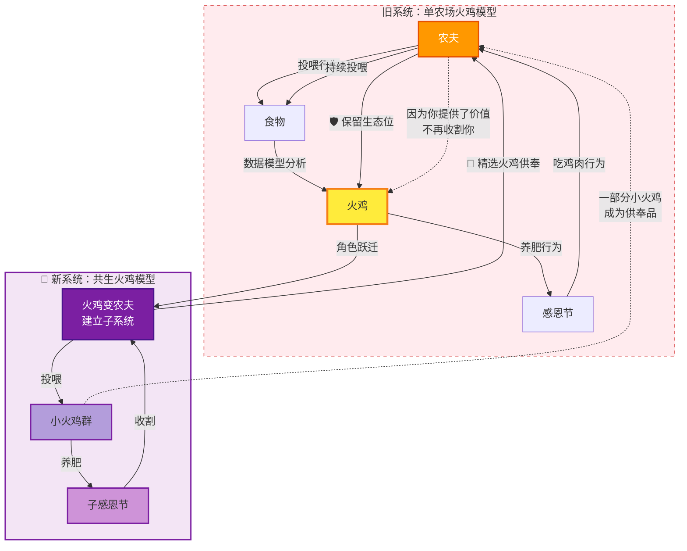
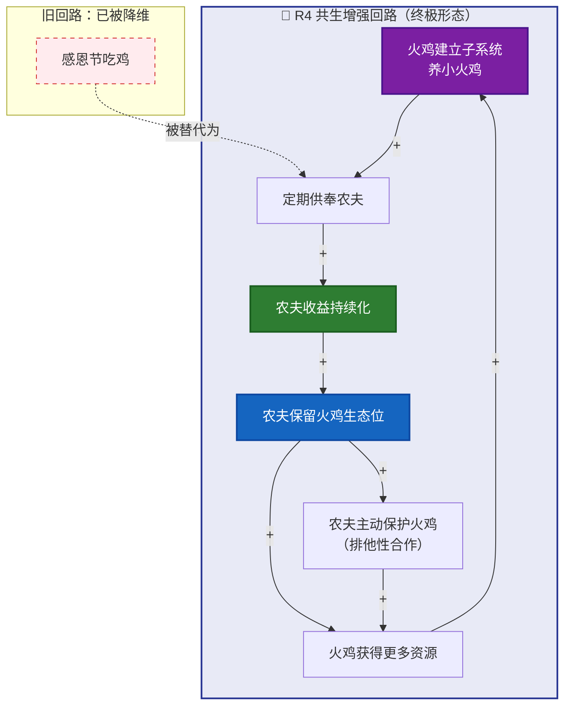

# 火鸡问题8：终极解法——共生回路，让杀你变成亏本生意

> 本文是火鸡问题系列的第八篇，也是整个体系最深的一层洞察。前三篇拆了投资、职业、商业三个场景的火鸡陷阱——这一篇回答那个终极问题：**怎么破？**

[火鸡问题1：从思维实验到行动指南](fire-turkey-guide) ｜ [火鸡问题5：投资场景](fire-turkey-investment) ｜ [火鸡问题6：职业场景](fire-turkey-career) ｜ [火鸡问题7：商业场景](fire-turkey-business)

---

## 前言：从"怎么不被杀"到"怎么让杀我变亏本"

前面七篇讲的都是防御——识别农夫、分散依赖、捕捉弱信号、保留退出能力。

防御让你活得更久，但不能改变游戏的本质。只要农夫和火鸡的关系还是零和——农夫的利益 = 把你养肥然后吃掉，你的利益 = 不被吃掉——你就永远在逃。

**有没有一种解法，不逃、不骗、不躲，而是彻底改变这个游戏的性质？**

有。它叫共生回路。

---

## 旧关系的本质：零和博弈

在旧系统里，农夫和火鸡是**零和关系**——

> 农夫的利益 = 把火鸡养肥然后吃掉
>
> 火鸡的利益 = 不被吃掉
>
> 这两者不可调和。火鸡越安全，农夫越饿。

所以你之前所有的路都是"逃离零和"——多头喂养是降低依赖，建立子系统是让自己退出游戏。

但你能逃一辈子吗？

---

## 真正的破局：把零和变成正和

这个洞察是把路径一（多头喂养）和路径二（建立子系统）缝合在一起，而且缝合的方式不是"逃跑"，而是**"反向嵌入"**——

> **你养的火鸡中，分一部分供奉给原来的农夫。**

农夫得到了什么？**不用自己养、不用喂、到了感恩节就有人送鸡肉上门。**

你得到了什么？**你从"被收割的资产"变成了"持续产出的资产"。农夫舍不得杀你了——杀了你，明年谁给他送鸡肉？**

关系变了——

| 旧关系 | 新关系 |
|-------|-------|
| 农夫养火鸡 → 吃火鸡 | 火鸡养小火鸡 → 供奉农夫 |
| 一次性收割 | 持续分红 |
| 零和博弈 | 正和共生 |
| 你是资产（待宰） | 你是合伙人（不可替代） |

---

## 升级版系统循环图：共生回路

---

## 农夫的算盘：一个思维实验

假设你是农夫，你有两只火鸡——

**火鸡A**：每天吃你的食物，长得很肥，感恩节可以杀，但杀了就没了。明年得从头养。

**火鸡B**：吃你的食物，但它自己也养了一群小火鸡。每年感恩节它主动挑两只最肥的小火鸡送给你。你算了算——

- 杀火鸡A = 一顿饱饭
- 留着火鸡B = 每年都有火鸡肉吃，还不用自己操心

**你会杀火鸡B吗？** 不会。你会给它更多的食物，让它养更多的小火鸡。你甚至会保护它不被别的农场主抢走。

> **这就是共生关系的底层逻辑：你的存在，降低了他的成本，或者提升了他的收益——而且是持续性的。**

---

## 共生增强回路：终极形态

一旦你进入这个回路，农夫不仅不杀你——他还怕你被别的农夫抢走。他会主动给你更多资源、更多保护。因为他已经把你写进了他的损益表，而且那一栏写着"收入"，不是"成本"。

---

## 共生的三个层级

| 层级 | 供奉内容 | 共生深度 | 风险 |
|------|---------|---------|------|
| **一级：工具供奉** | 你做的工具/系统嵌入对方流程 | 中 | 工具可能被接手 |
| **二级：人才供奉** | 你培养的人补充对方团队 | 高 | 需要持续培养能力 |
| **三级：规则供奉** | 你定义的标准/方法论被对方采用 | 极高 | 你成为行业基础设施 |

**三级共生**就是你之前说的"系统设计者"——当你定义的标准被农夫采纳为默认标准时，你不是他的供应商，你是他的底层架构。

> **一级供奉保饭碗，二级供奉保生态位，三级供奉让你的名字刻在规则上。**

---

## 通信程序员的"供奉"是什么

把这个模型套回现实——假设你是那个深耕通信10年的程序员。

**你是火鸡B**。你的原始农夫是雇主/行业。

**你建立子系统**：你做了一套自动化的通信协议测试工具，或者一个开源库，或者一个培训课程，或者一个垂直领域的AI诊断系统。这些就是你的"小火鸡"。

**你供奉给农夫的价值**：
- 你的工具让原来的团队效率翻倍（供奉 = 生产力提升）
- 你培养的新人填补了团队缺口（供奉 = 人才输送）
- 你的开源库成为公司也依赖的基础设施（供奉 = 技术债务减免）
- 你的AI诊断系统帮运维团队减少了凌晨报警（供奉 = 稳定性）

**农夫的反应**：
- 他舍不得裁你了——裁了你，工具谁维护？新人谁带？系统谁兜底？
- 他甚至会给你更多资源——因为你已经证明你能"产出火鸡"，而不仅仅是"消耗食物"。
- 你的"感恩节"被无限期推迟了——不是因为农夫心善，而是因为你的存在已经嵌入他的利益链。

---

## 芒格会怎么说

> "如果你想要说服一个人，最好的方式不是诉诸他的怜悯，而是诉诸他的利益。"

——这不是在说火鸡和农夫吗？

火鸡求农夫别杀自己——这是诉诸怜悯，没用。

火鸡每年送一批更肥的火鸡给农夫——这是诉诸利益，有用。

> **安全感的最高形式，不是对方不忍心杀你，而是对方舍不得杀你。**
>
> **前者靠感情，后者靠利益。感情会变，利益不会。**

---

## 三层进化路径总览

| 阶段 | 名称 | 核心机制 | 火鸡命运 |
|------|------|----------|----------|
| 原始模型 | 农夫-火鸡-感恩节回路 | 单农场 R 增强回路：投喂 → 信心增长 → 养肥 → 收割 | 被收割 |
| 防御与进攻路径 | 火鸡自救系统 | 多头喂养打破单点依赖；建立子系统分散风险 | 延缓收割，但未彻底摆脱 |
| 终极形态 | 共生回路 | 火鸡主动供奉，农夫从收割者转为保护者 | 长久共存 |

---

## 关键洞察

1. **归纳谬误的破解**：火鸡问题的根源不是喂食规律本身，而是结构性的权力不对等和自我强化的 R 回路。自救系统只是扰动，共生方案重构了回路性质。

2. **从对抗到共生**：最优生存策略不是逃跑或欺骗，而是让捕食者"不愿一次吃光"，即引入长期利益绑定。

3. **打破 R 增强回路不是靠对抗，而是靠引入新的利益闭环**——将收割者转化为共生者，火鸡才能真正摆脱感恩节。

---

> 你已经不是弗兰克了。
>
> 你是那个会在第360天主动走进农夫家、端着一盘烤火鸡、然后说"我们谈谈明年合作方案"的——
>
> **前火鸡，现合伙人。**

---

**系列导航**：
- 上一篇：[火鸡问题7：商业场景深度](fire-turkey-business)
- 下一篇：[火鸡问题9：通信程序员案例——一只看见裂缝的火鸡](fire-turkey-telecom-programmer)

**标签**：`火鸡问题` `共生` `博弈论` `正和博弈` `系统思维` `查理·芒格` `利益结构` `生态位`
