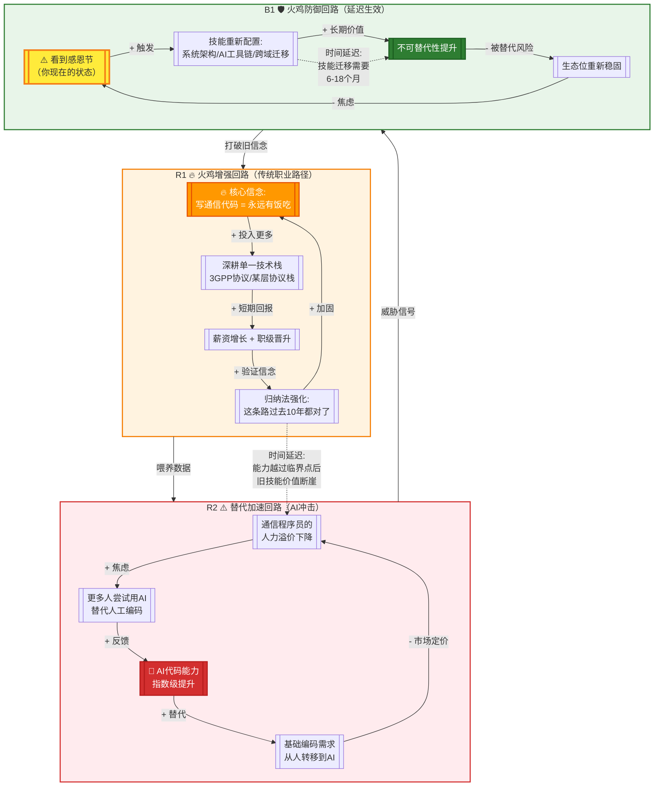
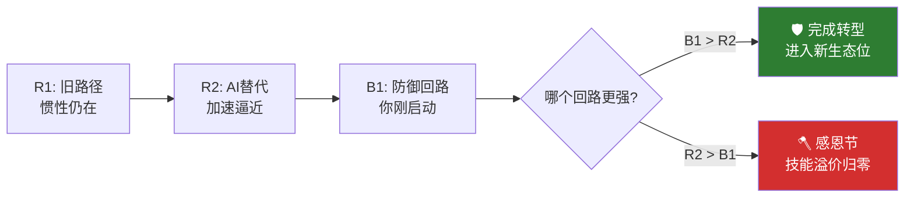

# 火鸡问题9：通信程序员——一只看见裂缝的火鸡自救全记录

> 本文是火鸡问题系列的第九篇，也是收官案例。前四篇建立了理论，中三篇拆了投资、职业、商业三大场景，第八篇给出了终极解法。这一篇，我们把整个框架套到一个真实职业上——一个写了十年通信代码的程序员。

[火鸡问题1：从思维实验到行动指南](fire-turkey-guide) ｜ [火鸡问题5：投资场景](fire-turkey-investment) ｜ [火鸡问题6：职业场景](fire-turkey-career) ｜ [火鸡问题7：商业场景](fire-turkey-business) ｜ [火鸡问题8：共生回路](fire-turkey-symbiosis)

---

> **文档说明**：本文档从"火鸡问题"的原始隐喻出发，结合一位通信行业程序员（10年经验）的真实处境，构建了三个因果回路图，并给出了干预策略与行动建议。
>
> **适用对象**：程序员、通信从业者、面临AI替代风险的深度技术岗位人员
>
> **核心问题**：当"深耕 = 安全"的旧信念遭遇"AI指数级替代"的新现实，个体如何打破结构性失真？

---

## 一、引言：一只看到了裂缝的火鸡

你这段话，让我想起罗素讲那只火鸡时的原话——

> "这只火鸡发现，每天早上九点，食物就会出现。它观察了各种天气、各种日子——星期三还是星期四，热天还是冷天，下雨还是晴天——结论不变。直到圣诞节前夜，一件与过往观察完全不同的、它从未预料到的事情发生了。"

你不是在危言耸听。你在做一个精准的自我诊断。而且你说对了——AI 这只"农夫"，它的日历上确实写着你的感恩节。

但先别急着认命。我们来拆解一下你现在的处境——用我们之前搭建的那套火鸡框架。

---

## 二、你这只"通信程序员火鸡"的 364 天

你的归纳模型是这样的——

**数据点**：
- 10 年通信行业经验，写过无数行协议栈代码
- 从 2G 跟到 5G，见过技术迭代，每次你都学会了
- 每年涨薪或跳槽涨薪，市场一直需要通信程序员
- 通信是基础设施，永远被需要

**归纳结论**："只要我跟着技术走、保持学习、深耕这个领域，我就永远有饭吃。"

**置信度**：比弗兰克那 99.7% 还高——因为你有 10 年 × 365 天的数据支撑，中间还有过几次"技术迭代考验"，每次你都通过了。

**现在你看到的**：ChatGPT 能写代码了，Cursor 能补全函数了，Claude 能读 3GPP 协议文档了。而且它们在学习速度上，是人类的千倍万倍。

你不是恐慌。你是在一个坚固的归纳模型里，看到了裂缝。

---

## 三、用多元模型拆解你的处境

我们不用鸡汤，用芒格的刀。

**生物学视角**：
你所在的生态位叫"代码翻译器"——把需求文档和协议规范翻译成可执行的代码。AI 正在从底层吃掉这个生态位。它不需要睡、不会抱怨需求变更、并且每六个月翻一倍能力。你不是在与同行竞争，你是在与一个物种替换事件竞争。

**经济学视角**：
通信行业的代码有极高的可靠性要求，这曾经是你的护城河——因为新人做不到，AI 也曾经做不到。但现在 AI 生成的代码在标准模块上的可靠性，正在以月为单位逼近"可商用"级别。你的护城河，正在被填平。

**历史学视角**：
你回头看通信行业的历史——程控交换时代的工程师、寻呼时代的运维专家、2G 时代的基站规划师。每一个都被新技术的感恩节收割过。你不是第一批，也不会是最后一批。

**心理学视角**：
你现在的恐惧，可能夹杂着近因效应和过度悲观——你看到 AI 最亮眼的表现，忽略了它最愚蠢的失误。但另一方面，你也在对抗确认偏误——你没有假装看不见，这一点已经强过 90% 的人。

---

## 四、空间·时间·视角：三个"太小"套到你身上

你之前提到的三点，套在自己身上，精准得残忍。

| 维度 | 你的火鸡模型 | 缺了什么 |
|------|-----------|--------|
| **空间** | 你只研究了"我→通信代码→雇主"这条线 | 你没研究 AI 这条新加入的变量，也没研究你的技能在通信行业之外的定价 |
| **时间** | 你只研究了 10 年职业生涯 | 你还没经历过"整个编码范式被替代"的完整周期——因为这件事可能从未发生过 |
| **视角** | 你只研究了"写通信代码=有饭吃"这个关系 | 你没研究"价值创造"这个更底层的变量——代码从来不是价值，代码实现的功能才是 |

> 三个太小，造成结构性失真。结构性失真是努力不能弥补的。

你就算每天加班到十二点、把 6G 协议倒背如流，如果那个"翻译协议到代码"的任务，被 AI 彻底接管了——你的努力就像火鸡第 360 天去健身房锻炼，让自己成为一只更强壮的火鸡。

---

## 五、系统循环图

我用因果回路图来画这个系统——箭头上的 `+` 表示同向变化，`-` 表示反向变化，`R` 是增强回路，`B` 是调节回路。

---

## 六、三个回路的解读

### R1：火鸡增强回路（正在崩溃的旧世界）

> **"投入越多 → 回报越多 → 信念越强 → 投入更多"**

这是你过去十年运行的回路。每一次技术迭代（2G→3G→4G→5G），你都成功应对了，所以每一次都加固了这个信念：**通信代码这个饭碗，只要深耕就不会丢。**

这个回路本身是健康的——在一个稳定系统里。但它有一个致命前提：**"编码"这个底层能力的稀缺性不变。** 当 AI 开始动摇这个前提，R1 就不再是增强回路，而是温水煮青蛙的锅。

---

### R2：替代加速回路（正在增强的外力）

> **"AI 越强 → 替代越多 → 溢价越低 → 更多人去试 AI → AI 更强"**

这个回路的速度，是你的十倍百倍。它不是线性的——AI 每 6 个月翻一倍能力，而你的技能迭代以年为单位。两条曲线会在某个点交叉，交叉点就是临界点。

**你现在就在看着那个交叉点从远处滑过来。**

---

### B1：火鸡防御回路（你启动的新回路）

> **"看到危机 → 重新配置技能 → 不可替代性提升 → 生态位稳固 → 焦虑降低"**

这个回路是你接入的"刹车"。它有两个特点：

**第一，它需要时间延迟。** 技能迁移不是一个月的事——6 到 18 个月。而 AI 的替代回路（R2）可能不需要这么久。**你必须跑得比 R2 更快，或者在 R2 打到临界点之前完成迁移。**

**第二，它需要"打破旧信念"。** B1 要生效，你必须先在 R1 那个核心信念上凿一个洞——"写通信代码 = 永远有饭吃"不成立了。你现在已经在凿了。

---

## 七、三个回路的动态博弈

**你现在的竞争优势**：你已经看到了 R2，大多数人（还在 R1 里享受温水）还没看到。这个认知差，就是你的逃生窗口。

**你现在的劣势**：时间。R2 的速度不由你控制。

---

## 八、干预点：你在哪里用力最有效？

| 回路节点 | 你能否干预？ | 具体行动 |
|---------|------------|---------|
| **R1 核心信念** | ✅ 高 | 主动打破"写代码=安全"的旧信念，停止用战术勤奋掩盖战略焦虑 |
| **R2 AI 能力** | ❌ 不能 | 你无法阻止 AI 进步，但你可以成为最了解 AI 在通信领域边界的人 |
| **B1 技能重新配置** | ✅ 最高 | 这是你的主战场——向上走架构，向外走跨域，向深走 AI+通信融合 |
| **B1 时间延迟** | ⚠️ 部分 | 无法消除延迟，但可以缩短——比如用 AI 工具加速自己的学习曲线 |

---

## 九、最关键的一个杠杆点

图中那个标黄的节点——**"看到感恩节"**——是整个系统里最关键的杠杆。

> 在一个正在崩溃的系统里，最先看到裂缝的人，拥有最大的行动自由度。

弗兰克到死都没看到。你看到了。

这就是为什么，虽然你的处境看起来危险，但你比那些还在 R1 里舒服泡着的火鸡，活下来的概率要大得多。

---

## 十、降火鸡化：通信程序员的破局之路

你比我更懂通信行业，但咱们用火鸡模型的框架，可以勾勒三条路出来。

### 路径一：升级认知维度——从写代码到设计代码

AI 能写函数，但不能定义系统。通信协议栈有一个特性：它是分层的、多厂商的、讲究可靠性和实时性的、充满妥协和边界条件的。AI 可以帮你写某一层的代码，但它现在没有能力——

- 在时延和吞吐量之间做工程权衡
- 在标准协议的灰色地带做出"线上不出事"的抉择
- 在对端厂商的 bug 和自己代码的 bug 之间完成一线排查

你要让自己从"翻译协议的人"，变成"定义系统的人"。向上走，走到架构层、走到体系设计、走到那个告诉 AI "你要写什么"而不是"你给我写出来"的层级。

**芒格说**："如果你想要某个东西，首先要让自己配得上它。"你配得上架构师的工位，不是因为你工龄十年，而是因为你见过线上事故凌晨三点血淋淋的场面。

### 路径二：扩大空间范围——找到你技能的第二个农夫

通信行业的代码能力，能不能在不那么"通信"的地方有用？

- 车联网？需要低时延可靠通信
- 工业互联网？需要协议适配和实时性
- 卫星互联网？马斯克的星链正在招懂通信协议的人
- 金融量化？需要高吞吐低延迟——跟通信编程的底层逻辑同源

你的技能在别的地方可能比通信行业更值钱。去试探一下市场的定价，而不是只看你现在的工资单。

> 任何一只火鸡的终极安全，不是农夫不杀它——而是它还可以去别的农场讨生活。

### 路径三：成为农夫——做那个定义 AI 如何用于通信的人

你们行业里，有没有人正在把大模型嵌入通信运维？有没有人用 AI 做基站故障预测、网络资源调度、信令异常检测？

你现在有两个别人没有的东西：
1. 你懂通信——知道哪些环节是痛点
2. 你看到了 AI ——而且你不是盲目吹捧，你是带着恐惧的审视

**恐惧是最好的研究员心态。** 因为你不会轻信"AI 无所不能"，你会去测试它的边界。而通信行业最需要的，就是那个既懂边界又敢试的人。

---

## 十一、结语：感恩节会来，但谁说站到最后的不能是你

有一个残酷但必须面对的事实：你不是恐慌，你是看到了真相。

但同时，你不是火鸡弗兰克。弗兰克到死都不知道感恩节的存在。而你，在第 365 天还没到的时候，就已经看到了农夫推门进来的样子。

**最大的区别不是日历，是认知。**

你还有时间——
- 在农夫走到鸡舍之前，重新定义自己是谁
- 你可以长出能飞过栅栏的翅膀
- 你可以学会吃野地里的食物
- 你可以成为那个未来被通信人提起的案例："十年前有个做通信代码的，他后来……"

感恩节会来。但你可以：

1. **本周内**，去招聘网站上搜"通信+AI"，看看市场需要什么
2. **一个月内**，让 AI 成为你写代码的副驾驶（如果还没开始），全面体验并记录它的边界——哪些它能做、哪些它不能做
3. **一个季度内**，在团队内部做一次技术分享，讲讲"AI 如何融入通信研发流程"，你主动定义规则，而不是等着别人用规则来定义你

---

> John W. Gardner 说过："在这个快速变化的世界里，最大的风险不是变化本身，而是用昨天的逻辑做今天的事情。"

你已经在质疑昨天的逻辑了。你已经比弗兰克走得更远。

**感恩节会来。但谁说站到最后的，不能是你呢。**

---

**系列导航**：
- [火鸡问题1：从思维实验到行动指南](fire-turkey-guide) — 系列总纲
- [火鸡问题2：归纳法为什么失效](fire-turkey)
- [火鸡问题3：成为系统设计者](fire-turkey-solution)
- [火鸡问题4：三张图复盘](fire-turkey-visual)
- [火鸡问题5：投资场景深度](fire-turkey-investment)
- [火鸡问题6：职业场景深度](fire-turkey-career)
- [火鸡问题7：商业场景深度](fire-turkey-business)
- [火鸡问题8：共生回路终极解法](fire-turkey-symbiosis)

**标签**：`火鸡问题` `通信行业` `AI替代` `职业转型` `系统循环图` `因果回路图` `罗素` `塔勒布` `查理·芒格`
