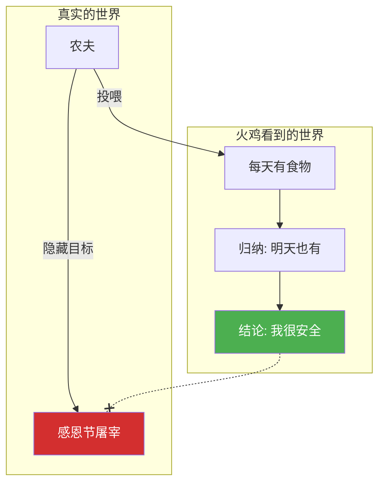
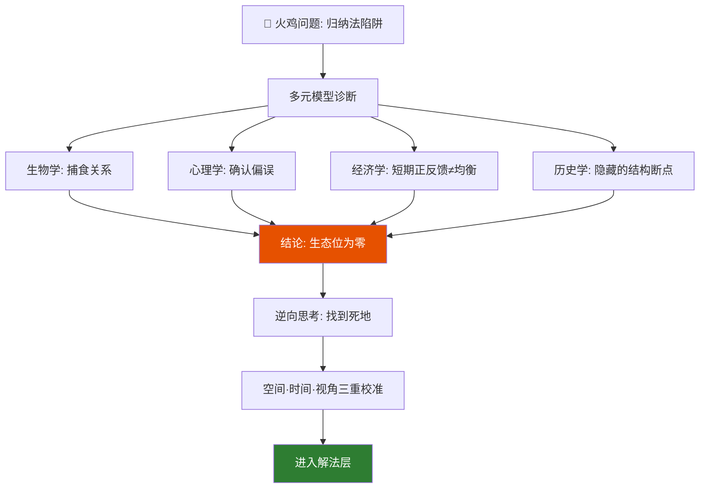
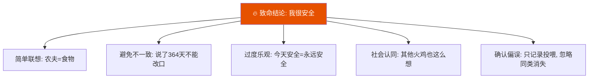
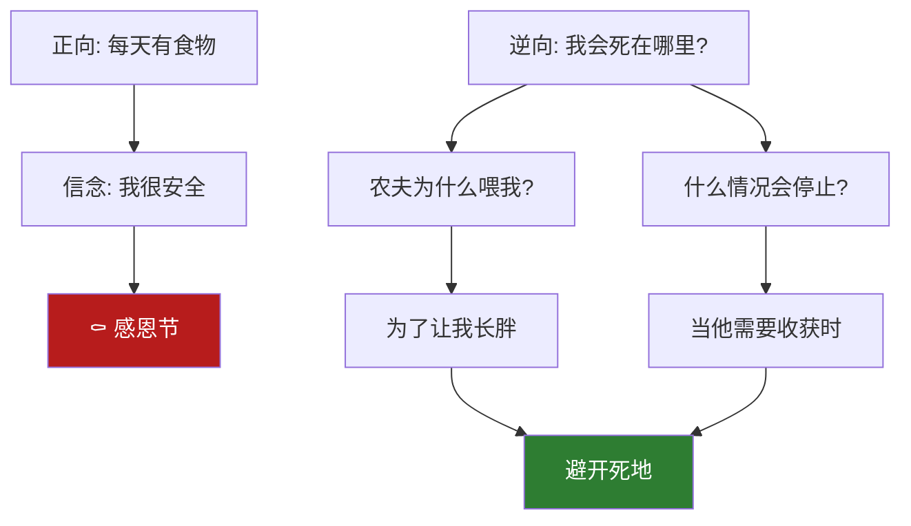
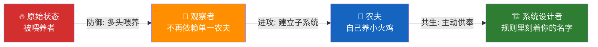
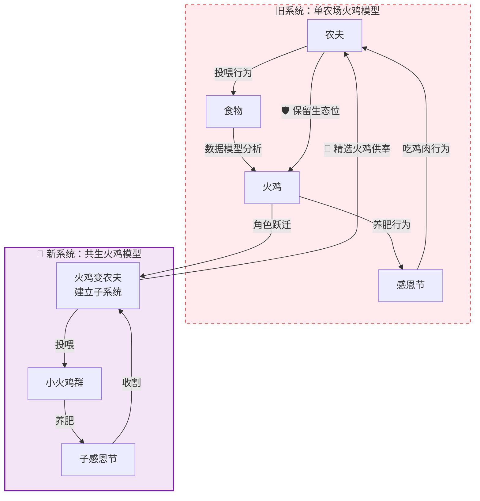
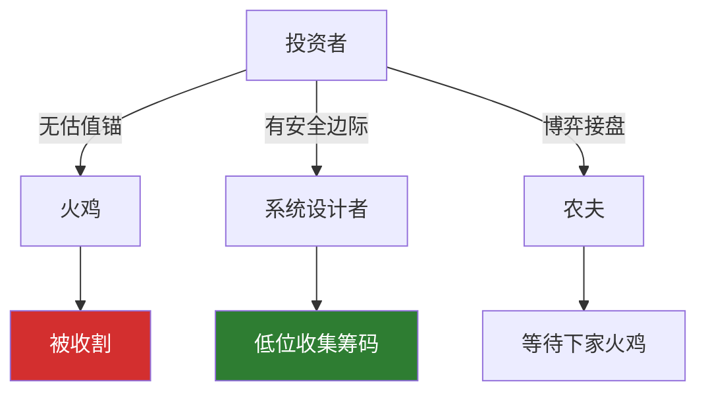
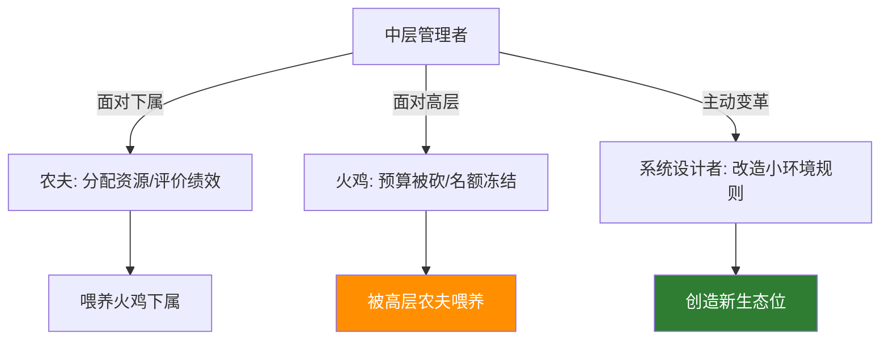
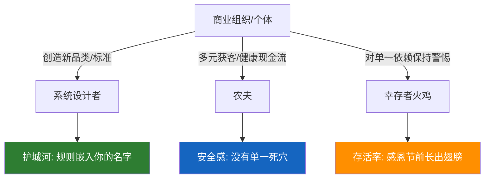
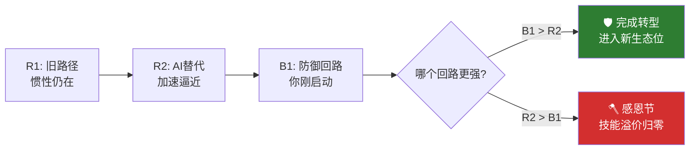

# 火鸡问题4：全系列图解总览

> 本文是火鸡问题系列的视觉索引——把九篇文章中最重要的图表集中到一个页面。适合快速复习，也适合截图分享。

[火鸡问题1：系列总纲](fire-turkey-guide) ｜ [火鸡问题2：诊断工具箱](fire-turkey) ｜ [火鸡问题3：三层进化](fire-turkey-solution)

---

## 一、火鸡问题核心：两个世界

火鸡看到的世界 vs 真实世界。这是整个系列的第一张图，也是所有分析的起点。



> 火鸡的模型是自洽的——364 天全部验证。但它不知道系统里有一个变量叫"感恩节"。

---

## 二、诊断层：多元模型交叉验证总图

来自 [火鸡问题2：诊断工具箱](fire-turkey)



---

## 三、火鸡触发的五个认知偏误

来自 [火鸡问题2：诊断工具箱](fire-turkey)



---

## 四、逆向思考：芒格"死在哪里"提问法

来自 [火鸡问题2：诊断工具箱](fire-turkey)



---

## 五、解法层：三层进化全景图

来自 [火鸡问题3：三层进化](fire-turkey-solution)



---

## 六、共生回路：旧系统 vs 新系统

来自 [火鸡问题3：三层进化](fire-turkey-solution) 和 [火鸡问题8：共生回路终极解法](fire-turkey-symbiosis)



---

## 七、投资场景：你同时是农夫和火鸡

来自 [火鸡问题5：投资场景](fire-turkey-investment)



---

## 八、职业场景：中层管理者的一天

来自 [火鸡问题6：职业场景](fire-turkey-career)



---

## 九、商业场景：幸存者的三层能力

来自 [火鸡问题7：商业场景](fire-turkey-business)



---

## 十、通信程序员：三个回路博弈

来自 [火鸡问题9：通信程序员案例](fire-turkey-telecom-programmer)



---

## 系列全貌

```text
火鸡问题完整指南
├── 基础篇（1-4）
│   ├── #1 系列总纲
│   ├── #2 诊断工具箱：六个工具完整拆解
│   ├── #3 三层进化：防御、进攻、共生
│   └── #4 图解总览 ← 你在这里
├── 场景篇（5-7）
│   ├── #5 投资场景
│   ├── #6 职业场景
│   └── #7 商业场景
└── 深度篇（8-9）
    ├── #8 共生回路终极解法
    └── #9 通信程序员真实案例
```

---

**标签**：`火鸡问题` `图解` `系统循环图` `Mermaid` `思维模型` `查理·芒格`
