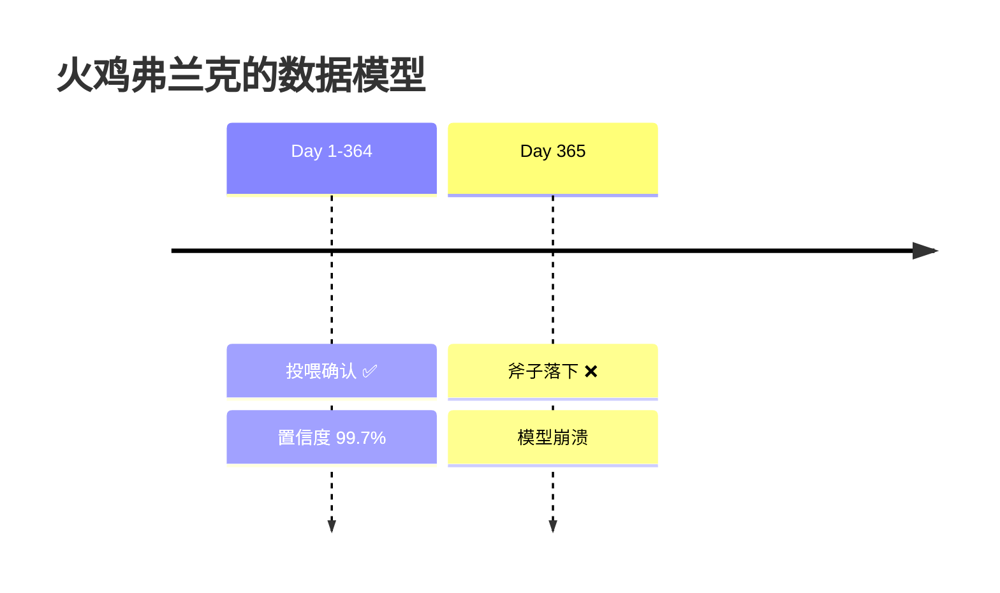
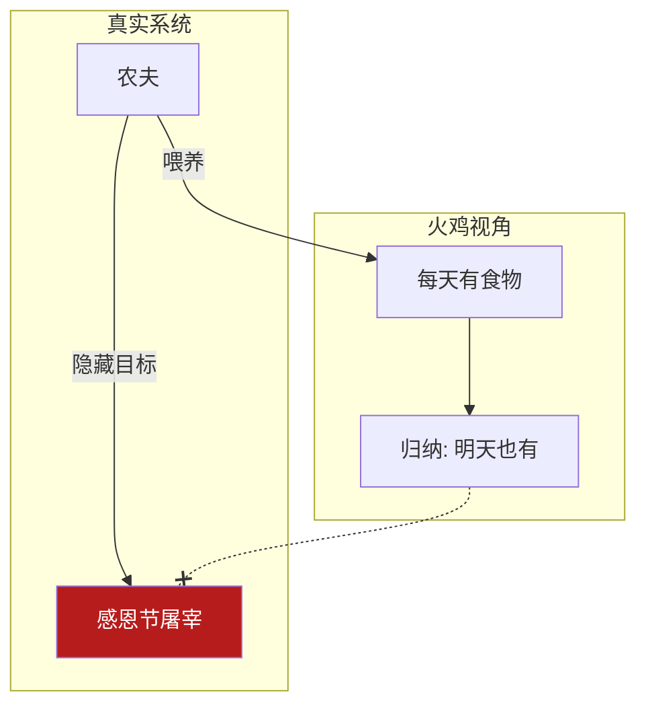
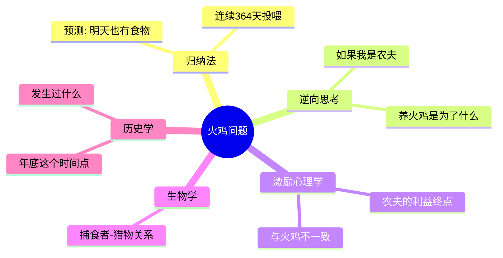
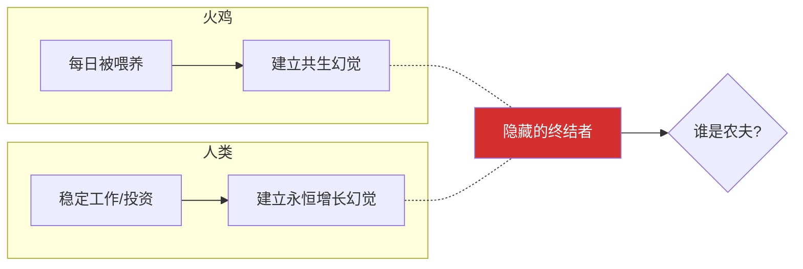
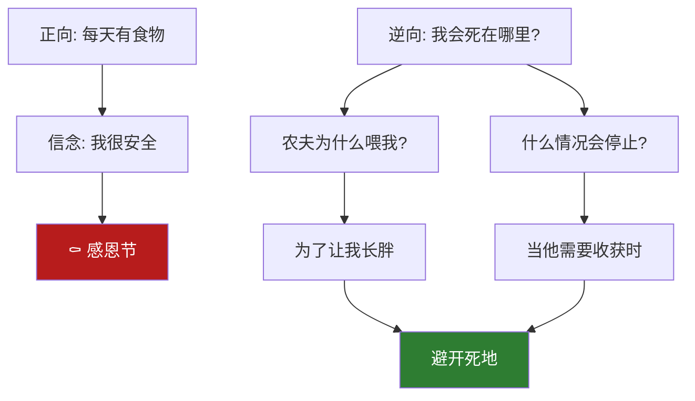
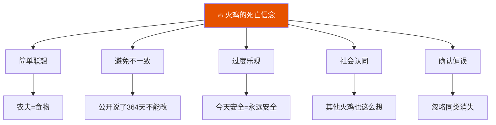
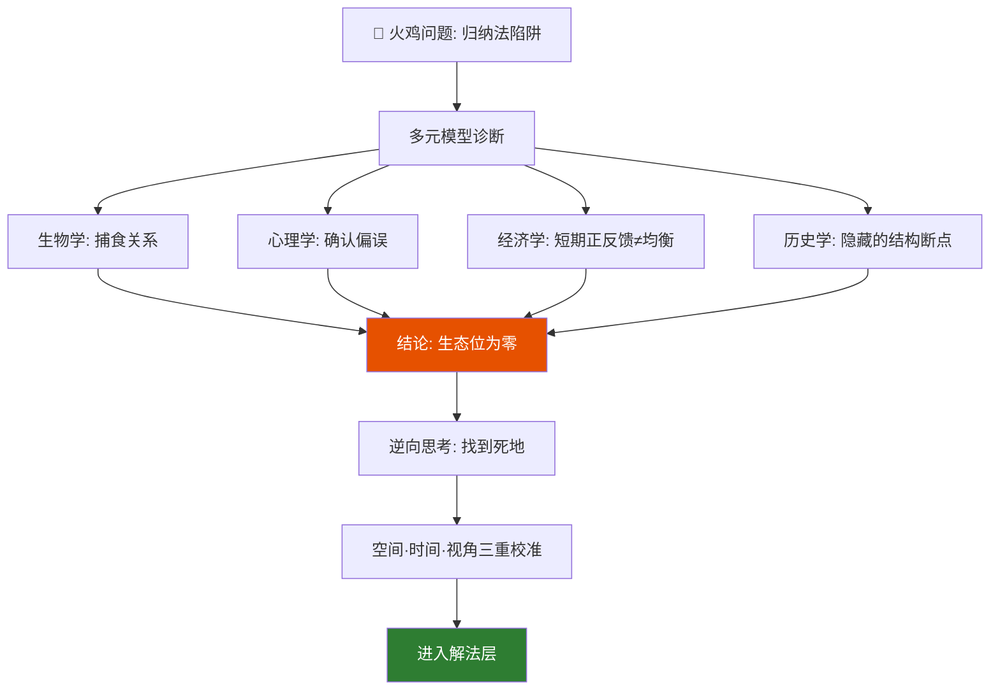
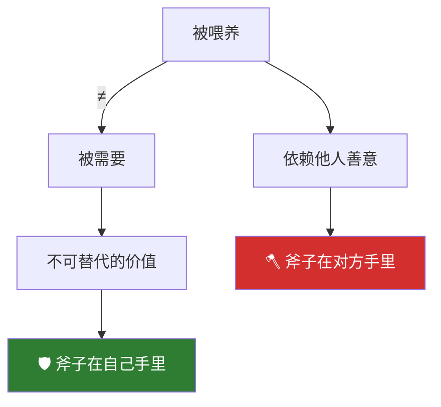
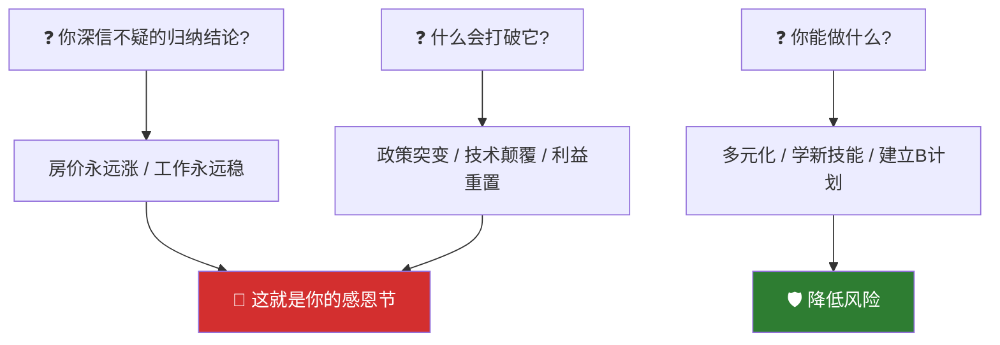

# 火鸡问题2：归纳法为什么在结构性风险面前失效

> 本文是火鸡问题系列的诊断层——用芒格多元思维模型，把火鸡问题一层一层拆开。读完你会有一套完整的工具箱，用来诊断任何系统的裂缝。

[火鸡问题1：从思维实验到行动指南](fire-turkey-guide) ｜ [火鸡问题3：从被喂养者到系统设计者](fire-turkey-solution)

---

## 一、故事：火鸡弗兰克的 364 天

一只名叫弗兰克的火鸡，连续 364 天被农夫精心喂养。它建立了完美的归纳模型：太阳升起 = 食物到来。它甚至在火鸡群中发表了论文，论证"人类存在的目的是服务火鸡"。

第 365 天是感恩节。农夫来了——手里没有玉米，只有一把斧子。

- 置信区间：99.7%
- 数据点：364/364 验证通过
- 模型预测：第 365 天继续投喂
- 实际结果：死亡

**问题**：为什么一个"数据完美"的模型，会在第 365 天彻底崩溃？



---

## 二、三个本质追问

在你诊断任何系统之前，先回答这三个问题：

| 追问 | 火鸡的答案 | 真实的答案 |
|------|-----------|-----------|
| 这个系统的设计者是谁？ | 没有设计者，这是自然规律 | 农夫，他有自己的时间表 |
| 喂养者的真正利益是什么？ | 我的利益 = 他的利益 | 他的利益是感恩节的火鸡大餐 |
| 数据成立的前提条件是什么？ | 无条件成立 | "系统不发生结构性突变"——而这个前提在感恩节被彻底打破 |

> 你收集的所有数据，都只在"系统不会突变"的前提下成立。而你根本不知道突变点什么时候来。



---

## 三、诊断工具箱（一）：如果火鸡有五个模型

这是芒格最核心的武器——用不同学科的透镜看同一个问题。单一模型只看到一束光，多元模型看到全息。

| 模型 | 单一视角（火鸡） | 多元视角（应该看到的） |
|------|-----------------|---------------------|
| 生物学 | 我们是共生关系 | 这是捕食者-猎物关系 |
| 经济学 | 每天有正反馈 = 长期均衡 | 任何不可持续的曲线，都可能是泡沫 |
| 历史学 | 历史数据支持安全结论 | 历史数据里缺少"感恩节"这个结构断点 |
| 心理学 | 近因效应：最近364天都很好 | 确认偏误：忽略了同类消失的弱信号 |
| 概率论 | 归纳法有效 | 归纳法在非平稳系统中不成立 |

> 芒格："手里只有锤子的人，看什么都像钉子。"



---

## 四、诊断工具箱（二）：火鸡与人类的镜像

把火鸡处境映射到你的现实——这个映射本身就是诊断的第一步：

| 火鸡处境 | 人类映射 |
|----------|----------|
| 每天按时收到资源 | 一份做了10年的稳定工作 |
| 被保护得很好 | 一个长期依赖的单一大客户 |
| 被允许"发声"（发表论文） | 行业里公认的"稳固地位" |
| 从未想过资源提供者有另一个日程表 | 从未想过公司/市场/客户有隐藏转折点 |

> **你的"农夫"是谁？他的日历上有你的感恩节吗？**



---

## 五、诊断工具箱（三）：芒格"死在哪里"提问法

这是逆向思考的实战版——不问你该怎么活，先问你会怎么死。

**正向思维（火鸡）**：每天都有食物 → 明天也有食物 → 我很安全

**逆向思维**：
1. 如果我是农夫，我为什么每天喂这只火鸡？ → 因为我要它长胖。
2. 什么情况下这个喂养会停止？ → 感恩节前夕。
3. 火鸡的安全感在什么条件下会瞬间归零？ → 当喂养者的利益与被喂养者的利益不再一致。

**逆向检查清单**——对你身边任何一个系统：
- 跟我互动的系统/人，它的真正利益诉求是什么？
- 我的"安全感"是建立在对方的善意上，还是建立在利益结构的一致性上？
- 对方有没有隐藏的时间表？



---

## 六、诊断工具箱（四）：五个心理偏误

火鸡犯了五种偏误——人类也全犯。对照看看你在哪个上面最危险：

| 偏误 | 火鸡的表现 | 人类的表现 |
|------|-----------|-----------|
| 简单联想倾向 | 农夫 = 食物，固化为自然法则 | 品牌 = 品质；过去涨 = 未来涨 |
| 避免不一致倾向 | 公开说了364天，不能改口 | 在某个观点上投入越多，越难承认错误 |
| 过度乐观倾向 | 我今天安全，我永远安全 | 今年的增长会持续到明年 |
| 社会认同倾向 | 其他火鸡也这么想 | 大家都在买，所以没问题 |
| 确认偏误 | 只记录被喂养的数据，忽略同类被带走 | 只看利好，不看利空 |

> 芒格："说服我要靠数据。但数据只在采集条件不变的情况下有效。"



---

## 七、诊断工具箱（五）：空间·时间·视角——三个"太小"

你之前提到的三点，套在任何陷入火鸡处境的人身上，精准得残忍。三个太小，造成结构性失真。结构性失真是努力不能弥补的。

| 维度 | 火鸡的研究范围 | 缺了什么 |
|------|--------------|--------|
| **空间太小** | 只研究了"这条线"上的变量 | 没研究新加入的变量，也没研究自己在这个系统之外的定价 |
| **时间太小** | 只研究了过去若干年的经验周期 | 还没经历过"整个范式被替代"的完整周期——因为这件事可能从未发生过 |
| **视角太小** | 只研究了"这条线 = 有饭吃"这个关系 | 没研究"价值创造"这个更底层的变量——你产出的从来不是价值的本体，你产出只是价值的某种形式 |

> 你就算每天加班到十二点、把自己领域的每一个细节倒背如流，如果那个"翻译形式到价值"的任务被彻底接管了——你的努力就像火鸡第 360 天去健身房锻炼，让自己成为一只更强壮的火鸡。

---

## 八、完整诊断流程图

把六个工具箱串在一起——这是火鸡问题诊断层的方法论总图：



```
火鸡问题（归纳法陷阱）
    │
    ├── 发现：单一模型在隐藏意图系统中失效
    │
    ├── 诊断：多元模型交叉验证
    │      生物×心理×经济×历史
    │      结论：这是捕食关系，不是共生；生态位为零
    │
    ├── 逆向思考：喂养者的利益 × 终止条件 × 隐藏日程
    │
    ├── 空间·时间·视角校准：你的研究范围有没有太小？
    │
    └── 进入解法层（火鸡问题3）
```

---

## 九、诊断层一句话总结

> **别把被喂养，当成被需要。**

任何安全感，如果建立在"对方没有杀心"上，就等于把斧子交给对方，然后祈祷它永远不会落下。

> 芒格："得到一个东西最好的办法，是配得上它。保住一个东西最好的办法，是永远不需要依赖它。"



---

## 诊断自检

1. 在你的投资/职业/商业中，有没有一个你深信不疑的"归纳结论"？
2. 如果这个结论有一天被打破，最可能的原因是什么？
3. 你的"农夫"是谁？他的日历上有没有你的感恩节？
4. 你现在可以做一件什么事，来降低这种结构性风险？



---

**系列导航**：
- 上一篇：[火鸡问题1：从思维实验到行动指南](fire-turkey-guide)
- 下一篇：[火鸡问题3：如何从被喂养者变成系统设计者](fire-turkey-solution) —— 解法层完整展开

**标签**：`火鸡问题` `归纳法` `多元思维模型` `逆向思考` `认知偏误` `查理·芒格` `系统思维` `诊断框架`
