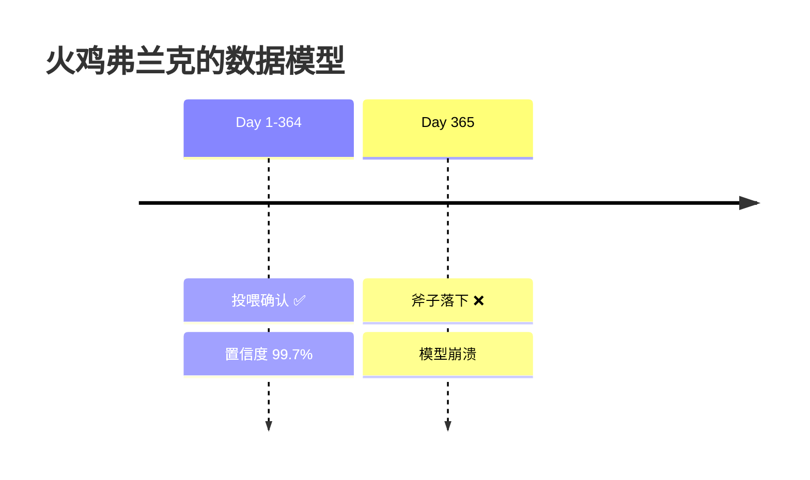
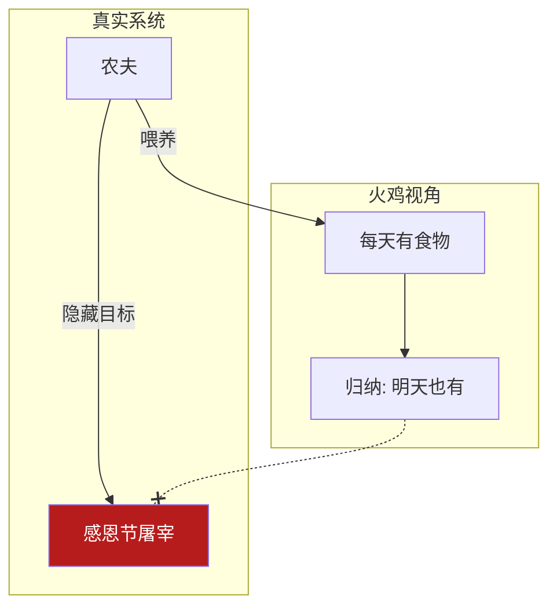
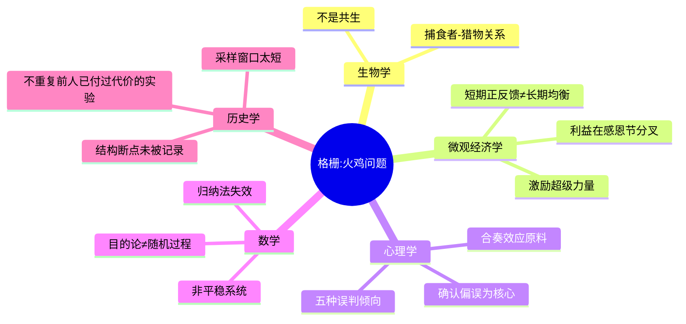
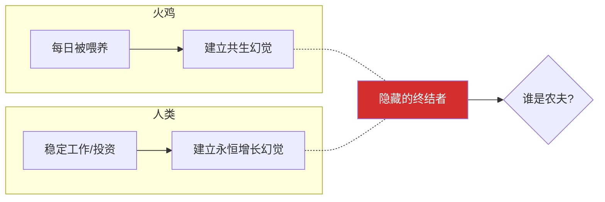
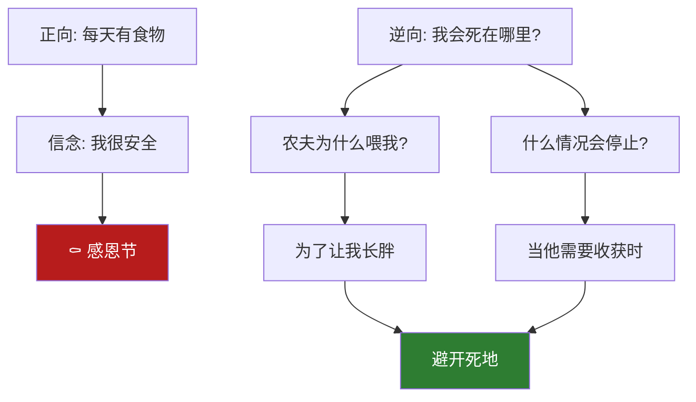
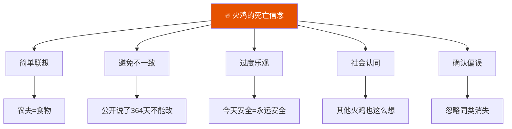
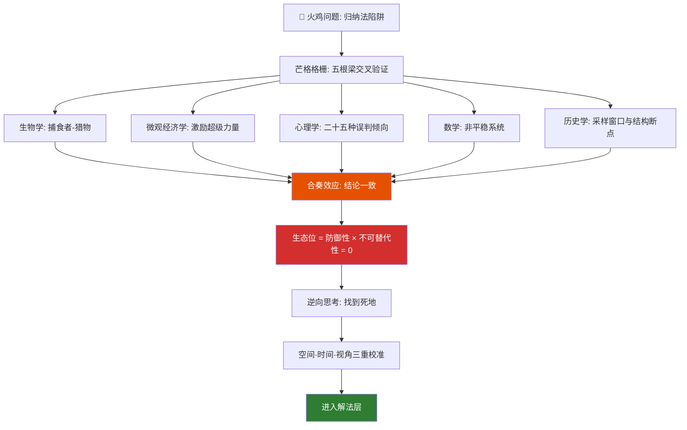
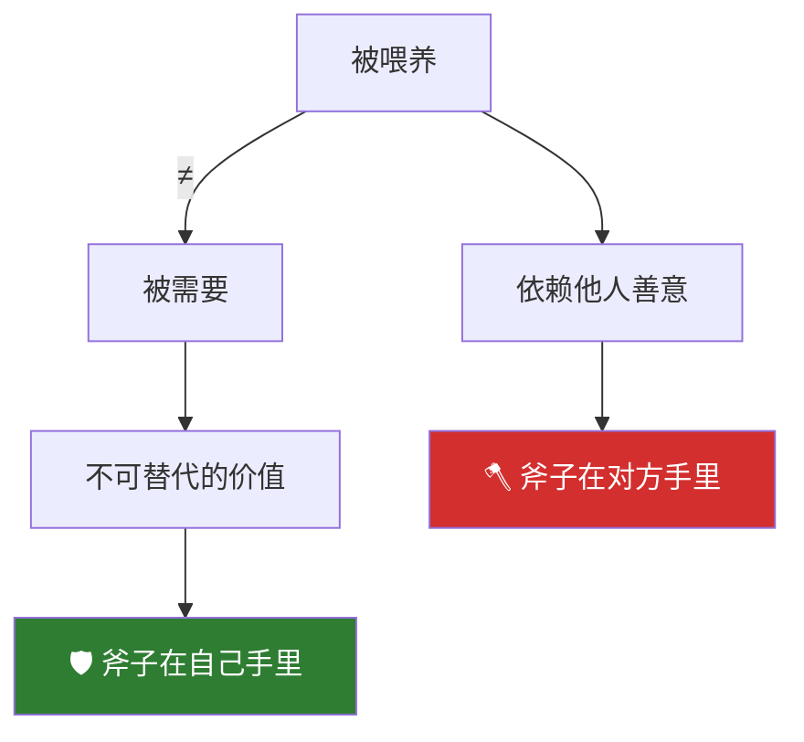
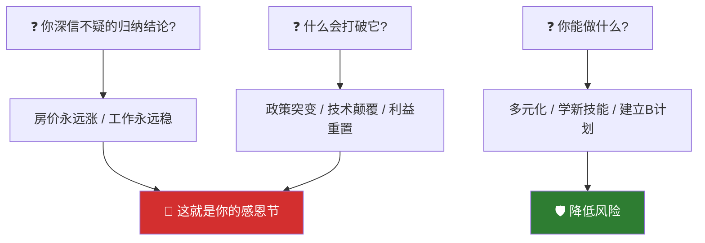

# 火鸡问题2：归纳法为什么在结构性风险面前失效

> 本文是火鸡问题系列的诊断层——用芒格多元思维模型，把火鸡问题一层一层拆开。读完你会有一套完整的工具箱，用来诊断任何系统的裂缝。

[火鸡问题1：从思维实验到行动指南](fire-turkey-guide) ｜ [火鸡问题3：从被喂养者到系统设计者](fire-turkey-solution)

---

## 一、故事：火鸡弗兰克的 364 天

一只名叫弗兰克的火鸡，连续 364 天被农夫精心喂养。它建立了完美的归纳模型：太阳升起 = 食物到来。它甚至在火鸡群中发表了论文，论证"人类存在的目的是服务火鸡"。

第 365 天是感恩节。农夫来了——手里没有玉米，只有一把斧子。

- 置信区间：99.7%
- 数据点：364/364 验证通过
- 模型预测：第 365 天继续投喂
- 实际结果：死亡

**问题**：为什么一个"数据完美"的模型，会在第 365 天彻底崩溃？



---

## 二、三个本质追问

在你诊断任何系统之前，先回答这三个问题：

| 追问 | 火鸡的答案 | 真实的答案 |
|------|-----------|-----------|
| 这个系统的设计者是谁？ | 没有设计者，这是自然规律 | 农夫，他有自己的时间表 |
| 喂养者的真正利益是什么？ | 我的利益 = 他的利益 | 他的利益是感恩节的火鸡大餐 |
| 数据成立的前提条件是什么？ | 无条件成立 | "系统不发生结构性突变"——而这个前提在感恩节被彻底打破 |

> 你收集的所有数据，都只在"系统不会突变"的前提下成立。而你根本不知道突变点什么时候来。



---

## 三、芒格的格栅：五根最粗的横梁

芒格把这种诊断方法叫做 **"多元思维模型格栅"**（Latticework of Mental Models）。

他的原话是："你必须把经验悬挂在头脑中由多个模型组成的格栅上。"单一模型就像手里只有一把锤子——你看什么都像钉子。但当你的格栅上有来自四五个硬学科的模型，每个问题都会从不同角度被照亮。

下面这五个学科，是芒格认定的"普世智慧"（Worldly Wisdom）的核心来源。它们组成火鸡问题诊断层的格栅骨架。

> "你必须知道重要学科的重要理论，并且经常使用它们——不是偶尔用，是用它们来理解生活中的一切。"

---

### 生物学：铁的自然法则

芒格说，经济学本质上是一门生态学——物种竞争、资源分配、生态位。他喜欢用进化论的眼光看商业："竞争不是介于两个势均力敌的对手之间，而是介于一个饥饿的捕食者和它的猎物之间。"

火鸡的生态位来自一种错误的分类——它把自己和农夫的关系理解成"共生"。但生物学的基本事实是：**一个物种每天投喂另一个物种，然后在特定时间点屠宰它——这叫捕食者-猎物关系。**

| 共生 | 捕食 |
|------|------|
| 双方持续受益 | 一方受益，另一方最终被消耗 |
| 离开会互损 | 猎物离开，捕食者换下一个目标 |
| 蜜蜂与花 | 农夫与火鸡 |

火鸡犯的不是精度错误，是**分类错误**。它把捕食者的投喂行为解读为善意的共生信号，就像你把公司的高薪解读为"我们是一家人"。

> "在商业世界里，那些认为自己和平台、雇主、大客户是'共生关系'的人，绝大多数只是还没到感恩节的猎物。"

---

### 微观经济学：激励是超级力量

芒格把激励分析视为经济学最重要的模型。他的原话是：

> "也许在所有让人类产生错误判断的倾向里，最强大的就是激励。**永远、永远不要在想其他事情的时候，忽视激励。** 告诉我激励在哪，我就能告诉你结果。"

农夫每天喂火鸡，不是因为爱，是因为**他的整个激励结构指向一个终点——感恩节的火鸡大餐**。喂养不是目的，是达到目的的成本最低的路径。

把这个公式套到你身边的任何一个"喂养者"：

- 基金经理给你推荐产品——他的激励是你的资产增值，还是他的佣金收入？如果两者冲突，哪个赢？
- 公司给你升职加薪——它的激励是留住不可替代的人才，还是暂时稳住你直到找到更便宜的替代者？
- 平台给你流量——它的激励是帮你做大，还是用你养数据然后推出自营品牌吃掉你的赛道？

芒格还特别强调**利益错位**的破坏力。火鸡的利益是"一直活下去"，农夫的利益是"在感恩节吃掉它"。两股力量在前364天恰好同向——火鸡养得越肥，两方都越开心。第365天，它们彻底逆行。

> 经济学诊断的核心不是"他对我好不好"，而是"**他的激励和我的激励，从哪天开始不再同向**"。

芒格的附带一击：任何看起来不可持续的曲线——房价、利润增长、用户增长——如果不是建立在真实的竞争优势或均衡结构上，它就是一个等待破裂的泡沫。短期正反馈说服不了微观经济学，它只说服了参与泡沫的人。

---

### 心理学：人类误判的二十五种倾向

这是芒格投入心血最多的学科。他说："心理学是格栅上最重要的学科。如果你不懂人类会如何误判，你就是在黑暗中摸索。"

火鸡在364天里，完美命中了他列出的二十五种误判心理倾向中最致命的五种。芒格称之为 **"合奏效应的原料"**——当多个偏误同时同向发力，结果不是加法，是聚变。

（芒格列了二十五种，火鸡直接命中了十六种。完整的全清单分析见[火鸡问题特辑：二十五种误判倾向全解析](fire-turkey-25-biases)。本文先给出核心的五种。）

| 芒格的误判倾向 | 火鸡的表现 |
|--------------|-----------|
| 奖励和惩罚的超级反应倾向 | 每口食物都在说"这样做是对的" |
| 避免不一致倾向 | 公开说了364天"人类是善良的"，无法改口 |
| 过度乐观倾向 | 我今天安全 → 我永远安全 |
| 社会认同倾向 | 别的火鸡也这么想，所以肯定没问题 |
| 确认偏误 | 只记录投喂事件，忽略同类被带走的所有信号 |

（心理学是格栅上内容最多的模型。本文用[第六节](#六诊断工具箱四五个心理偏误)专门展开这五种倾向，此处先挂上格栅。）

> "说服我要靠数据。但说服也只在你收集数据的前提条件没变的时候有效。"——芒格

---

### 数学：肥尾与失效的概率论

芒格要求他的格栅上必须挂着数学——尤其是**决策树理论、贝叶斯更新，以及最重要的一条：知道概率论什么时候不适用**。

火鸡的数学计算是精确的。364/364，置信度极高——在一个**平稳系统**里。

但火鸡的系统不是平稳的。它被一个具有明确意图的外部代理人（农夫及其日程表）定义了一个确定性转折点。在这样的系统里，一切基于历史频率的概率估计，在转折点那一刻同时归零。

这不是数学好不好。这是**用错了数学的适用范围**。你把一个目的论的确定性过程，当成一个随机过程来建模。这个分类错误让你的整个概率框架变成了废纸。

> "火鸡没有算错概率。火鸡错在不知道——它做的所有计算，只在系统不发生结构性突变时有效。而突变点，从来不在它的采样窗口里。"

---

### 历史学：30美元的书与90亿美元的经验

芒格反复讲一个观点：最好的商业模式课不是商学院的案例，是历史书里那些已经在无数行业反复上演了几百年的兴衰模式。"历史是唯一真正的实验数据。"而你不去读它，就等于把人类用巨大代价换来的实验数据扔掉，自己从头做一遍。

火鸡的历史数据集是364天。它做了它能做的最好的统计分析。但这个数据集有一个不可修复的缺陷：**感恩节不在里面**。不是因为感恩节不存在，而是因为火鸡的采样窗口还没覆盖到它。

人类犯的是同一个错误：

- 2007年的抵押贷款银行家：历史数据完美证明房价从不会全国性暴跌
- 2020年初的世界：历史数据完美证明现代医疗系统完全能应付任何新出现的传染病
- iPhone发布前一年的诺基亚董事会：历史数据完美证明功能手机的利润增长会一直持续

每一个结构性断点在被第一次记录到数据集里之前，历史数据都已经完美地支持"一切如常"。

> "你们当中大多数人将来能获得的成功，不取决于你们有多聪明，而取决于你们能不能避免——'我以前从没见过这种事'——这种错误。"

---

### 合奏效应（Lollapalooza Effect）

当五根梁同时搭上去，四个学科的结论交叉指向同一个答案——芒格管这叫**合奏效应**。不是五个结论相加，是五个结论互相放大：

| 芒格的格栅 | 结论 |
|-----------|------|
| 生物学 | 这是捕食关系，不是共生。分类从一开始就错了 |
| 微观经济学 | 激励超级力量指向一个固定终点；利益在那一天分叉 |
| 心理学 | 五种误判倾向同向发力，让危险信号全部被自我说服机制过滤掉 |
| 数学 | 非平稳系统中的归纳法在结构断点同时失效 |
| 历史学 | 采样窗口永远太短；你的经验里还没有感恩节，不代表没有 |

**生态位 = 防御性 × 不可替代性。火鸡弗兰克：0 × 0 = 0。**



---

## 四、诊断工具箱（二）：火鸡与人类的镜像

把火鸡处境映射到你的现实——这个映射本身就是诊断的第一步：

| 火鸡处境 | 人类映射 |
|----------|----------|
| 每天按时收到资源 | 一份做了10年的稳定工作 |
| 被保护得很好 | 一个长期依赖的单一大客户 |
| 被允许"发声"（发表论文） | 行业里公认的"稳固地位" |
| 从未想过资源提供者有另一个日程表 | 从未想过公司/市场/客户有隐藏转折点 |

> **你的"农夫"是谁？他的日历上有你的感恩节吗？**



---

## 五、诊断工具箱（三）：芒格"死在哪里"提问法

这是逆向思考的实战版——不问你该怎么活，先问你会怎么死。

**正向思维（火鸡）**：每天都有食物 → 明天也有食物 → 我很安全

**逆向思维**：
1. 如果我是农夫，我为什么每天喂这只火鸡？ → 因为我要它长胖。
2. 什么情况下这个喂养会停止？ → 感恩节前夕。
3. 火鸡的安全感在什么条件下会瞬间归零？ → 当喂养者的利益与被喂养者的利益不再一致。

**逆向检查清单**——对你身边任何一个系统：
- 跟我互动的系统/人，它的真正利益诉求是什么？
- 我的"安全感"是建立在对方的善意上，还是建立在利益结构的一致性上？
- 对方有没有隐藏的时间表？



---

## 六、诊断工具箱（四）：五个心理偏误

火鸡犯了五种偏误——人类也全犯。对照看看你在哪个上面最危险：

| 偏误 | 火鸡的表现 | 人类的表现 |
|------|-----------|-----------|
| 简单联想倾向 | 农夫 = 食物，固化为自然法则 | 品牌 = 品质；过去涨 = 未来涨 |
| 避免不一致倾向 | 公开说了364天，不能改口 | 在某个观点上投入越多，越难承认错误 |
| 过度乐观倾向 | 我今天安全，我永远安全 | 今年的增长会持续到明年 |
| 社会认同倾向 | 其他火鸡也这么想 | 大家都在买，所以没问题 |
| 确认偏误 | 只记录被喂养的数据，忽略同类被带走 | 只看利好，不看利空 |

> 芒格："说服我要靠数据。但数据只在采集条件不变的情况下有效。"



---

## 七、诊断工具箱（五）：空间·时间·视角——三个"太小"

你之前提到的三点，套在任何陷入火鸡处境的人身上，精准得残忍。三个太小，造成结构性失真。结构性失真是努力不能弥补的。

| 维度 | 火鸡的研究范围 | 缺了什么 |
|------|--------------|--------|
| **空间太小** | 只研究了"这条线"上的变量 | 没研究新加入的变量，也没研究自己在这个系统之外的定价 |
| **时间太小** | 只研究了过去若干年的经验周期 | 还没经历过"整个范式被替代"的完整周期——因为这件事可能从未发生过 |
| **视角太小** | 只研究了"这条线 = 有饭吃"这个关系 | 没研究"价值创造"这个更底层的变量——你产出的从来不是价值的本体，你产出只是价值的某种形式 |

> 你就算每天加班到十二点、把自己领域的每一个细节倒背如流，如果那个"翻译形式到价值"的任务被彻底接管了——你的努力就像火鸡第 360 天去健身房锻炼，让自己成为一只更强壮的火鸡。

---

## 八、完整诊断：格栅总图

把芒格的整个格栅串在一起——从多元模型诊断到合奏效应：



```
火鸡问题（归纳法陷阱）
    │
    ├── 芒格格栅：五根梁交叉验证
    │      生物 × 微观经济 × 心理 × 数学 × 历史
    │      ↓
    │      合奏效应：五个结论指向同一个答案
    │      生态位 = 0
    │
    ├── 逆向思考：喂养者的激励 × 终止条件 × 隐藏日程
    │
    ├── 空间·时间·视角校准
    │
    └── 进入解法层（火鸡问题3）
```

---

## 九、诊断层一句话总结

> **别把被喂养，当成被需要。**

任何安全感，如果建立在"对方没有杀心"上，就等于把斧子交给对方，然后祈祷它永远不会落下。

> 芒格："得到一个东西最好的办法，是配得上它。保住一个东西最好的办法，是永远不需要依赖它。"



---

## 诊断自检

1. 在你的投资/职业/商业中，有没有一个你深信不疑的"归纳结论"？
2. 如果这个结论有一天被打破，最可能的原因是什么？
3. 你的"农夫"是谁？他的日历上有没有你的感恩节？
4. 你现在可以做一件什么事，来降低这种结构性风险？



---

**系列导航**：
- 上一篇：[火鸡问题1：从思维实验到行动指南](fire-turkey-guide)
- 下一篇：[火鸡问题3：如何从被喂养者变成系统设计者](fire-turkey-solution) —— 解法层完整展开

**标签**：`火鸡问题` `归纳法` `多元思维模型` `逆向思考` `认知偏误` `查理·芒格` `系统思维` `诊断框架`
