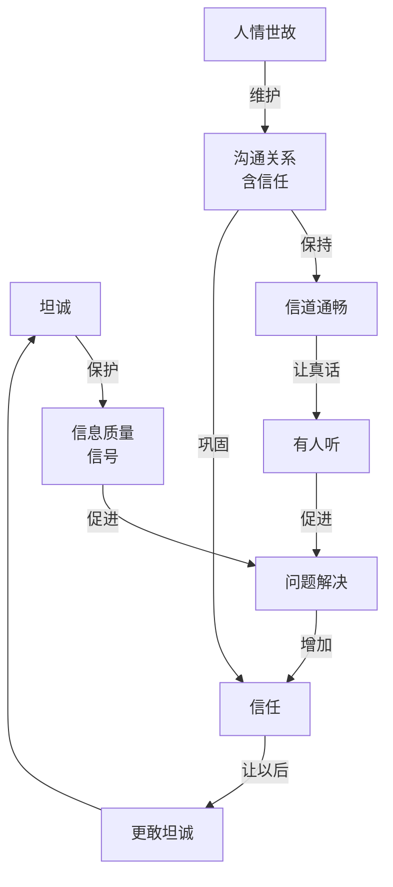

# 坦诚遇上人情世故：两种框架拆出来的同一个答案

老张和小陈是大学室友，认识十年了。

小陈最近想辞职创业，做了一个方案。他把方案发给老张："兄弟，帮我看看，说真话。"

老张花了一晚上看完。第二天回了一句："这个方向不行，你对市场完全不了解，做不起来。"

小陈说"好，我再想想。"

之后三个月，小陈没再找老张聊创业的事。老张以为他在忙。

后来老张从另一个朋友那听说，小陈的项目已经在跑了，找了别人合伙。

老张给我打电话："我是不是说错话了？他说要听真话的。"

---

## 真话没说错，但方式贵了

老张的问题，我遇到过。你也可能遇到过。

一个人问你意见，你说的是真话，你也确实为他好。但结果是你被绕过去了。这不是"坦诚"的问题——老张是**把真话用最贵的方式说了**。

很多人脑子里的选项只有两个：要么坦，有什么说什么。要么圆，说别人爱听的。但这个二分法是错的。

说真话 ≠ 想什么说什么。后者是粗暴。懂分寸 ≠ 见人说人话。后者是虚伪。

真正的分界线不在"坦诚 vs 人情世故"，而在**粗暴 vs 虚伪**。成熟的状态在另一头：真实但不粗暴，圆融但不虚伪。

但光说"分界线不在这"不够。得往下拆。

---

## 第一层：地基

沟通这件事，看起来是两个人之间传信息。但实际上，传信息之前，有一个更底层的东西被忽略了。

人不是机器。

人有自私、有欲望、有面子、有偏见、有情绪、有恐惧、有虚荣、有不安。

如果人是机器，沟通就简单了：你说真话 → 对方逻辑处理 → 接受 → 问题解决。

但人不是。实际过程是：你说真话 → 对方情绪先反应 → 面子受损 → 防御启动 → **逻辑还没上线，关系已经伤了**。真话根本没被处理，先被情绪挡在外面。

这就是地基。

**沟通不是信息传输，沟通是在人性里穿行。**

所有关于坦诚和人情世故的讨论，如果跳过这层地基，都会偏。

---

## 第二层：两根柱子

承认了人不是机器，坦诚和人情世故的意思就变了。

它们从"对立"变成了**站在同一块地基上的两根柱子**。

**坦诚** = 基于人性的坦诚。承认人不是机器，不要求对方像机器一样接收信息。

**人情世故** = 基于人性的分寸。承认人不是机器，不用逻辑去砸对方的情绪和面子。

区别在哪？坦诚保护**信号**，人情世故保护**信道**。信号再强，信道断了也没用。信道再通畅，信号是假的，等于白搭。

一根柱子管信号真不真，一根柱子管信道通不通。不对立。

---

## 老张的三句话

回到老张。同样指出问题，他可以有三句话：

**第一句**（他当时说的）："这个方向不行，你对市场完全不了解，做不起来。"

信息是真的。但一句话否了三样东西：方向、能力、结果。对方听到的是"你不行"。信号是发出去了，信道断了。

**第二句**（另一个极端）："挺好的，加油。"

对方舒服了。信道是通的。但信息是假的。小陈真去做了，该踩的坑一个不会少。

**第三句**："方向我理解你为什么选。但市场这块，咱们现在掌握的信息不够，最好先找几个目标客户聊一下再决定。要不要一起想想怎么聊？"

信息一样真：风险在，信息不够。但没有否定小陈这个人，指向了具体问题，给了下一步。**信号真，信道也没断。**

老张听完沉默了一会。"第三句确实更好。"

同一个真信息。方式不同，结果完全不同。

---

公式就一个：

> **成熟表达 = 真内容 × 对时机 × 对方式 × 对边界**

---

## 第三层：系统

地基有了，两根柱子立住了。但还不够。因为沟通不是一次性的。它会自己跑，会形成回路。

老张说完第一句话之后，小陈三个月没找他。下次老张再想跟小陈说什么，小陈心里会有预判。

系统长这样：



系统里坦诚和人情世故各演一个角色：

**坦诚是信息校准器。** 它管信号——高了，信息真，对方拿到有效反馈，问题更可能解。

**人情世故是关系维护器。** 它管信道——高了，信任在，关系稳，对方愿意听，信息通道不关闭。

坦诚的任务是：说出去的是真东西。人情世故的任务是：说出去的东西有人接。

---

## 四种状态

| 坦诚 | 人情世故 | 结果 |
|---|---|---|
| 高 | 高 | 信号真，信道通，问题能解 |
| 高 | 低 | 老张状态：真话多，但人被推远了 |
| 低 | 高 | 表面舒服，信息假，长期不可靠 |
| 低 | 低 | 又伤人又没价值 |

---

## 回路：好的越好，坏的越坏

**好的回路：** 坦诚表达 → 信息真 → 对方获益 → 问题改善 → 信任增加 → 下次更敢坦诚。

**坏的回路：** 刺耳真话 → 对方防御 → 情绪对抗 → 听不进去 → 关系变差 → 下次沟通更难。

回路一旦跑起来，自己加强自己。好的越用越顺，坏的越用越难。

---

## 四个能调的地方

想让这个系统变好，不是问"我要坦诚还是要圆滑"，是调四个点：

**一、目的。** 这句话说出去，是想帮对方，还是想证明自己厉害？答案不是前者，先别说。

**二、场合。** 私下说比当众说有效。当众指出问题，伤面子，信道容易断。老张是私下说的，这一点他做对了。

**三、方式。** 同一个信息，换种说法。不否定人，指向具体问题，给出下一步。信道是通的，信号才能到。

**四、边界。** 人情世故不是无限迁就。对方反复越界，坦诚表达边界："这个我不能接受。"这时候不需要分寸。

---

## 芒格怎么看

芒格一辈子讲同一件事：**理性。**

他的框架是一个三角：

```
        理性
       /    \
      /      \
   坦诚 ——— 人情世故
        \    /
         \  /
       无缝信任网
```

理性的人不自欺，所以坦诚。理性的人也不无谓树敌，所以在乎分寸。两者同一个目标——建一个无缝的信任网。

他对坦诚的理解比"说真话"深：**坦诚是理性的自然产物，不自欺，不欺人。** 说的和做的对得上。

对人情世故，他一句话说完：

> "如果你想得罪人，你就说真话。如果你想交朋友，你就说真话——但是要温和。"

他不觉得人情世故是虚伪。真话必须说，方式可以选。

这和你刚才补的地基，是一回事。你说"人不是机器，沟通要建立在人性上"——芒格会点头，然后加一句：正因为人不是机器，理性才要后天练。**知道自己不理性，接受别人也不理性，这件事本身是最大的理性。**

---

## 回到老张

我跟老张聊完，他给小陈发了一条消息：

"上次我说的太绝对了。你的方向其实有道理，我的意思是市场这块咱们掌握的信息还不够。你要是还在看这个事，我可以帮你一起想想怎么验证。"

小陈当天就回了："没事哥。我最近确实在跑，有空聊。"

回路扭过来了。

---

## 结论

三层结构，一句话收：

**第一层，地基：** 人不是机器。沟通是在人性里穿行。

**第二层，柱子：**

> 坦诚 = 基于人性的坦诚。承认人不是机器，不要求对方像机器一样接收信息。
> 人情世故 = 基于人性的分寸。承认人不是机器，不用逻辑去砸对方的情绪和面子。

**第三层，系统：** 坦诚管信号，人情世故管信道。信号真，信道通，系统才会跑起来。

坦诚和人情世故，从来不是敌人。承认人不是机器，它们站在同一块地基上。

> **坦诚让你可信，人情世故让你可处。两个都有，真话才有人听。**
