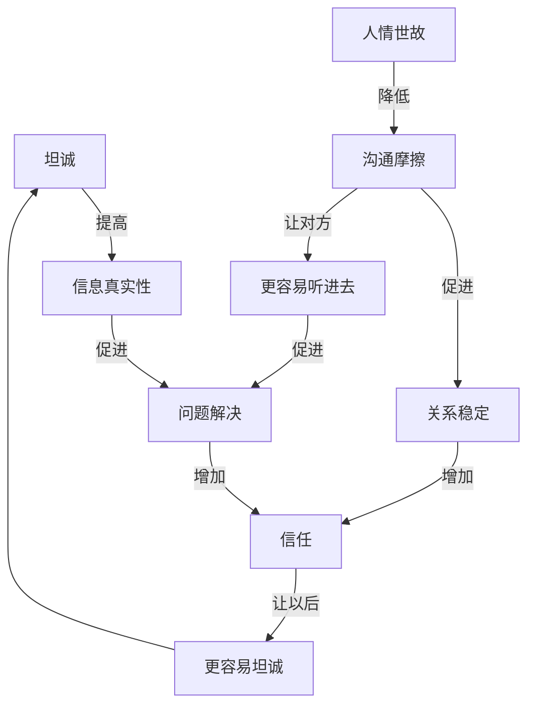

# 坦诚遇上人情世故：两种框架拆出来的同一个答案

老张和小陈是大学室友，认识十年了。

小陈最近想辞职创业，做了一个方案。他把方案发给老张："兄弟，帮我看看，说真话。"

老张花了一晚上看完。第二天回了一句："这个方向不行，你对市场完全不了解，做不起来。"

小陈说"好，我再想想。"

之后三个月，小陈没再找老张聊创业的事。老张以为他在忙。

后来老张从另一个朋友那听说，小陈的项目已经在跑了，找了别人合伙。

老张给我打电话："我是不是说错话了？他说要听真话的。"

---

## 真话没说错，但方式贵了

老张的问题，我遇到过。你也可能遇到过。

一个人问你意见，你说的是真话，你也确实为他好。但结果是你被绕过去了。

这不是"坦诚"的问题。这是**真话的传递方式**出了问题。

后来我用两个框架把这件事拆透了。

---

## 先分清两件事

很多人脑子里的选项只有两个：

要么坦——有什么说什么。要么圆——说别人爱听的。

但这个二分法是错的。

说真话 ≠ 想什么说什么。后者是粗暴。懂分寸 ≠ 见人说人话。后者是虚伪。

真正的分界线不在这里。

老张不是"太坦诚"了。老张是**把真话用最贵的方式说了**。

---

## 拆到最底层

第一性原理就一件事：不管别人怎么做，拆到基本事实，重新搭。

沟通这件事，拆到最底层，四个绕不开的事实：

**第一，人需要真信息。** 信息假了，决定就错。所以你得说真话。

**第二，人有情绪，有面子。** 人不是机器。你说的再对，方式刺耳，对方也会防御、受伤。

**第三，说话有成本。** 一句话出去，可能建信任，也可能炸关系。

**第四，沟通是为了解决问题，不是发泄。** 你说真话，是为了帮对方，还是为了显得自己厉害？

四条摆在一起，结论自己出来了：

**坦诚**管的是信息真不真——我不骗你。

**人情世故**管的是传递顺不顺——我说真话，但用你能听进去的方式。

各管一摊，不对立。

---

## 老张的三句话

我让老张重演了一遍。同样指出问题，他可以有三句话：

**第一句**（他当时说的）："这个方向不行，你对市场完全不了解，做不起来。"

信息是真的。但一句话否了三样东西：方向、能力、结果。对方听到的是"你不行"。

**第二句**（另一个极端）："挺好的，加油。"

对方舒服了。但信息是假的。小陈真去做了，该踩的坑一个不会少。

**第三句**："方向我理解你为什么选。但市场这块，咱们现在掌握的信息不够，最好先找几个目标客户聊一下再决定。要不要一起想想怎么聊？"

信息一样真：风险在，信息不够。但没有否定小陈这个人，指向了具体问题，给了下一步。

老张听完沉默了一会。"第三句确实更好。"

同一个真信息。方式不同，结果完全不同。

---

公式就一个：

> 成熟表达 = 真内容 × 对时机 × 对方式 × 对边界

---

## 沟通是个系统，它会自己跑

第一性原理拆了本质。但还得加上系统思维。

因为老张说完第一句话之后，事情没结束。小陈三个月没找他。下次老张再想跟小陈说什么，小陈心里会有预判。

这就是回路。

系统里坦诚和人情世故各演一个角色：

**坦诚是信息校准器。** 它高了 → 信息真 → 对方拿到有效反馈 → 问题更可能解 → 信任上去。

**人情世故是摩擦控制器。** 它高了 → 表达有分寸 → 对方防御下来 → 更愿意听 → 关系更稳。

缺一个，系统就歪。

---

## 四种状态

| 坦诚 | 人情世故 | 结果 |
|---|---|---|
| 高 | 高 | 信息真，关系稳，问题能解 |
| 高 | 低 | 老张状态：真话多，但人被推远了 |
| 低 | 高 | 表面舒服，信息假，长期不可靠 |
| 低 | 低 | 又伤人又没价值 |

---

## 回路：好的越好，坏的越坏

沟通最要命的地方在这——它会自己循环。

**好的回路：** 坦诚表达 → 信息真 → 对方获益 → 问题改善 → 信任增加 → 下次更敢坦诚。

**坏的回路：** 刺耳真话 → 对方防御 → 情绪对抗 → 听不进去 → 关系变差 → 下次沟通更难。

回路一旦跑起来，自己加强自己。

老张那一次，踩进了坏回路。他不调整，下次小陈更不会找他。

---

## 四个能调的地方

想让这个系统变好，不是问"我要坦诚还是要圆滑"，是调四个点：

**一、目的。** 这句话说出去，是想帮对方，还是想证明自己厉害？答案不是前者，先别说。

**二、场合。** 私下说比当众说有效。当众指出问题，伤面子，摩擦翻倍。老张是私下说的，这一点他做对了。

**三、方式。** 同一个信息，换种说法，摩擦降一半。不否定人，指向具体问题，给下一步。

**四、边界。** 人情世故不是无限迁就。对方反复越界，坦诚表达边界："这个我不能接受。"这时候人情世故靠边。

---

## 回到老张

我跟老张聊完，他给小陈发了一条消息：

"上次我说的太绝对了。你的方向其实有道理，我的意思是市场这块咱们掌握的信息还不够。你要是还在看这个事，我可以帮你一起想想怎么验证。"

小陈当天就回了："没事哥。我最近确实在跑，有空聊。"

回路扭过来了。

---

坦诚和人情世故的关系，不是"真诚 vs 虚伪"。

是**信息真实性 vs 沟通摩擦度**。

系统角度看：

> 坦诚是真实性机制，人情世故是稳定性机制。

只有真实性没稳定性，系统会崩。只有稳定性没真实性，系统会烂。

成熟的人不追求"只管说真话"，也不追求"只管不得罪人"。成熟的人在调系统：让真话能被听见，关系还能承受，问题能够解决。

一句话：

> 坦诚让你可信，人情世故让你可处。两个都有，才叫成熟。
