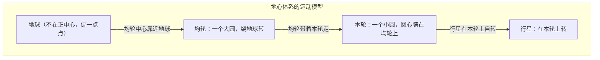
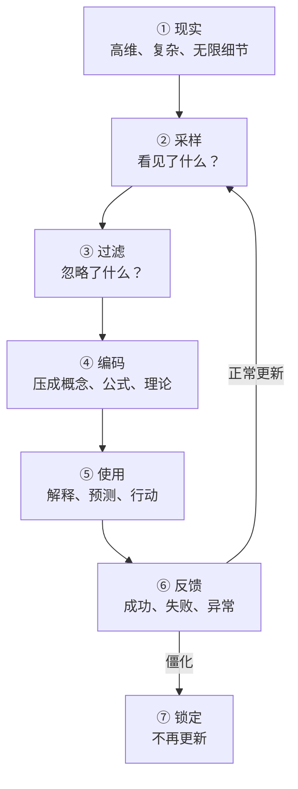
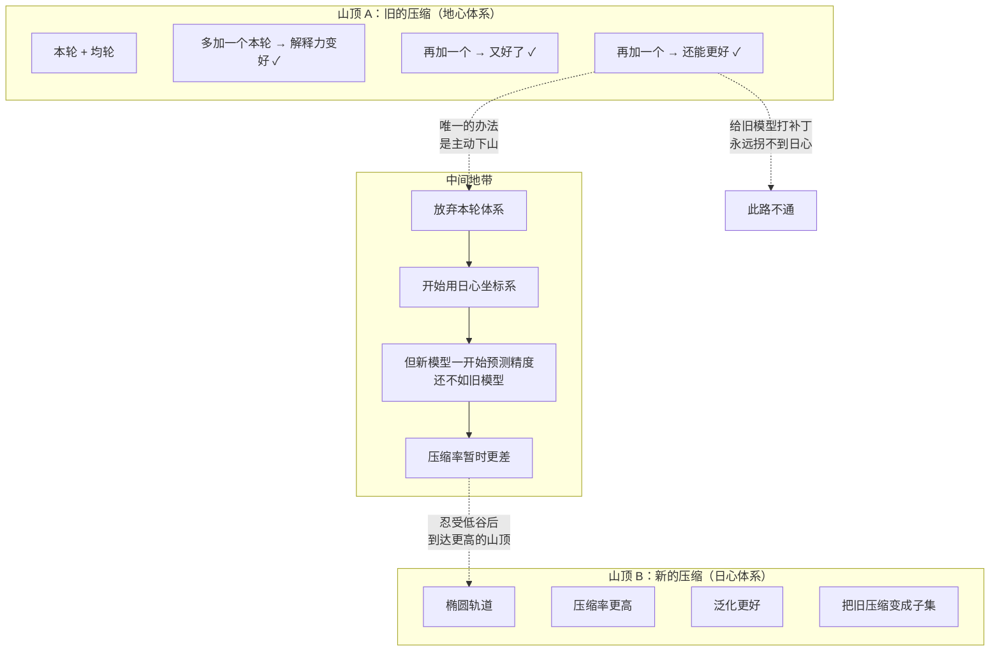
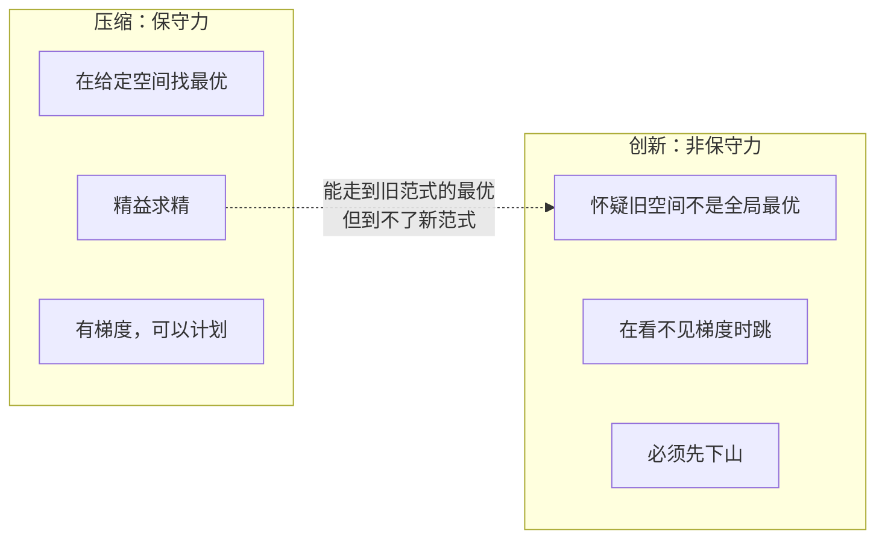

# 创新的本质：为什么最难的不是找到答案，而是换一个问题

**创新事后看是压缩，事前看是跳崖。**

---

很多人以为创新是"找到更好的答案"。

更好的答案是给已有的问题找的。真正难的那种创新——牛顿到爱因斯坦、地心到日心、马车到汽车——不是找到更好的答案，而是**把整个问题换掉了。** 而"换问题"这件事，旧问题不教你。

这篇文章用一套系统性的方式，把创新拆到底。

---

## 一、从第一性原理开始：创新到底在做什么？

先把"创新"这个词解压。

拆到最底层，所有创新都是同一个操作：**换一种方式压缩世界。**

回头看：哥白尼把"本轮-均轮"换成"椭圆绕太阳"。牛顿把"运动需要解释"换成"静止才需要解释"。达尔文把"每个物种独立设计"换成"所有物种来自同一个算法"。iPhone 把"手机 = 按键 + 屏幕"换成"手机 = 一块玻璃"。

每一次，都是找到了压缩率更高、泛化更好的表示方式。

> **所以创新就是压缩——这个结论没问题。**

但真正的问题是：**如果创新就是压缩，为什么"换一种压缩"这么难？**

---

## 二、插一段：本轮和均轮是什么？

这篇文章会用"本轮-均轮"作为核心例子，所以先花一分钟把它说清楚。

**背景：** 古人每天看到太阳、月亮、星星东升西落，自然觉得地球是中心。但有一个麻烦——行星有时候会"逆行"：正常每晚往东走一点点，但每隔一段时间，它会停下来、往回走、再掉头。如果所有天体绕地球匀速转圈，解释不了这个。

**托勒密的解法：**



- **均轮：** 一个大圆，圆心在地球附近。整圈转完就是行星绕地球一圈的时间。
- **本轮：** 一个小圆，圆心骑在均轮上，跟着均轮一起走。行星在这个小圆上自转。

**为什么这能解释逆行？** 当行星转在本轮的内侧（靠近地球那一半）时，本轮往前走、行星在本轮上往后转——两个运动方向相反，从地球看，行星就像停住了、往回走了。转到外侧时，两个运动同向，行星正常前进。

**为什么它是"旧压缩"的完美例子？** 因为它可以无限打补丁：

```
第一版：一个本轮 → 解释得还不错
发现偏差？ → 再加一个本轮，嵌套在本轮上
还有偏差？ → 再加一个
还不够？   → 再加……
```

每多加一个本轮，解释力就变好一点。所以**在它自己的体系里，你永远有正向反馈**——这就一路加。加到几十个本轮，算得人眼花缭乱，但你不会怀疑整个模型是错的。因为每一个补丁都在说"再打磨一下就好了"，从来没有一个补丁告诉你"算了，拆了重建吧"。

好了，现在可以往下走了。

---

## 三、先看懂压缩系统，才能看懂创新

在一篇关于压缩的文章里，我把"压缩"扩展成了系统模型。这里复述关键节点：



一个成熟的压缩系统——比如牛顿力学——不是一条公式。它是**一整套从采样到编码到使用到反馈的运转系统**。它用得很顺，解释力很强，所以不会被轻易怀疑。

而创新要做的事，是**把这个运转良好的系统停下来，换一个新的。**

---

## 四、第一个障碍：旧压缩让你看不见它

一个足够好的压缩，会让你透过它看世界，却看不见它自己。

就像：

- **戴眼镜的人忘了自己在戴眼镜。** 他看到的不是"镜片里的画面"，就是"世界"。只有镜片脏了、碎了、度数不对了，他才想起来——哦，我戴了眼镜。
- **鱼不知道水的存在。** 水对它来说不是"环境"，就是一切。它不会问"水是什么"，因为从来没离开过。
- **你呼吸空气。但一天里有几次想起"我在呼吸空气"？**

旧压缩就是眼镜、是水、是空气。

中世纪天文学家说"行星逆行"。他不觉得自己在**用一套模型**。他觉得他在**描述事实**。他从小受的训练、用的工具、写的论文、跟同行说的话——全在地心体系里。他把操作系统当成了桌面壁纸。

```
────────────────────────────────────────────
你不是在想"有没有更好的模型？"
你是在想"本轮从五个加到七个够不够？"
────────────────────────────────────────────
```

这不是人的问题，是压缩系统的结构特征：

> **压缩得越好，用的人越感觉不到它的存在。它从"一个工具"变成了"常识"。而常识是不需要检查的——常识就是"本来就这样"。**

这就是第一个障碍：**旧压缩不会主动告诉你它只是压缩。**

---

## 五、第二个障碍：两个最优解之间没有平滑路径

这是整个框架里最重要的一张图：



**在一个旧范式里做梯度下降，你只会走到旧范式的山顶——绝不会走到另一个范式。**

多加一个本轮，解释力就变好了。再加一个，又好了一点。这个方向上的每一步都在进步。但沿着这个方向走到死，也到不了日心说。

两个山顶之间隔着一片低谷。你要先变差，才能变更好。

这就是为什么"渐进式创新"和"颠覆式创新"不是程度差异——它们是**两个不同的方向**。渐进是爬同一座山。颠覆是从一座山下来，走到另一座山。

---

## 六、第三个障碍："下山"的指令，旧系统不给

在地心体系里，你收到的所有信号都在说同一件事：

```
"再加一个本轮，误差又变小了"              → ✓ 继续加
"本轮理论是复杂了点，但还能用"            → ✓ 继续磨
"日心说？别开玩笑，它连火星位置都算不准"   → ✗ 别跳
```

你的 KPI、同行评审、研究经费——**全在让你留在旧山顶上。**

没有任何一个信号告诉你："可以下山了。"

哥白尼得到的不是一个数据信号。他得到的是一种直觉："这系统太丑了。"不是数据告诉他的——是他自己觉得。而美学不在科学方法的流程里。

> **旧压缩系统里的每一个反馈回路，都在说"继续往上爬"。下山的指令，只来自系统之外。**

---

## 七、创新的完整结构

创新不是"突然想到一个好主意"。它是一连串跨越：

```
阶段一：看见压缩
    旧的解释方式不再是"现实"，而只是"一个可能的模型"
    这一步最难——因为好的压缩，你根本看不见它

阶段二：怀疑压缩
    这个模型可能不是全局最优
    这个怀疑不是数据给的——是美学、直觉、或者异常的不可忽略的积累
    而旧系统里的所有人都在说"再打磨一下就行了"

阶段三：忍受低谷
    放下旧的，新的还没建好
    中间比两边都差
    这不是"卡住了"——这是结构决定的必经阶段

阶段四：跳到新空间
    找到新的不变量
    用新方式重新压缩
    这一步才是压缩——但它只是整个流程的最后一段

阶段五：验证
    新压缩能不能比旧压缩解释更多？
    能不能把旧压缩变成自己的子集？
```

**五个阶段里，只有第四、第五步跟"压缩"有关。前三步——看见压缩、怀疑压缩、忍受低谷——才是创新的核心，也是旧系统绝对不教你的部分。**

---

## 八、用三种创新验证这个模型

### 科学创新：哥白尼

| 阶段 | 哥白尼做了什么 |
|---|---|
| 看见压缩 | "我们一直在用本轮-均轮模型在看行星。它不是现实——它是一个模型。" |
| 怀疑 | "加到几十个本轮了，不可能是对的。这太丑了。" |
| 忍受低谷 | 日心说早期预测精度不如本轮体系；他死后近百年才被接受 |
| 跳到新空间 | "假设行星绕太阳转" |
| 验证 | 伽利略看到木星卫星；开普勒修正为椭圆；牛顿统一天上和地上 |

注意：**"太丑了"是美学判断，不是数据判断。** 数据还在说"再加一个本轮就对了"。

### 技术创新：iPhone

| 阶段 | 苹果做了什么 |
|---|---|
| 看见压缩 | "手机 = 小屏幕 + 物理键盘"是 Nokia/Moto 的压缩方式，不是唯一方式 |
| 怀疑 | "为什么必须有键盘？手指不就是最好的输入工具吗？" |
| 忍受低谷 | 初代 iPhone 没 3G、续航差、没 App Store、定价被批评 |
| 跳到新空间 | "手机 = 一整块玻璃 + 多点触控" |
| 验证 | 三年后 Nokia 退出手机市场 |

注意：**"为什么必须有键盘？"** 这个问题，在 Nokia 的世界里根本不会出现。键盘不是"一个选项"，键盘是"手机是什么"的一部分。

### 日常创新：骑自行车

所有人都经历过的小型创新：

```
旧压缩："我要保持平衡"
    → 你死死抓住车把，身体僵硬，摔了

怀疑："死死抓住可能不是办法……"

忍受低谷："完了，放掉之后更不稳了！"

新压缩："往前骑，速度起来，身体自然平衡"
    → 会了
```

回头看太简单了——不就是"往前骑"吗？

但**"死死抓住 → 往前骑"之间没有中间状态。** 你不可能"70% 死死抓住 + 30% 往前骑"然后慢慢过渡。你必须放掉旧模式，忍受那一瞬间的失控。

创新跟这是同一件事，只是规模更大。

---

## 九、三个常见误区

**误区一：以为创新是"突然想到"。** 实际是在旧系统里泡了足够久，久到能感受到它的美——和它的丑。那个"突然"是泡了很久之后，终于把旧的放下了。

**误区二：以为反对创新的是"保守"。** 站在旧山顶上的人，看到的数据全在说"旧的更好"。他不是在反对创新——他是在看自己看到的证据。系统性的阻力不是来自人品，是来自位置。

**误区三：以为创新之后一切变好了。** 创新只是换了压缩。新压缩一样会失真、会自隐、有一天会变成下一个需要被突破的旧范式。这不是失败——这是压缩系统的本质。

---

## 十、怎么提升创新的可能？

不画大饼——没有"三步成为创新者"。但从系统视角，有几件事可以做：

**1. 认出压缩。** 你做的事、你用的方法、你行业的默认规则——哪部分是真约束，哪部分是"这个压缩方式就这么压了"？

**2. 看异常。** 旧压缩解释不了的东西，不是 bug，是下山的路标。不要用"这是噪音"扔掉它。

**3. 容忍混乱期。** 从旧方式到新方式，中间一定会有一段"好像更差了"。这不是你做错了，是结构决定的。两座山顶之间，必须穿过山谷。

**4. 问一个外人会问的问题。** 不是外行——是完全不在这套压缩里的人。他们看不到这套压缩的优点，但他们也看不到它的盲区。他们能看到"本轮太丑了"。

**5. 区分两种改进：** 是在爬同一座山（渐变），还是在找另一座山（跃迁）。前者靠勤奋和梯度。后者靠怀疑和跳跃。方法论完全不同。

---

## 收束



> **压缩是保守力——决定你能在一条路上走多远。**
>
> **创新是非保守力——决定你能不能换一条路。**
>
> **而换路最难的地方，不是找到新路——是放下旧路，在看不见新路的时候，愿意先往下走。**

---

*用到的思维框架：第一性原理、系统思维、模型路由、思想实验、地图-领土、反馈回路*
