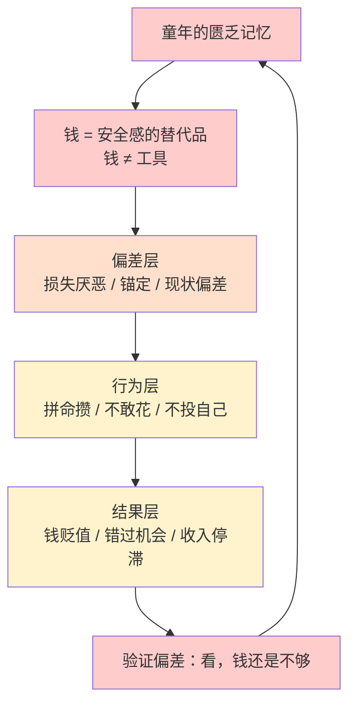
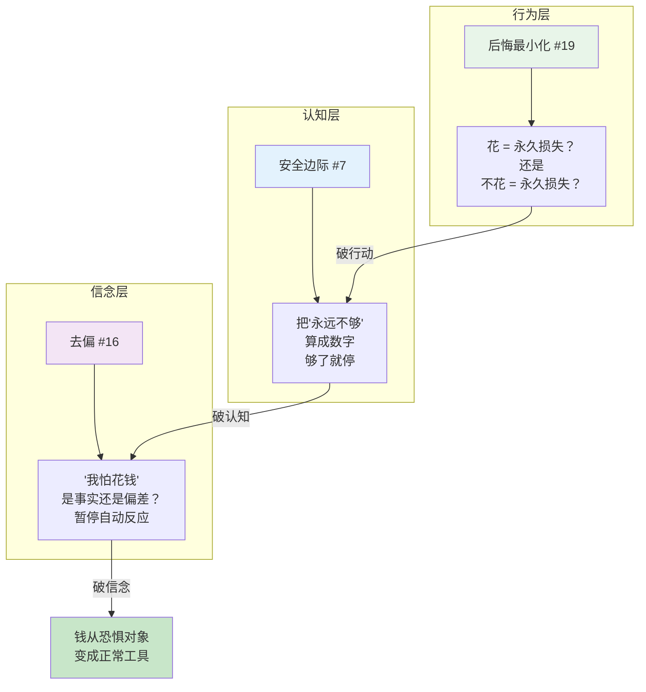
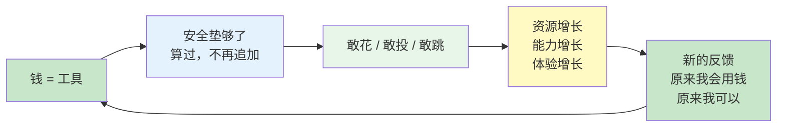

穷过的孩子长大后，对钱的感觉和别人不一样。这种"不一样"到底是什么？不是抠门，也不是节俭——是**钱从来没有变成过正常的工具**。

这篇文章用三个思维框架，把这种感觉拆开、算清、然后重建。

---

## 16 去偏：金钱观里的认知偏差

穷过的孩子面对钱的时候，脑子里的第一反应不是"这个东西值不值"，而是"我配不配"。这不是理智决定的，是长在骨头里的。

以下是几个最容易中的偏差：

| 偏差 | 表现 | 自问 |
|------|------|------|
| **损失厌恶** | 花掉 100 块的痛苦 > 赚到 100 块的快乐 | 这 100 块不花，十年后它在哪？ |
| **锚定效应** | 小时候 100 块是大钱，现在花 100 块还是紧张 | 你心里的"贵"，锚在十几年前的物价上？ |
| **心理账户** | "工资可以花，奖金必须存"——同一笔钱被分了三六九等 | 这笔钱换个来源，你会一样对待吗？ |
| **现状偏差** | 钱必须趴在储蓄卡里，任何变动都让人不安 | 不做任何改变的机会成本是多少？ |
| **幸存者偏差** | 只记得"家里没钱的时候"，看不见自己已经走出来了 | 今天你的财务状况，换一个人看会觉得危险吗？ |

核心武器只有一句：

> **"我现在对钱的感觉——它是事实，还是偏差？"**

---

## 7 安全边际：把恐惧算成数字

穷过的孩子拼命攒钱，不是因为会理财，是因为**安全感不是算出来的，是感觉出来的**。感觉会膨胀，所以"够了"永远不会来。

安全边际框架做的事很简单：**把安全感从感觉变成数字。**

### 第一步：分清理性和恐惧

| 场景 | 理性安全边际 | 恐惧驱动 |
|------|------------|---------|
| 应急金 | 6-12 个月生活费 | "永远不够" |
| 买房 | 首付 30%-40% | "必须全款" |
| 换工作 | 3-6 个月缓冲 | "下家必须签卖身契" |
| 给自己花一笔 | 不超过月收入的 X% | "不行" |

### 第二步：边际效用递减

安全边际不是越大越好。过了某个点，多出来的每一块钱，是在用**"活着的自由"换"死不了的安心"**。

算清楚多少就够了。够了的，就是你的。多出来的——放心用。那不是乱花，是你算过的。

---

## 19 后悔最小化：解决"不敢花"

这是专门对付"花钱有罪恶感"的武器。原理很简单：

> **这笔钱花掉，最坏结果：钱没了。可恢复。**
> **这笔钱不花，失去的体验/学习/机会是永久的。不可恢复。**

### 两类后悔，两种结局

- **行动的后悔：** 花了钱、事情没成 → **随时间消退**
- **不行动的后悔：** 没花、没试、没去 → **越老越痛**

| 犹豫的事 | 八十岁的后悔 |
|----------|------------|
| "想学个东西，挺贵的" | 会后悔没学 |
| "想去个地方" | 会后悔没去 |
| "想给自己买个喜欢的" | 会后悔一辈子对自己抠 |
| "投点钱试个小项目" | 失败能再挣，没试永远不知道 |

---

## 系统视图：三条杠杆撬动一个循环

### 旧系统：恐惧驱动的恶性循环

**三个回路在同时运转：**

- 🔴 **增强回路 R1：** 恐惧 → 保守 → 验证恐惧 → 更恐惧
- 🔴 **增强回路 R2：** 不投资自己 → 收入停滞 → 更需要省 → 更不投
- 🔵 **调节回路 B1：** 攒到 X 就安心 → X 到了 → X 自己往后移 → 继续攒

---

### 干预：三个框架撬动三层杠杆

---

### 新系统：钱的正常化

---

## 总结

| 维度 | 旧系统 | 新系统 |
|------|--------|--------|
| 钱的本质 | 安全感的替代品 | 工具 |
| 驱动力 | 恐惧（怕不够） | 计算（够了就停） |
| 核心偏差 | 损失厌恶、锚定、现状偏差 | 被识别、被审视 |
| 安全边际 | 感觉驱动，永不满足 | 数字驱动，到了就停 |
| 花钱的感觉 | 罪恶感 | 算过的自由 |
| 增强回路 | 越怕越省，越省越怕 | 越用越敢，越敢越有 |

---

三个框架撬动了三层深度：

- **#19 后悔最小化** 撬行为层——最容易开始，立刻见效
- **#7 安全边际** 撬认知层——把模糊焦虑变成精确数字
- **#16 去偏** 撬信念层——最深、最慢、最根本

最终的目标不是"会省钱"，是**让钱从恐惧的对象，变成正常的工具。**

---

*用到的思维框架：去偏、安全边际、后悔最小化、系统思维、反馈回路*
