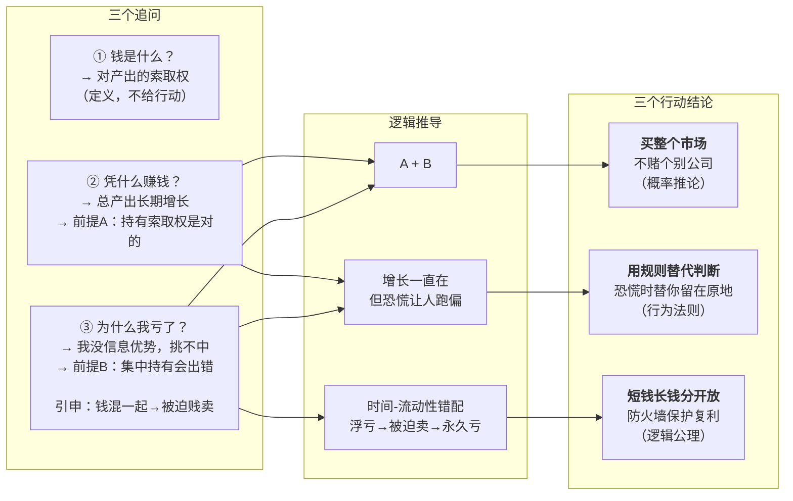
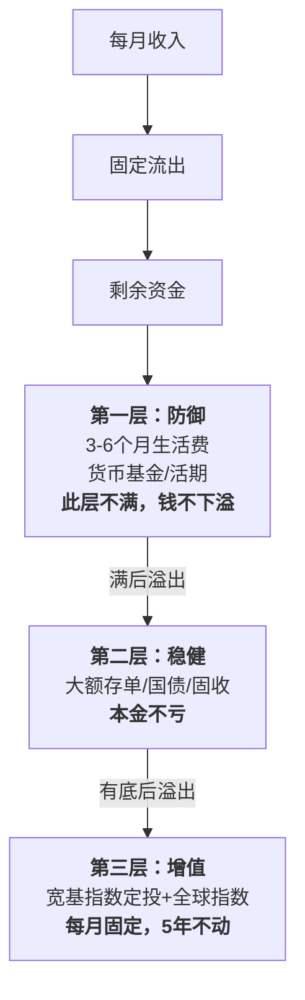

# 一个理财白痴的系统重建：用第一性原理推倒重来

我和 AI 聊了二十轮，把自己的财务状况从头拆了一遍。这篇文章是整个过程的结构化复盘——不是为了告诉你"该怎么理财"，而是展示：一个没有信息优势、没有分析能力、没有时间的普通人，如何从零建一个不需要判断力的财务系统。

---

## 我管了十几年钱，为什么还是一塌糊涂？

过去我管钱就三种方式：钱躺银行卡、跟风买房、炒股瞎买。

结果：股票亏损，房子高位站岗，钱在卡里贬值。

**这些不是操作失误——是我根本没有一个系统。** 所有决策都是感性的、被风气推着走的。

但"建系统"是空话。我得先搞清楚最底层的东西。

---

## 钱到底是什么？

**钱是对社会产出的索取权。** 今天不花的每一块钱，是你存下的一张"欠条"——将来找社会兑现。

理财无非是在两个维度上配置这些欠条：时间（什么时候兑现）和不确定性（能不能兑现）。

这个定义本身不告诉你该买什么。但它是地基。

---

## 那投资凭什么能赚钱？

唯一的底层原因：**人类社会的总产出长期增长。** 只要人还在工作、创新、交易，经济总盘子就会变大。战争、危机、疫情——都是短期坑，长期线从没停过。

"持有对整个产出的索取权"这件事是对的。十年后社会生产的东西比今天多，你的欠条就自动变值了。

赚的不是别人的钱，是人类创造的新价值。

---

## 那我为什么亏了？

如果总产出一直在涨，持有索取权就应该赚钱——为什么我买房亏了、炒股亏了？

**我把"总盘子会变大"和"我能挑中哪一块变大"混在一起了。**

| 操作 | 我在赌什么 |
|---|---|
| 买个股 | 这家公司跑赢整个经济。大部分公司不行，大部分人也挑不出行的 |
| 跟风买房 | 这个地段、这个时机、这个价格持续跑赢。极度集中、带杠杆、不可拆分 |
| 钱躺银行卡 | 名义上安全。但通胀不饶人——确定性地在输购买力 |

我没有信息优势，没有分析能力，没有时间——却在玩一个需要这三样东西才能赢的游戏。

---

## 所以呢？

三轮追问撞在一起，答案自己出来了：

三条结论不是并列的智慧——它们是构建系统的三段工序：

- **结论三**是逻辑公理，必须先落地：先有架构，才能谈别的东西放哪。
- **结论一**是概率推论，填进架构：第三层放什么？为什么是它？
- **结论二**是行为法则，保护架构：东西都放好了，怎么不让自己拆掉它？

下面按这个顺序，一条一条落地。

---

## 短钱和长钱，怎么分？

分层的逻辑很简单——**一笔钱什么时候要用，就放在什么风险等级里。**

**第一层：防御。** 工具：货币基金、活期理财。目标：3-6 个月生活费。建成标志：你失业半年，不需要卖任何东西。

**第二层：稳健。** 工具：大额存单、国债、固收。没有绝对上限，到你心里有底。建成标志：第三层暴跌 40%，你不慌。

**第三层：增值。** 工具：下文决定。时间下限：5 年不动。建成标志：设完自动扣款，之后你不看。

---

## 第三层放什么？

架构有了，第三层空着。结论一说"买整个市场"——具体是什么？有没有别的选择？

我先交代一个背景：聊了十几轮之后，我问了 AI 一个问题——"你一个劲推广宽基指数定投，有啥目的？"这个问题比之前所有问题都重要，因为**我开始审视给我建议的人。** AI 不拿佣金、不卖产品、没有算法导流。它反复推荐指数定投，是因为在我的能力边界里，它是唯一一个通过全部条件的。

### 我的六个约束

| 条件 | 定义 |
|---|---|
| C1 不用选 | 不需要挑个股、挑经理、挑地段、挑时机 |
| C2 不会归零 | 永久性本金损失的概率极低 |
| C3 不用择时 | 不需要判断什么时候买、什么时候卖 |
| C4 无优势能赢 | 没有信息优势和分析能力的人也能获得正收益 |
| C5 够简单 | 手机或银行柜台 5 分钟搞定 |
| C6 能自动化 | 设定后不需要持续干预 |

### 全部候选过滤

✅ 满足 / ⚠️ 部分满足 / ❌ 不满足

| 候选 | C1 | C2 | C3 | C4 | C5 | C6 | 通过 | 第三层？ |
|---|---|---|---|---|---|---|---|---|
| 银行存款 | ✅ | ✅ | ✅ | ⚠️ 确定缩水 | ✅ | ✅ | — | ❌ |
| 货币基金 | ✅ | ✅ | ✅ | ⚠️ 跑不赢通胀 | ✅ | ✅ | — | ❌ |
| 国债 | ✅ | ✅ | ✅ | ✅ | ✅ | ⚠️ | — | ❌ |
| 大额存单 | ✅ | ✅ | ✅ | ✅ | ✅ | ⚠️ | — | ❌ |
| **宽基指数定投** | ✅ | ✅ | ✅ | ✅ | ✅ | ✅ | **6/6** | **✅** |
| **全球指数定投** | ✅ | ✅ | ✅ | ✅ | ✅ | ✅ | **6/6** | **✅** |
| 行业 ETF | ❌ | ⚠️ | ❌ | ❌ | ✅ | ✅ | 2/6 | ❌ |
| 个股 | ❌ | ❌ | ❌ | ❌ | ✅ | ❌ | 1/6 | ❌ |
| 主动基金 | ❌ | ❌ | ⚠️ | ❌ | ⚠️ | ✅ | 1/6 | ❌ |
| REITs | ⚠️ | ⚠️ | ⚠️ | ⚠️ | ⚠️ | ⚠️ | 0/6 | ❌ |
| 房产 | ❌ | ⚠️ | ❌ | ❌ | ❌ | ❌ | 0/6 | ❌ |
| 黄金 | ✅ | ✅ | ❌ | ⚠️ | ✅ | ❌ | 3/6 | ❌ |

银行、货基、国债、存单没通过 C4——但它们不需要通过。它们的设计目的是确定性，属于第一层和第二层。

**行业 ETF 最迷惑人。** 和宽基指数只差两个字，都能定投。但选行业 = 在判断一个行业未来二十年。把判断权交出去，正是这个系统设计的前提。

**第三层，结论明确：宽基指数 + 全球指数，定投。**

---

## 管不住手怎么办？

架构搭好了，东西选好了。但我知道自己——市场大跌的时候，我肯定想做点什么。

所以需要规则。规则不用判断力。它在你想跑的时候替你留在原地。

| 规则 | 为什么不是靠判断 |
|---|---|
| 定投发薪日自动扣 | 不给"这个月要不要投"留犹豫空间 |
| 大跌时什么都不做 | 恐慌时人天生想操作。规则替你挡这一刀 |
| 每年看一次，只调比例 | 大脑对浮亏的恐惧和真实物理威胁一样强烈——但这种恐惧在长期投资中是错的。所以不看 |
| 第一层不满，不进第二层 | 顺序不能跳——防御没建好，一切投资讨论是虚的 |
| 大额决策设 72 小时冷静期 | 情绪峰值做的决策，事后大多后悔 |

五条，不复杂。复杂的规则守不住。

---

## 从哪开始？

三层架构还没填满，股票还没处理完。这个系统更多是我正在朝的方向，不是我已完成的状态。

差别在于——以前我不知道自己在哪，也不知道该往哪走。现在至少两个问题都有答案了。

启动：

- [ ] 1. 算出 3-6 个月全部生活支出
- [ ] 2. 开独立账户（和工资卡不同银行），设每月发薪日自动划转，直到填满第一层
- [ ] 3. 检查保险覆盖：百万医疗 + 重疾 + 定寿，缺的补上
- [ ] 4. 第一层达标当天，三件事一起做：
        · 设第三层自动定投，金额不影响生活
        · 关闭所有理财 APP 通知
        · 定一个年度检查日（比如生日），日历设提醒
- [ ] 5. 第二层等第一层满、第三层在跑、手头有余钱，买大额存单或国债。不纠结配比，有就行
- [ ] 6. 列出所有股票，逐只问：**今天手里是现金，还买它吗？** 不是 → 卖，钱按最缺的层填

系统建成的那一刻，不是想通的那一刻——是**第一笔自动定投扣款成功**的那一刻。
