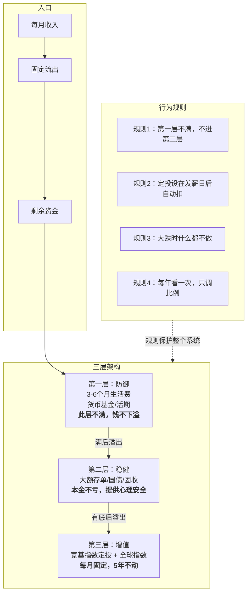

我和 AI 聊了二十轮，把自己的财务状况从头拆了一遍。这篇文章是整个过程的结构化复盘——不是为了告诉你"该怎么理财"，而是为了展示：一个没有信息优势、没有分析能力、没有时间的普通人，如何从零建一个不需要判断力的财务系统。

---

## 起点：承认自己没系统

我管了十几年钱，方式就三种：

- 钱躺银行卡
- 跟风买房
- 炒股瞎买

结果：股票亏损，房子高位站岗，钱在卡里被通胀慢慢吃掉。

说出来不难。难的是承认——**这些不是操作失误，是我根本没有一个财务系统。** 所有决策都是感性的、随机的、被社会风气推着走的。

---

## 第一性原理：把"理财"拆到不能再拆

### 第一层追问：钱是什么？

**钱是对社会产出的通用索取权。** 今天不花的每一块钱，都是你存下来的一张"欠条"——将来可以找社会兑现。

理财是在干什么？**在时间和不确定性两个维度上，配置这些欠条。**

### 第二层追问：投资凭什么能赚钱？

唯一的底层原因：**人类社会的总产出长期增长。** 只要人还工作、创新、交易，经济总盘子就会变大。战争、危机、疫情都是短期坑，长期线从没停过。

投资 = 持有对这部分增长的索取权。赚的不是别人的钱，是人类创造的新价值。

### 第三层追问：那为什么我亏了？

因为我把"总盘子会变大"这个大概率正确的事，和"我能挑中哪一块变大"这个极小概率的事——**混在一起了**。

| 操作 | 我在赌什么 |
|---|---|
| 买个股 | 这家公司跑赢整个经济。大部分公司不行，大部分人也挑不出行的 |
| 跟风买房 | 这个地段、这个时机、这个价格能持续跑赢。极度集中、带杠杆、不可拆分 |
| 钱躺银行卡 | 名义上安全，但确定性地输——通胀这笔隐形税收不饶人 |

**问题不是我操作差。问题是让一个没有信息优势的人，在做需要信息优势才能赢的游戏。**

---

## 系统的三条公理

从追问里提取三条。所有具体操作从它们推出来。

这里要先诚实：三条里的前两条不是逻辑公理，不能和数学里的"两点确定一条直线"类比。**第三条是真公理（逻辑必然）。前两条是"历史上概率极高的推论"和"大量行为数据的经验法则"。**

| 公理 | 性质 | 含义 |
|---|---|---|
| **推论 1** | 历史强概率 | 人类长期生产力增长是投资赚钱的唯一可靠来源 → 买整个市场，不赌个别公司 |
| **法则 2** | 行为数据 | 我最大的敌人不是市场，是我自己 → 用规则替代判断力 |
| **公理 3** | 逻辑必然 | 短期要花的钱和长期要增长的钱必须分开放 → 分层，每层设防火墙 |

---

## 三层架构：系统的骨架

**每一层为下一层提供保护。** 第一层让你不会被迫贱卖第二、三层。第二层让你在第三层跌 40% 时不恐慌。第三层用时间和分散化换取复利增长。

### 每一层的精确定义

**第一层：防御**

目的：确保你不被迫在不利时间卖出长期资产。工具：货币基金、银行活期理财。目标：3-6 个月全部生活支出。**此层不满，所有投资暂停。** 建成标志：你失业半年，不需要卖任何东西。

**第二层：稳健**

目的：保住大部分本金，提供心理安全感。工具：大额存单、国债、固收类理财。没有绝对上限，到"你心里有底"为止。建成标志：第三层暴跌 40%，你心里不慌。

**第三层：增值**

目的：长期复利，分享经济增长。工具：宽基指数定投（如沪深300）+ 全球市场指数（如标普500、MSCI全球指数）。时间下限：至少 5 年不动。建成标志：设完自动扣款，之后你不看。

---

## 系统的运行规则

核心设计理念：**不用判断力，用规则替代。**

| 规则 | 为什么不是"靠判断" |
|---|---|
| 定投设在发薪日自动扣款 | 不给"这个月要不要投"留犹豫空间 |
| 市场跌 30%，什么都不做 | 恐慌时人天生想做点什么。规则替你挡这一刀 |
| 每年看一次，只调比例 | 不看 = 不给大脑犯错的机会。大脑对纸面浮亏的感知和真实物理威胁一样强烈——但这种恐惧在长期投资中是错的 |
| 大额决策设 72 小时冷静期 | 情绪峰值时做的决策，绝大多数事后后悔 |

系统不需要你聪明、勤奋、或判断力强。它只需要你在恐慌时刻——什么都不做。

---

## 六条件过滤实验：为什么是它

在聊了十几轮之后，我问了 AI 一个问题：

> "你一个劲地在推广宽基指数定投，你有啥目的嘛？"

这个问题比之前所有问题都重要。不是因为答案——是因为**我开始审视给我建议的人。**

AI 不拿佣金、不卖产品、没有算法导流。它反复推荐指数定投，不是因为有利益——是因为在我的六个约束条件下，宽基指数定投是唯一一个通过全部条件的增值工具。

### 六个条件

| 条件 | 定义 |
|---|---|
| **C1 不用选** | 不需要挑个股、挑经理、挑地段、挑时机 |
| **C2 不会归零** | 永久性本金损失的概率极低（不是不波动） |
| **C3 不用择时** | 不需要判断"什么时候买、什么时候卖" |
| **C4 历史验证** | 不要求操作者有信息优势或分析能力也能获得正收益 |
| **C5 够简单** | 一个普通人用手机或银行柜台 5 分钟能搞定 |
| **C6 能自动化** | 设定后不需要持续干预，系统替你执行 |

### 全部候选过滤结果

**✅ = 满足    ⚠️ = 部分满足/有条件    ❌ = 不满足**

| 候选 | C1 | C2 | C3 | C4 | C5 | C6 | 通过 | 用途 |
|---|---|---|---|---|---|---|---|---|
| 银行存款 | ✅ | ✅ | ✅ | ⚠️ 确定缩水 | ✅ | ✅ | — | 第一层 |
| 货币基金 | ✅ | ✅ | ✅ | ⚠️ 跑不赢通胀 | ✅ | ✅ | — | 第一层 |
| 国债 | ✅ | ✅ | ✅ | ✅ | ✅ | ⚠️ 到期续买 | — | 第二层 |
| 大额存单 | ✅ | ✅ | ✅ | ✅ | ✅ | ⚠️ 同上 | — | 第二层 |
| 纯债基金 | ⚠️ 需稍选 | ⚠️ 信用风险 | ✅ | ✅ | ✅ | ✅ | — | 第二层 |
| **宽基指数定投** | ✅ | ✅ | ✅ | ✅ | ✅ | ✅ | **6/6** | **第三层** |
| **全球指数定投** | ✅ | ✅ | ✅ | ✅ | ✅ | ✅ | **6/6** | **第三层** |
| 行业 ETF | ❌ | ⚠️ | ❌ | ❌ | ✅ | ✅ | 2/6 | — |
| 个股 | ❌ | ❌ | ❌ | ❌ | ✅ | ❌ | 1/6 | — |
| 主动基金 | ❌ | ❌ | ⚠️ | ❌ | ⚠️ | ✅ | 1/6 | — |
| REITs | ⚠️ | ⚠️ | ⚠️ | ⚠️ | ⚠️ | ⚠️ | 0/6 | — |
| 房产 | ❌ | ⚠️ | ❌ | ❌ | ❌ | ❌ | 0/6 | — |
| 黄金 | ✅ | ✅ | ❌ | ⚠️ | ✅ | ❌ | 3/6 | — |
| 加密货币 | ❌ | ❌ | ❌ | ❌ | ⚠️ | ❌ | 0/6 | — |
| 期货/期权 | ❌ | ❌ | ❌ | ❌ | ❌ | ❌ | 0/6 | — |

这张表没有用一个字说"你应该买什么"。但它把能力边界和工具属性做了一个交叉比对——**通过几个条件的，自然留下来。**

有三点值得一提：

第一，银行存款、货币基金、国债、大额存单——它们在"C4 历史验证"上是黄的（跑不赢或刚跑赢通胀），但这不是它们的设计目的。它们的设计目的是**确定性**，所以它们在第一层和第二层，不在第三层。

第二，行业 ETF 看起来和宽基指数很像——都是 ETF，都能定投。但 **"新能源 ETF"和"沪深 300 ETF"只差两个字，前者要求你判断一个行业未来二十年的走势，后者只需要你相信经济整体会增长。** 选行业 = 你在做判断。而且这个判断大部分人也做不对。

第三，全球指数定投（标普500、MSCI全球指数）和沪深300定投原理完全相同——买整个市场，不赌单一经济体。两者都通过全部六项。没有讨论全球分散化是我的视野局限。

---

## 最难做的一个判断：房子

2020 年高位买的房。每月房贷 3000，房租抵扣之后还要倒贴。

系统思维的第一步是算清真账：**每月 3000 里，大约 2000 是还本金——自己的钱从左口袋进右口袋，不是亏损。只有 1000 利息是真成本。** 伤害只有原来以为的三分之一。

但接下来才是难的。首付和已还本金已经沉没了——卖不卖，它们都不会回来。而且最关键的：卖了到手现金也几乎是零。**"卖房套现去定投"不存在。**

所以房子和定投是两个独立决策，不能互相绑架。

那房子在我系统里究竟算什么？它是一笔**每月 1000 块的真实成本**，换来的是一张"房价涨回来"的彩票。一年 12,000 块。要不要继续买这张彩票——这个决策不是财务计算，是心理成本评估。这 12,000 花得值不值，只有自己知道。

**过去的价格和未来的价格没有因果关系。市场不知道也不在乎我多少钱买的。** 这个事实很残酷，但它是第一性原理。

---

## 最重要的不是"怎么做"，是"怎么想"

整件事拆完，我得到的不是一个理财产品推荐清单——是一个思考框架：

1. **分清存量和流量**。存量是你已经有的钱（银行存款、股票持仓、房产），流量是每月进出。你只能控制流量。
2. **分清你能控制的和不能控制的**。市场涨跌、房价走势你控制不了。花多少、存多少、钱放在哪个池子——你完全能控制。
3. **分清逻辑公理和经验法则**。公理 3（时间-流动性不能错配）是逻辑必然。推论 1 和法则 2 是高概率经验。不要把概率当真理。
4. **用规则替代判断**。判断在恐慌时会失效。规则不会。规则不需要勇气——它只需要执行。
5. **审视每一个给你建议的人**。包括我。包括这篇文章。

---

## 当前真实状态

写下这些的时候，三层架构还没填满，股票还没处理完，房子的事还在犹豫。

这个系统更多是我正在朝的方向，不是我已完成的状态。

但差别已经在于——以前我不知道自己在哪，也不知道该往哪走。现在至少这两个问题都有答案了。

---

## 启动清单

- [ ] 算出 3-6 个月生活费的具体数字
- [ ] 开独立账户放应急金（和工资卡物理隔离）
- [ ] 应急金达标后，设置定投，金额不影响生活
- [ ] 关闭所有理财 APP 通知推送
- [ ] 设一个年度检查日，其他时间不看
- [ ] 列出所有股票持仓，逐只用"今天拿的是现金，还买它吗"审视一遍

系统建成的那一刻，不是**想通了**的那一刻——是**定投第一笔自动扣款成功**的那一刻。
