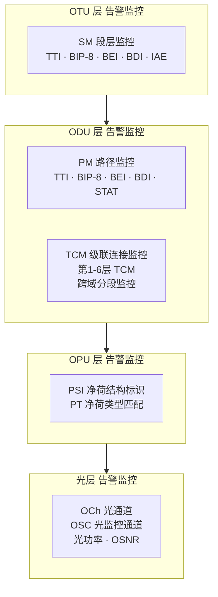

# OTN 告警系统详解

OTN 的告警不是一层一层"瞎报"，而是严格按照 G.709 分层模型来组织的——每一层都有自己独立的 OAM（操作管理维护）开销字段，用来做故障检测和告警上报。

## 告警体系的基础——分层监控架构



**核心原则**：每一层都是独立监控的——上层不依赖下层来发现自己的问题。这样故障定位才能精确到"是光功率不行，还是 OTU 帧丢了，还是 ODU 路径断了"。

## 各层告警逐层拆解

### 1. OTU 层告警（段层 SM）

OTU 层管的是"相邻两个 OTN 节点之间这一段"是否正常。核心告警：

| 告警缩写 | 全称 | 含义 | 触发条件 | 严重等级 |
|---|---|---|---|---|
| LOS | Loss of Signal | 光信号丢失 | 接收端检测不到光信号 | Critical |
| LOF | Loss of Frame | 帧丢失 | FAS 连续 OOF 超时 | Critical |
| OOF | Out of Frame | 帧失步 | FAS 字节对不上，无法找到帧头 | Major |
| LOM | Loss of Multi-frame | 复帧丢失 | MFAS 复帧对齐失败 | Critical |
| OTU-AIS | OTU Alarm Indication Signal | OTU 告警指示信号 | 上游发来"我这边有问题"的告知 | —（透传） |
| SM-TIM | SM Trace Identifier Mismatch | 段层 TTI 不匹配 | 期望的 TTI 和收到的 TTI 不一致 | Critical |
| SM-BDI | Backward Defect Indication | 后向缺陷指示 | 对端说"你发给我的信号有问题" | —（远端告警） |
| SM-BIP8 | BIP-8 误码计数 | 段层误码 | 奇偶校验字节统计到比特错误 | 取决于门限 |

**关键逻辑**：

- LOS → 光没了，啥都不用看了，先查光纤/光模块/光放
- LOF/OOF → 有光但没有帧，可能是收发不匹配（速率、FEC、调制格式）、时钟问题、DSP 问题
- SM-TIM → 帧是好的，但"身价标签"对不上——大概率是跳纤跳错了

### 2. ODU 层告警（路径层 PM + TCM）

ODU 层管的是"端到端这条业务路径"是否正常，这是 OTN 告警体系里最丰富、也最常用的一层。

#### PM（Path Monitoring）

| 告警 | 含义 |
|---|---|
| ODU-AIS | ODU 路径告警指示——下游收到，表示上游 ODU 路径断了 |
| ODU-OCI | 开放连接指示——交叉没做或没通 |
| ODU-LCK | 通道被锁定（管理员手工锁了） |
| PM-TIM | 路径层 TTI 不匹配 |
| PM-BDI | 远端告诉我：你的信号有问题 |
| PM-BIP8 | 路径层误码检测 |
| PM-DEG | 信号劣化——误码在持续，但还没断 |

#### TCM（Tandem Connection Monitoring）

TCM 支持在一条 ODU 路径上设置最多 6 段独立监控区间：

```
[站点A] —TCM1— [站点B] —TCM2— [站点C] —TCM3— [站点D]
 \                                                  /
  \—————— PM（端到端全程监控）—————————————————/
```

**为什么需要 TCM？**跨运营商/跨域时，每个域都需要独立监控自己那段；故障时能快速判断是哪段有问题；对 SLA 分段负责非常有用。

### 3. OPU 层告警

| 告警 | 含义 |
|---|---|
| PLM（Payload Mismatch） | OPU 净荷类型不匹配——期望接 100GE，但收到 OTU4 |

### 4. 光层告警

| 告警 | 含义 |
|---|---|
| LOS（光层） | 光信号丢失 |
| LOW（Loss of Wavelength） | 某个波长信号丢失 |
| OPWR-HIGH/LOW | 光功率过高/过低 |
| OSNR-LOW | 光信噪比过低 |
| 光放大器告警 | EDFA/Raman 泵浦异常、增益异常 |

## 告警严重等级

| 等级 | 含义 | 典型告警 |
|---|---|---|
| Critical | 业务中断 | LOS、LOF、LOM |
| Major | 业务受影响/保护倒换发生 | ODU-AIS、PM-TIM |
| Minor | 性能降级但未中断 | PM-DEG |
| Warning | 预警 | 光功率偏移、FEC 纠错率上升 |
| Info | 信息类 | 保护倒换事件、状态变更 |

## 告警的级联和抑制机制

这是 OTN 告警体系最关键的设计——**告警级联**：

```
光缆断了
  → OTS/OMS 层：光信号全丢
  → 各波长 OCh 层：LOW（波长丢失）
  → OTU 层：LOS→LOF（无帧）
  → ODU 层：ODU-AIS（上游告知下游"我这断了"）
```

**AIS（告警指示信号）** 的作用：
- 当某节点检测到上游业务中断时，向下游发送 AIS 信号，告诉下游"你不要忙着自检了，是上游的问题"
- 这防止了设备上一屏红——不会因为光纤断了一段，全网几十个节点都报 Critical

**告警抑制规则**：

| 根本告警 | 被抑制的次级告警 |
|---|---|
| LOS | LOF、LOM、OTU-AIS |
| LOF | OTU-AIS、ODU-AIS |
| ODU-AIS | PM-TIM、PM-DEG、PM-BIP8 |
| ODU-LCK | 该通道上的所有后续告警 |

**根因分析法则**：在告警列表里找"最下层"的告警——通常是 LOS 或 LOF，处理掉它，上层告警会自动消除。

## 典型故障场景

### 场景 1：光纤中断

```
告警链：OTS LOS → OCh LOW → OTUk LOS → OTUk LOF
         → ODUk-AIS → 下游 PM-TIM
影响：业务中断，保护倒换启动（<50ms）
排查：① OTDR 定位断点 ② 查光功率
```

### 场景 2：跳纤错误

```
告警链：OTUk 层正常（光信号有、帧同步正常）
         → ODU 层 PM-TIM 上报（TTI 不匹配）
影响：根据 TTI 比对配置，可能导致业务阻断
排查：① 对比期望 TTI 和实际收到的 TTI ② 顺藤摸瓜找跳纤记录
```

### 场景 3：光模块/相干 DSP 故障

```
告警链：光功率正常 → OOF/LOF 上报（有光但解不出帧）
排查：① 检查 FEC/调制格式配置 ② 检查互通性 ③ 替换模块
```

### 场景 4：性能劣化未中断

```
告警链：PM-BIP8 增长 → PM-DEG（达到门限）→ 业务尚未中断
排查：① 查光功率/OSNR 趋势 ② 查光纤/连接器清洁度 ③ 查外部干扰
```

## 与告警配套的性能监测

| 监测项 | 作用 |
|---|---|
| BIP-8（SM/PM/TCM） | 每帧误码统计 |
| BEI | 远端汇报误码数 |
| Pre-FEC BER | FEC 纠错前原始误码率——评估链路健康度 |
| Post-FEC BER | FEC 纠错后误码率——业务质量判定 |
| Q 因子 / OSNR | 链路裕量评估 |

> **Pre-FEC BER 是比告警更早的预警信号**——等它恶化到告警级别，业务就已经断了。好的 OTN 运维团队盯的是 Pre-FEC BER 趋势，而不是等着告警跳出来。

## 总结

OTN 告警体系的设计思想可归纳为三点：

1. **分层独立监控**：OTU 管段、ODU 管路径、TCM 管域、光层管物理——每一层有自己的眼睛
2. **AIS 级联抑制**：根因永远在"最下层首个告警"
3. **告警 + 性能双轨**：告警是"有没有断"，性能是"快不快断了"——真正的运维能力体现在后者
