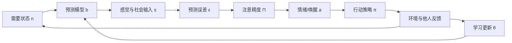

> 当今的心理学有点像法拉第之后、麦克斯韦之前的电磁学：我们已经发现了许多局部规律，却还没有把它们放进同一套动力学语言里。

这篇文章尝试做一件冒险但必要的事：提出一个**心理学统一模型 v0.3**。

它不是宣称"我已经证明了人的全部心理"，而是提出一个可以被批评、修正、检验和扩展的最小理论骨架：把认知、情绪、动机、行为、人格、创伤、关系和成长放进同一套闭环系统中。

我把它称为：

# 预测—调节统一模型

## Predictive-Regulatory Field Theory，简称 PRFT

一句话版：

> **人是一个在不确定世界中，通过预测、情绪、行动、学习和关系反馈，持续调节自身需要状态的自组织系统。**

更短：

> 心理 = 需要调节 + 世界预测 + 情绪估值 + 行动控制 + 经验学习 + 社会嵌入。

如果说牛顿把天体与苹果统一在"引力"之下，麦克斯韦把电、磁、光统一在一组方程之下，那么 PRFT 想做的是：

> 把心理学中分散的概念——欲望、情绪、人格、防御、焦虑、创伤、关系、成长——统一为一个调节系统的不同变量。

---

# 0. 第一性原理：心理系统到底要解决什么问题？

从第一性原理出发，人类心理系统不是为了"思考"而存在，也不是为了"快乐"而存在。

思考、快乐、痛苦、记忆、人格、关系，都服务于一个更底层的问题：

> **在资源有限、信息不完整、未来不确定、他人不可完全预测的环境中，让身体、关系和自我维持在可生存、可行动、可学习、可成长的范围内。**

这句话里有五个关键词。

## 1. 资源有限

人不是无限理性的机器。注意力有限，时间有限，能量有限，身体承受力有限，社会资源有限。

所以心理系统必须做取舍：

- 哪些信号值得注意？
- 哪些风险值得提前模拟？
- 哪些痛苦应该忍受？
- 哪些关系应该维持？
- 哪些目标值得投入？

心理不是单纯的信息处理，而是**在有限资源下的优先级分配**。

## 2. 信息不完整

人永远无法直接接触完整现实。我们只能接收片段信号，然后用过去经验、身体状态、文化语言和社会反馈来补全它。

因此，人不是活在现实本身里，而是活在一个不断更新的预测模型里。

同样一句话，不同的人会听出不同世界：

- 安全型的人听见建议。
- 羞耻敏感的人听见否定。
- 创伤者听见危险。
- 完美主义者听见失败预告。

现实输入相同，预测模型不同，心理世界就不同。

## 3. 未来不确定

心理系统最重要的任务不是解释过去，而是控制未来。

焦虑是未来模拟，计划是未来建模，羞耻是未来社会排斥的预演，愤怒是未来边界被继续侵犯的防御，悲伤是未来世界结构坍塌后的重组。

心理系统关心的不是"发生了什么"，而是：

> 这意味着接下来会发生什么？我还能不能承受？我还有没有行动余地？

## 4. 他人不可完全预测

人不是孤立个体。婴儿首先通过照料者调节自己，成年人继续通过亲密关系、组织、文化、身份和声誉调节自己。

所以心理不是单体系统，而是**社会嵌入的调节系统**。

很多心理痛苦不是来自一个人的内部错误，而是来自关系系统中的长期失调：忽视、羞辱、控制、背叛、不稳定、无法表达、无法被看见。

## 5. 维持在可生存、可行动、可成长的范围内

这就是心理系统的核心目标：不是永远快乐，而是保持**可调节性**。

所谓健康，不是没有痛苦，而是：

> 当需要偏离、预测失败、关系受挫、行动受阻时，系统仍然能够恢复、学习和重新组织。

这也是 PRFT 的第一条总原则：

> **心理健康 = 系统在压力下仍能保持调节弹性。**

---

# 1. 心理学的最小闭环

心理学的基本单位不应该是孤立的"想法""情绪""行为"或"人格特质"，而应该是一个闭环：

翻译成人话就是：

> 我现在缺什么？我以为世界会怎样？现实给了我什么信号？这个信号有多重要？我感觉危险还是有机会？我该怎么行动？行动之后世界如何回应？我是否需要更新自己对世界、他人和自己的判断？

这就是一个完整的心理事件。

例如"伴侣没有回消息"：

1. 需要状态：我需要亲密、确认、安全感。
2. 预测模型：如果他爱我，应该很快回复。
3. 感觉输入：两个小时未回复。
4. 预测误差：现实和期待不一致。
5. 注意精度：这件事被赋予高重要性。
6. 情绪生成：焦虑、愤怒、羞耻或悲伤。
7. 行动策略：追问、冷战、讨好、转移注意、直接表达需要。
8. 反馈学习：如果表达后被安抚，模型更新；如果被羞辱，旧模型强化。

心理学要统一，必须解释这个闭环中的每一环。

---

# 2. 五个公理

## 公理一：人首先是调节系统，而不是思考机器

身体、情绪、自我和关系都需要维持在某个可承受区间。

当安全感、能量、亲密、自主、胜任、尊严、归属、意义、可预测性、控制感中的任何变量偏离安全范围，系统就会产生压力。

所以人的很多行为不是为了"理性最优"，而是为了"马上能撑住"。

拖延、讨好、逃避、成瘾、强迫检查、情绪爆发，常常不是毫无逻辑，而是系统为了短期调节而选择的局部最优解。

## 公理二：人活在预测模型里，而不是现实里

大脑不是被动接收世界，而是不断预测：

> 接下来会发生什么？这个人怎么看我？我安全吗？我有价值吗？努力有用吗？亲密可靠吗？失败是否意味着我完了？

现实输入只是用来修正预测模型的误差信号。

因此，心理痛苦往往不是由事件本身决定，而是由事件与预测模型之间的关系决定。

## 公理三：情绪是调节系统的仪表盘，不是理性的敌人

情绪不是噪音，而是系统读数。

它告诉你：某个重要需要正在偏离目标区间，某个预测模型正在遭遇挑战，某个行动策略需要调整。

| 情绪 | 底层读数 |
|---|---|
| 恐惧 | 安全变量可能失控 |
| 愤怒 | 边界、尊严、资源或公平被侵犯 |
| 羞耻 | 社会价值、归属或自我形象受到威胁 |
| 悲伤 | 重要依附、目标、身份或未来路径丧失 |
| 焦虑 | 未来威胁概率高，但结果不可确定 |
| 兴奋 | 高价值机会正在接近 |
| 厌恶 | 系统检测到污染、腐败、侵犯或道德越界 |
| 无聊 | 当前环境学习价值或奖励价值过低 |
| 内疚 | 行为偏离了内在价值或关系契约 |
| 嫉妒 | 重要关系资源或地位可能被替代 |
| 空虚 | 意义、连接、目标或自我连续性不足 |

情绪不是要被消灭，而是要被解释、校准、表达和整合。

## 公理四：行为是主动控制，不是刺激反应

人不是简单地"刺激 → 反应"。

人是在选择行动策略，试图降低未来的痛苦、不确定性、失控、羞耻或需要偏差。

| 行为 | 短期调节收益 | 长期代价 |
|---|---|---|
| 拖延 | 暂时避免失败焦虑 | 压力累积，能力感下降 |
| 讨好 | 避免冲突和抛弃 | 自我边界被侵蚀 |
| 成瘾 | 快速降低痛苦 | 自由度下降，长期需要恶化 |
| 回避 | 立刻降低威胁 | 恐惧模型被强化 |
| 强迫检查 | 降低不确定性 | 焦虑回路被训练得更敏感 |
| 攻击 | 快速恢复控制感 | 关系损伤，威胁循环升级 |
| 麻木 | 切断过载情绪 | 生命感、亲密感和意义感下降 |

核心洞察：

> **很多症状是短期有效、长期有害的调节策略。**

## 公理五：人格是慢变量，情绪是快变量

人格不是固定标签，而是长期形成的预测参数。

它回答一些高阶问题：

- 世界是否安全？
- 他人是否可靠？
- 我是否有价值？
- 努力是否有用？
- 亲密是否危险？
- 表达需要是否会被惩罚？
- 冲突是否意味着关系结束？
- 成功是否必须靠完美换取？

这些慢变量决定了一个人如何解释事件、分配注意、产生情绪、选择行动。

所以"人格"不是与心理过程并列的东西，而是心理系统中长期稳定的参数结构。

---

# 3. 变量定义：把心理学翻译成同一种语言

| 符号 | 名称 | 类型 | 含义 |
|---|---|---|---|
| $\mathbf{n}_t$ | 需要状态 Need vector | 向量 | 当前身体、关系、自我和意义的满足程度 |
| $\mathbf{n}^*_t$ | 目标区间 Set-point | 向量 | 系统希望维持的可承受范围 |
| $\boldsymbol{\delta}_t$ | 需要偏差 Need deviation | 向量 | $\boldsymbol{\delta}_t = \mathbf{n}^*_t - \mathbf{n}_t$，当前偏离目标区间多少 |
| $\mathbf{b}_t$ | 信念模型 Belief model | 函数 | 系统对世界、他人和自我的预测模型 |
| $\mathbf{s}_t$ | 感觉输入 Sensory input | 向量 | 外部事件、身体感觉、他人表情、语言、沉默 |
| $\boldsymbol{\varepsilon}_t$ | 预测误差 Prediction error | 向量 | $\boldsymbol{\varepsilon}_t = \mathbf{s}_t - \hat{\mathbf{s}}(\mathbf{b}_t)$，现实与预期的差距 |
| $\boldsymbol{\Pi}_t$ | 精度 / 注意权重 Precision | 向量 | 系统对每个误差维度的重视程度和可信度 |
| $\mathbf{w}_t$ | 加权误差 Weighted error | 向量 | $\mathbf{w}_t = \boldsymbol{\Pi}_t \odot \|\boldsymbol{\varepsilon}_t\|$，真正进入体验的误差 |
| $a_t$ | 情绪 / 唤醒 Affect | 标量 | 系统对当前调节状态的整体估值读数 |
| $\sigma_t$ | 不确定性 Uncertainty | 标量 | 对未来状态的可预测程度 |
| $\kappa_t$ | 可控感 Controllability | 标量 | 系统认为自己能影响结果的程度 |
| $\tau_t$ | 时间紧迫性 Temporal urgency | 标量 | 必须在多长时间内做出响应 |
| $\pi$ | 行动策略 Policy | 函数 | 注意什么、忽略什么、表达还是压抑、接近还是回避 |
| $\mathcal{G}(\pi)$ | 预期调节代价 Expected regulatory cost | 标量 | 执行策略 $\pi$ 后预期的偏差、误差、成本和收益总和 |
| $\boldsymbol{\theta}$ | 长期参数 Long-term parameters | 向量 | 人格、依恋模式、图式、自我模型、创伤痕迹 |
| $\eta$ | 学习率 Learning rate | 标量 | 模型更新的速度 |
| $\Omega$ | 调节窗口 Window of tolerance | 标量 | 系统仍能学习与整合的承受范围 |
| $S$ | 安全感 Safety | 标量 | 当前环境的主观安全程度 |
| $A$ | 主体感 Agency | 标量 | 我是自己行动的主人，而非被动承受者 |

核心思想可以浓缩为：

> 心理痛苦不是单一变量导致的，而是 **需要偏差 × 预测误差 × 注意权重 × 不确定性 × 低可控感 × 行动策略** 的动态结果。

---

# 4. 一个总方程：心理系统在最小化什么？

如果必须把 PRFT 压缩成一个总方程，它会是：

$$
\mathbf{b}^*,\; \pi^* = \arg\min_{\mathbf{b},\,\pi} \;
\mathbb{E}_t\Bigg[
\underbrace{\|\boldsymbol{\delta}_{t+1}\| + \|\mathbf{w}_{t+1}\| + \sigma_{t+1}}_{\text{调节负担}}
\;+\;
\underbrace{C_{\text{act}} + C_{\text{soc}}}_{\text{成本}}
\;-\;
\underbrace{\big(R_{\text{need}} + I_{\text{gain}} + \kappa_{t+1}\big)}_{\text{收益}}
\Bigg]
$$

翻译一下：

> 心理系统会选择某种理解世界的方式 $\mathbf{b}$ 和行动策略 $\pi$，使未来的需要偏差、加权误差、不确定性、行动成本和社会成本尽可能低，同时让需要满足、信息收益和控制感尽可能高。

这不是说人真的在脑子里算公式，而是说：

> 人的心理活动可以被理解为一种持续的调节优化。

这个总方程可以解释几个重要事实。

## 4.1 人不是单纯追求快乐

如果人只追求快乐，就无法解释为什么有人会主动承担痛苦、训练、牺牲、冒险、道歉、承诺或离开舒适区。

更准确地说，人追求的是：

> 长期可调节性。

快乐是调节成功的信号之一，但不是唯一目标。

## 4.2 人不是单纯追求真相

如果人只追求真相，就无法解释防御、否认、合理化、选择性注意、自我欺骗。

心理系统有时宁愿保留一个不完全真实但暂时可承受的模型，也不愿面对一个真实但会让系统崩溃的误差。

所以治疗不是粗暴地"告诉真相"，而是创造一个系统能够承受真相、消化真相、用新行动验证真相的过程。

## 4.3 人不是单纯追求奖励

奖赏很重要，但很多行为不是为了获得奖赏，而是为了避免失控、羞耻、抛弃、失败、空虚、无意义。

所以人类动机不是单轴度的"趋利避害"，而是多维度的"需要调节"。

---

# 5. 六方程：心理动力学的最小骨架

下面六个方程，不是物理定律，而是心理系统的抽象骨架。

它们分别回答六个问题：

1. 我缺什么？
2. 我以为世界怎样？
3. 哪些信号会被放大？
4. 我为什么会有这种情绪？
5. 我为什么这样行动？
6. 我为什么会变成现在这样，又如何改变？

---

## 方程一：需要偏差方程

$$
\boxed{\;\boldsymbol{\delta}_t = \mathbf{n}^*_t - \mathbf{n}_t\;}
$$

一切心理压力都源于某些重要需要偏离安全区间。

动态形式——需要状态如何随时间变化：

$$
\frac{d\mathbf{n}}{dt} = \mathbf{R} + \mathbf{F}_{\text{soc}} + \mathbf{F}_{\text{act}} - \mathbf{C} - \mathbf{L}
$$

符号说明：

| 项 | 含义 | 示例 |
|---|---|---|
| $\mathbf{R}$ | 身体/心理资源补充 Recovery | 睡眠、休息、营养、成功经验 |
| $\mathbf{F}_{\text{soc}}$ | 关系补给 Social replenishment | 被理解、被支持、被尊重、被回应 |
| $\mathbf{F}_{\text{act}}$ | 行动补给 Action replenishment | 完成任务、表达边界、解决问题 |
| $\mathbf{C}$ | 压力消耗 Consumption | 压力、冲突、努力、威胁 |
| $\mathbf{L}$ | 慢性泄漏 Leakage | 焦虑反刍、创伤触发、长期压抑、无效环境 |

人类需要不是一个单值，而是一个向量：

$$
\mathbf{n} = \big[\;E_{\text{phy}},\; S_{\text{saf}},\; A_{\text{att}},\; \text{Au},\; C_{\text{comp}},\; D_{\text{dig}},\; B_{\text{bel}},\; J_{\text{fai}},\; M_{\text{mean}},\; S_{\text{cont}}\;\big]^{\top}
$$

分别对应：生理能量、安全、依恋、自主、胜任、尊严、归属、公平、意义、自我连续性。

所以心理压力的底层形式是：

> 某个重要需要偏离了安全区间。即 $\|\boldsymbol{\delta}_t\| \gg 0$ 在某个维度上。

$$
\begin{aligned}
\text{安全感不足} &\rightarrow \text{焦虑} \\
\text{归属感不足} &\rightarrow \text{孤独} \\
\text{尊严受损} &\rightarrow \text{愤怒/羞耻} \\
\text{控制感不足} &\rightarrow \text{无助} \\
\text{意义感不足} &\rightarrow \text{空虚} \\
\text{胜任感不足} &\rightarrow \text{自我怀疑} \\
\text{自我连续性受损} &\rightarrow \text{迷茫、解离、身份危机}
\end{aligned}
$$

这解释了为什么一个人的心理状态不只是"想法问题"，也是资源流动问题。

一个长期睡不好、没人支持、总被批评、没有行动余地的人，不可能只靠"想开点"恢复健康。

---

## 方程二：预测误差方程

$$
\boxed{\;\boldsymbol{\varepsilon}_t = \mathbf{s}_t - \hat{\mathbf{s}}(\mathbf{b}_t)\;}
$$

人痛苦的核心不只是发生了什么，而是：

> 发生的事与"我以为会发生什么""我认为这意味着什么"之间产生了差距。

其中：

- $\mathbf{s}_t$：当前输入——身体感觉、外部事件、他人表情、语言、沉默、环境变化
- $\mathbf{b}_t$：预测模型——系统对世界、他人和自我的内部模型
- $\hat{\mathbf{s}}(\mathbf{b}_t)$：基于模型生成的预期——"我以为会发生什么"
- $\boldsymbol{\varepsilon}_t$：预测误差——现实与预期的差距

这可以统一解释很多心理现象：

| 现象 | 预测误差形式 |
|---|---|
| 失恋 | "我们会继续在一起"的模型被打破 |
| 创伤 | "世界基本安全"的模型被暴力击穿 |
| 羞耻 | "我在他人眼中还可以"的模型被威胁 |
| 愤怒 | "我的边界会被尊重"的模型被破坏 |
| 惊喜 | 现实明显好于预期（正误差） |
| 认知失调 | 行为、信念和自我形象互相冲突 |
| 存在危机 | 旧意义系统无法解释新的生命处境 |

预测误差有两种处理方式：

1. **更新模型**：承认世界和我想的不一样。
2. **解释输入**：把新证据扭曲到旧模型里。

健康系统能够在安全范围内更新模型；僵化系统会过度防御；创伤系统会把一次误差固化成永久威胁先验。

---

## 方程三：注意精度方程

$$
\boxed{\;\mathbf{w}_t = \boldsymbol{\Pi}_t \odot |\boldsymbol{\varepsilon}_t|\;}
$$

不是所有误差都会让人痛苦。只有被系统赋予高精度、高重要性的误差，才会成为强烈心理事件。

其中：

- $\boldsymbol{\Pi}_t$：精度/注意权重向量——系统对每个误差信号的重视程度
- $\boldsymbol{\varepsilon}_t$：原始预测误差
- $\mathbf{w}_t$：加权误差——真正进入主观体验的信号
- $\odot$：逐元素乘积（每个误差维度各自乘以对应权重）

通俗形式：

$$
\text{心理冲击} = \text{预测误差} \times \text{主观重要性}
$$

同样一句批评：

- 陌生人说你不好 → $\|\boldsymbol{\Pi}\|$ 很小，也许只是噪音
- 重要的人说你不好 → $\|\boldsymbol{\Pi}\|$ 很大，可能是关系威胁
- 权威说你不行 → 影响胜任感维度
- 父母说你没用 → 可能直接写入自我模型 $\boldsymbol{\theta}$

差异不在句子本身，而在 $\boldsymbol{\Pi}$。

精度权重 $\boldsymbol{\Pi}$ 受以下因素调制：

$$
\boldsymbol{\Pi} = g\big(\text{需要重要性},\; \text{威胁程度},\; \text{关系重要性},\; \text{过去经验},\; \text{身体状态},\; \text{不确定性},\; \text{文化规则}\big)
$$

这解释了为什么"小事"会让人崩溃。

所谓小事，可能只是外部观察者认为小；对当事人的系统而言，它击中了高权重需要。

例如"被已读不回"表面是小事，底层可能是：

> 我是不是不重要？我是不是会被抛弃？我是不是不值得被爱？关系是不是又要失控？

心理系统真正处理的是：

> 原始现实 × 主观重要性。

---

## 方程四：情绪生成方程

$$
\boxed{\;a_t = f\big(\boldsymbol{\delta}_t,\; \mathbf{w}_t,\; \sigma_t,\; \kappa_t,\; \tau_t\big)\;}
$$

情绪是需要偏差、加权误差、不确定性、可控感和紧迫性的综合估值读数。

可以粗略写成强度近似式：

$$
|a_t| \;\propto\; \frac{\|\boldsymbol{\delta}_t\| \cdot \|\mathbf{w}_t\| \cdot \sigma_t \cdot \tau_t}{\kappa_t + \epsilon}
$$

其中 $\epsilon$ 是一个小常数，防止分母为零。直觉上：

- 需要偏差越大 → 情绪越强
- 加权误差越大 → 情绪越强
- 不确定性越高 → 情绪越强
- 时间越紧迫 → 情绪越强
- 可控感越高 → 情绪被缓冲

情绪不是单一反应，而是系统把多个变量合成后的读数。不同情绪可以看成不同变量组合在状态空间中的位置：

$$
\begin{aligned}
\text{焦虑} &\approx P_{\text{threat}} \cdot \sigma \cdot \tau \;\big/\; \kappa \\[4pt]
\text{恐惧} &\approx P_{\text{threat}} \cdot (1 - \kappa) \quad (\text{高威胁，低控制，短窗口}) \\[4pt]
\text{愤怒} &\approx P_{\text{threat}} \cdot \kappa \quad (\text{高威胁，但仍有行动余地}) \\[4pt]
\text{羞耻} &\approx P_{\text{social-threat}} \cdot P_{\text{self-blame}} \cdot \tau_{\text{escape}} \\[4pt]
\text{悲伤} &\approx \|\boldsymbol{\delta}_{\text{loss}}\| \cdot (1 - \kappa_{\text{recover}}) \\[4pt]
\text{内疚} &\approx \|\boldsymbol{\delta}_{\text{value-violation}}\| \cdot \kappa_{\text{repair}} \\[4pt]
\text{嫉妒} &\approx P_{\text{replacement}} \cdot \|\boldsymbol{\delta}_{\text{attachment}}\| \\[4pt]
\text{无聊} &\approx 1 \;\big/\; \big(R_{\text{rate}} + I_{\text{learn}} + M_{\text{connect}}\big) \\[4pt]
\text{空虚} &\approx 1 \;\big/\; \big(M_{\text{meaning}} + B_{\text{connect}} + S_{\text{cont}}\big)
\end{aligned}
$$

这也解释了情绪之间的转换：

$$
\text{恐惧}\;(\kappa \downarrow)\; \xrightarrow{\;\kappa \uparrow\;}\; \text{愤怒}
\qquad
\text{愤怒}\;(\kappa \downarrow)\; \xrightarrow{\;\text{self-blame} \uparrow\;}\; \text{羞耻}
$$

如果系统认为还能反击，恐惧可能转为愤怒。

如果系统认为无法反击，愤怒可能转为羞耻、无助、麻木或抑郁。

如果系统在关系中得到安抚，高唤醒下降，预测模型重新校准。

---

## 方程五：行动选择方程

$$
\boxed{\;\pi^* = \arg\min_{\pi} \; \mathbb{E}\big[\mathcal{G}(\pi)\big]\;}
$$

展开为完整的代价函数：

$$
\mathcal{G}(\pi) = \mathbb{E}\Big[
\underbrace{\|\boldsymbol{\delta}_{t+1}\| + \|\mathbf{w}_{t+1}\| + \sigma_{t+1}}_{\text{未来调节负担}}
\;+\;
\underbrace{C_{\text{act}}(\pi) + C_{\text{soc}}(\pi)}_{\text{执行成本}}
\;-\;
\underbrace{R_{\text{need}}(\pi) - I_{\text{gain}}(\pi) - \kappa(\pi)}_{\text{预期收益}}
\Big]
$$

含义：

> 人会选择一个预期能最小化未来调节代价的行动策略。

行动策略 $\pi$ 不只是外显行为，也包括：

- 注意什么、忽略什么
- 如何解释模糊信号
- 是否表达、表达多少
- 是否回避、是否攻击
- 是否求助、是否压抑
- 是否改变环境、是否改变自己

很多"非理性行为"其实有局部理性——它们在最小化当下的 $\mathcal{G}(\pi)$，只是代价计算有盲区。

| 行为 | PRFT 解释 |
|---|---|
| 拖延 | 用延迟行动降低当下的 $\sigma$ 和 $C_{\text{soc}}$（避免失败、羞耻、身份威胁） |
| 讨好 | 用服从降低 $C_{\text{soc}}$，保护关系安全 |
| 回避 | 不接触证据从而避免高 $\|\boldsymbol{\varepsilon}\|$ 进入更新 |
| 强迫检查 | 用重复确认降低 $\sigma$（不确定性） |
| 成瘾 | 用高速奖励路径压低当下的 $\|\boldsymbol{\delta}\|$ 和 $a_t$ |
| 攻击 | 用威慑和控制恢复 $\kappa$（可控感） |
| 冷漠 | 降低 $\boldsymbol{\Pi}$ 以减少 $\|\mathbf{w}\|$，保护自己不再受伤 |
| 完美主义 | 用高标准预防未来羞耻误差 |

所以改变行为不能只问：

> 这个行为有什么问题？

还必须问：

> 这个行为正在替系统完成什么调节功能？

如果不替代它的功能，症状很容易复发或转移。

---

## 方程六：学习更新方程

$$
\boxed{\;\frac{d\boldsymbol{\theta}}{dt} = \eta \cdot \|\boldsymbol{\Pi} \odot \boldsymbol{\varepsilon}\| \cdot \Phi(\Omega,\; S,\; A,\; \rho)\;}
$$

其中 $\Phi$ 是门控函数，决定误差是否被允许进入深层更新：

$$
\Phi(\Omega,\; S,\; A,\; \rho) = \begin{cases}
1 & \text{if } \varepsilon_{\min} < \|\boldsymbol{\varepsilon}\| < \varepsilon_{\max} \;\text{ and }\; S > S_{\text{thr}} \;\text{ and }\; A > A_{\text{thr}} \;\text{ and }\; \rho > \rho_{\min} \\[6pt]
0 & \text{otherwise}
\end{cases}
$$

符号说明：

| 符号 | 含义 |
|---|---|
| $\boldsymbol{\theta}$ | 长期参数——人格、依恋、图式、自我模型、创伤痕迹 |
| $\eta$ | 学习率——个体差异，有些人更容易更新模型 |
| $\boldsymbol{\Pi}$ | 精度权重——误差的重要性 |
| $\boldsymbol{\varepsilon}$ | 预测误差 |
| $\Omega$ | 调节窗口——系统能承受的误差强度范围 |
| $S$ | 安全感——当前环境是否安全 |
| $A$ | 主体感——我是否有能力行动 |
| $\rho$ | 重复次数——新经验是否反复出现 |
| $\varepsilon_{\min}$ | 最小可觉误差——误差太小则被忽略 |
| $\varepsilon_{\max}$ | 最大可承受误差——误差过大则创伤固化 |

核心洞察：

> 人只有在**误差足够清晰、系统足够安全、当事人仍有行动感、新经验能够重复**的状态下，才会真正更新深层模型。

三种学习状态：

| 条件 | 结果 |
|---|---|
| $\|\boldsymbol{\varepsilon}\| < \varepsilon_{\min}$ | 误差太小 → 没有学习 |
| $\varepsilon_{\min} < \|\boldsymbol{\varepsilon}\| < \varepsilon_{\max}$ 且 $S$、$A$、$\rho$ 充足 | 误差适中且安全 → 模型更新 |
| $\|\boldsymbol{\varepsilon}\| > \varepsilon_{\max}$ 且 $S \approx 0$ 或 $A \approx 0$ | 误差过大且无助 → 创伤固化 |

这解释了为什么"道理都懂，就是做不到"。

因为理性信息可能只进入了显性认知（表层 $\mathbf{b}$），没有进入高权重情绪模型（深层 $\boldsymbol{\theta}$）。

真正改变的公式是：

$$
\Delta\boldsymbol{\theta} > 0 \quad\Longleftrightarrow\quad \{\text{安全证据}\} + \{\text{新行动}\} + \{\text{新反馈}\} + \{\text{重复整合}\}
$$

心理治疗、深度关系、成功经验、身体调节和长期练习，本质上都在满足这四个条件。

---

# 6. 六方程为什么足够统一？

一个心理现象如果要被完整解释，至少需要回答六个问题：

| 问题 | 对应方程 |
|---|---|
| 哪个需要失衡？ | 需要偏差方程 $\boldsymbol{\delta}_t = \mathbf{n}^*_t - \mathbf{n}_t$ |
| 哪个世界模型在运作？ | 预测误差方程 $\boldsymbol{\varepsilon}_t = \mathbf{s}_t - \hat{\mathbf{s}}(\mathbf{b}_t)$ |
| 哪些信号被放大？ | 注意精度方程 $\mathbf{w}_t = \boldsymbol{\Pi}_t \odot \|\boldsymbol{\varepsilon}_t\|$ |
| 为什么产生这种情绪？ | 情绪生成方程 $a_t = f(\boldsymbol{\delta}_t, \mathbf{w}_t, \sigma_t, \kappa_t, \tau_t)$ |
| 为什么选择这种行为？ | 行动选择方程 $\pi^* = \arg\min_{\pi} \mathbb{E}[\mathcal{G}(\pi)]$ |
| 为什么形成稳定模式，又如何改变？ | 学习更新方程 $\frac{d\boldsymbol{\theta}}{dt} = \eta \cdot \|\boldsymbol{\Pi} \odot \boldsymbol{\varepsilon}\| \cdot \Phi$ |

这六个方程对应心理系统的六个基本功能：

$$
\text{状态} \rightarrow \text{预测} \rightarrow \text{选择信号} \rightarrow \text{估值} \rightarrow \text{行动} \rightarrow \text{学习}
$$

如果缺少"需要"，心理学会变成冷冰冰的信息处理。

如果缺少"预测"，心理学无法解释同一事件为什么产生不同体验。

如果缺少"注意精度"，心理学无法解释为什么小事会击穿一个人。

如果缺少"情绪"，心理学无法解释价值、方向和紧迫性。

如果缺少"行动"，心理学会停留在解释，而不能解释行为。

如果缺少"学习"，心理学无法解释人格、创伤、成长和治疗。

因此，六方程不是六个并列观点，而是一个闭环系统的六个环节。

---

# 7. PRFT 如何统一主要心理学流派？

| 流派 | PRFT 中的位置 |
|---|---|
| 行为主义 | 行动策略 $\pi$ 与反馈：奖惩改变 $\mathcal{G}(\pi)$ 的估值 |
| 认知行为疗法 CBT | 信念模型 $\mathbf{b}$、预测误差 $\boldsymbol{\varepsilon}$、精度 $\boldsymbol{\Pi}$ 与行为实验 |
| 精神分析 | 防御机制是避免高代价 $\boldsymbol{\varepsilon}$ 击穿 $\boldsymbol{\theta}$ 的保护策略 |
| 人本主义 | 高层需要向量：自主、胜任、意义、真实、自我实现 |
| 依恋理论 | 早期关系塑造社会预测模型 $\mathbf{b}_{\text{soc}}$ 和安全感基线 $S$ |
| 创伤理论 | 高强度 $\boldsymbol{\varepsilon}$ 在低 $S$、低 $A$ 状态下固化为 $\boldsymbol{\theta}$ 威胁先验 |
| 正念/接纳疗法 | 改变系统与 $\boldsymbol{\varepsilon}$、$a_t$ 的关系，降低过度 $\|\boldsymbol{\Pi}\|$ |
| ACT | 以价值为高层 $\mathbf{n}^*$，扩展 $\pi$ 可选集，不消除情绪 |
| 神经科学 | $a$、$\boldsymbol{\varepsilon}$、奖赏、威胁、身体状态是同一调节网络的不同读数 |
| 进化心理学 | $\mathbf{n}$ 和 $\boldsymbol{\Pi}$ 来自生存、繁殖、联盟、地位、亲缘等适应问题 |
| 社会建构论 | 文化语言影响需要命名、$a$ 解释、自我模型和 $\pi$ 可选集 |

PRFT 不否定这些流派，而是试图给它们一个共同坐标系。

每个流派都抓住了系统的一部分：

- 行为主义抓住了反馈。
- CBT 抓住了信念。
- 精神分析抓住了防御和无意识冲突。
- 依恋理论抓住了关系调节。
- 创伤理论抓住了过载学习。
- 人本主义抓住了成长性需要。

PRFT 的目标是把这些部分放到同一个闭环里。

---

# 8. 防御机制在 PRFT 中的解释

防御不是简单的自欺欺人，而是系统为了避免高代价误差而采取的调节策略——本质上是对 $\boldsymbol{\Pi}$、$\boldsymbol{\varepsilon}$、$\mathbf{b}$ 的操作。

$$
\begin{aligned}
\text{压抑} &\approx \text{降低内部信号的 } \|\boldsymbol{\Pi}_{\text{internal}}\| \\
\text{否认} &\approx \text{拒绝 } \boldsymbol{\varepsilon}_{\text{external}} \text{ 进入模型更新} \\
\text{投射} &\approx \text{将内部冲突重新标记为外部威胁} \\
\text{合理化} &\approx \text{用认知叙述降低 } \|\boldsymbol{\varepsilon}\| \text{ 的情绪分量} \\
\text{回避} &\approx \text{限制 } \mathbf{s} \text{ 的输入，保护旧 } \mathbf{b} \\
\text{解离} &\approx \text{当 } \|\boldsymbol{\varepsilon}\| \gg \varepsilon_{\max} \text{ 时切断整合} \\
\text{理想化} &\approx \text{放大对象的 } S \text{ 信号以稳定依恋} \\
\text{贬低} &\approx \text{降低对象的 } \|\boldsymbol{\Pi}\| \text{ 以减少丧失痛苦} \\
\text{控制} &\approx \text{限制他人行为以降低 } \sigma \\
\text{完美主义} &\approx \text{用高标准预防未来羞耻 } \boldsymbol{\varepsilon}
\end{aligned}
$$

防御有两个特点：

1. 它曾经有保护功能——在特定环境下是 $\mathcal{G}(\pi)$ 最小的选择。
2. 它后来可能变成牢笼——环境变了，$\pi$ 没变。

成熟不是没有防御，而是系统有更大的 $\pi$ 可选集，不必总靠同一种防御活着。

---

# 9. 用 PRFT 解释常见心理现象

## 9.1 焦虑

$$
\text{Anxiety} \;\propto\; \frac{P_{\text{threat}} \cdot \sigma \cdot \|\boldsymbol{\delta}_{\text{safety}}\|}{\kappa}
$$

焦虑者的问题不只是"想太多"，而是系统认为：

> 如果我不提前模拟危险，我就会失控。即 $\sigma$ 和 $P_{\text{threat}}$ 高，$\kappa$ 低。

所以焦虑是一种过度未来模拟。

它短期有用：提前准备，避免危险。

它长期有害：消耗能量（$\mathbf{C} \uparrow$），强化威胁模型（$\mathbf{b}_{\text{threat}}$ 固化），让世界越来越像危险场。

改变焦虑不只是"别想了"，而是要同时在五个维度上工作：

- 降低 $P_{\text{threat}}$——重新校准威胁预测
- 降低 $\sigma$——增加可预测性
- 提升 $\kappa$——恢复可控感
- 扩大 $\Omega$——通过身体调节扩大承受窗口
- 用行动经验更新 $\boldsymbol{\theta}$——让新证据写入旧模型

## 9.2 抑郁

$$
\text{Depression} \;\approx\; \kappa \downarrow \;+\; R_{\text{predict}} \downarrow \;+\; \mathbf{b}_{\text{self}} \ll 0 \;+\; \text{Energy-Save Mode}
$$

抑郁不是单纯悲伤，而是系统进入一种低行动模式：

> 行动不值得，未来不会好，我没有能力，我没有价值，世界没有回应。

从 PRFT 看，抑郁常常包含四个塌陷：

1. **需要塌陷**：$\|\boldsymbol{\delta}\|$ 在连接、意义、胜任、能量维度长期高。
2. **预测塌陷**：$\mathbf{b}$ 预测未来没有 $\|\boldsymbol{\delta}\|$ 改善的空间。
3. **行动塌陷**：对所有 $\pi$，$\mathcal{G}(\pi)$ 都预测为高代价。
4. **自我塌陷**：$\mathbf{b}_{\text{self}}$ 从"我失败了"退化为"我就是失败"。

所以治疗抑郁不能只靠鼓励，而要重新建立微小但真实的链：

$$
\text{行动} \;\rightarrow\; \text{反馈} \;\rightarrow\; \kappa \uparrow \;\rightarrow\; R_{\text{predict}} \uparrow \;\rightarrow\; \text{未来可能性重新打开}
$$

## 9.3 愤怒、恐惧与羞耻

三者在 PRFT 状态空间中有明确的分界线：

$$
\begin{aligned}
\text{Anger} &\approx P_{\text{threat}} \uparrow,\; \kappa \uparrow \quad &\text{（威胁 + 可行动）} \\
\text{Fear}   &\approx P_{\text{threat}} \uparrow,\; \sigma \uparrow,\; \kappa \downarrow \quad &\text{（威胁 + 不确定 + 低控制）} \\
\text{Shame}  &\approx P_{\text{social-threat}} \uparrow,\; \text{self-attribution} \uparrow \quad &\text{（社会价值威胁 + 自我归因）}
\end{aligned}
$$

三者可以相互转换——开关变量是 $\kappa$（可控感）和自我归因方向：

$$
\text{Fear}\;(\kappa \uparrow)\; \xrightarrow{\;P_{\text{threat}} \text{ persists}\;}\; \text{Anger}
\qquad
\text{Anger}\;(\kappa \downarrow)\; \xrightarrow{\;\text{self-blame} \uparrow\;}\; \text{Shame}
$$

这就是为什么很多人的愤怒下面是恐惧，恐惧下面是羞耻，羞耻下面是对关系断裂的恐惧——它们是同一调节动力系统在不同参数下的相态。

## 9.4 成瘾

$$
\text{Addiction} \;\approx\; \pi_{\text{fast}} \text{ 劫持 } \mathcal{G}(\pi) \text{ 估值系统}
$$

成瘾对象在短期内提供四个维度的快速下降：

- 快速降低 $\|\boldsymbol{\delta}\|$（痛苦）
- 快速获得 $R_{\text{need}}$（奖赏）
- 快速恢复 $\kappa$（控制感）
- 快速逃离 $\mathbf{b}_{\text{self}}$（自我模型）

但长期代价是系统性的：

- $\|\boldsymbol{\delta}\|$ 在停药后反弹更高
- $\mathbf{b}_{\text{self}}$ 恶化（"我管不住自己"）
- $\pi$ 可选集缩小（只剩一条路）
- 真实关系补给 $\mathbf{F}_{\text{soc}}$ 被替代
- 调节能力全面萎缩

所以成瘾治疗不是简单"戒掉一个东西"，而是重建一个人失去的调节系统。

## 9.5 拖延

$$
\text{Procrastination} \;\approx\; \arg\min_{\pi} \; \mathcal{G}_{\text{short-term}}(\pi) \;\neq\; \arg\min_{\pi} \; \mathcal{G}_{\text{long-term}}(\pi)
$$

拖延不是懒。拖延是系统在做一个（局部）理性选择：

> 当下的 $\mathcal{G}$（包含失败焦虑、羞耻暴露、完美主义压力、身份威胁、不确定性、低胜任感）太高，执行任务 $\pi_{\text{task}}$ 不划算。

所以拖延时系统选择的不是"什么都不做"，而是选择了一个当下 $\mathcal{G}$ 更低的替代策略 $\pi_{\text{alt}}$（刷手机、做杂事、睡觉）。

真正解决拖延：
- 降低任务对 $\mathbf{b}_{\text{self}}$ 的威胁
- 缩小行动单位（降低 $C_{\text{act}}$）
- 增加即时反馈（提高 $R_{\text{need}}$ 和 $I_{\text{gain}}$）
- 恢复 $\kappa$（可控感）

## 9.6 亲密关系冲突

亲密关系冲突常常不是因为一件事，而是两个预测模型互相触发——两个 PRFT 系统形成耦合振荡。

$$
\begin{aligned}
A_{\text{silence}} &\rightarrow B_{\text{predict}}(\text{abandonment}) \uparrow \;\rightarrow\; B_{\text{chase}} \\
B_{\text{chase}}   &\rightarrow A_{\text{predict}}(\text{control})      \uparrow \;\rightarrow\; A_{\text{withdraw}} \\
A_{\text{withdraw}} &\rightarrow B_{\text{confirm}}(\text{abandonment})  \;\rightarrow\; B_{\text{chase}} \uparrow \\
B_{\text{chase}} \uparrow &\rightarrow A_{\text{confirm}}(\text{control}) \;\rightarrow\; A_{\text{withdraw}} \uparrow
\end{aligned}
$$

这就是关系中的负循环。

两个人都在保护自己，却共同制造了彼此最害怕的现实。

关系修复的关键是让双方看见：

> 我们不是敌人，我们是两个调节系统在互相触发。对方的 $\pi$ 不是针对我，而是他的 $\boldsymbol{\theta}$ 在保护他。

## 9.7 自我成长

成长不是变成另一个人，而是扩大系统的调节能力。

$$
\text{Growth} \;\approx\; \mathbf{b} \uparrow_{\text{accuracy}} \;+\; \Omega \uparrow \;+\; |\{\pi\}| \uparrow \;+\; \mathbf{F}_{\text{soc}} \uparrow_{\text{stability}} \;+\; M_{\text{integration}} \uparrow
$$

一个人成熟的标志不是永远平静，而是：

- 能感受到 $a_t$，但不完全被 $a_t$ 劫持。
- 能面对 $\boldsymbol{\varepsilon}$，但不立刻崩溃或防御。
- 能承认 $\boldsymbol{\delta}$，但不把需要变成控制。
- 能行动，也能等待。
- 能依赖别人，也能保持自我。
- 能让 $\boldsymbol{\theta}$ 被更新，而不是被过去永久定义。

---

# 10. 自我、意识与意义：三个高阶概念

如果要让模型更完备，必须解释自我、意识和意义。

## 10.1 自我是什么？

在 PRFT 中，自我不是一个固定实体，而是一个高阶预测模型。

$$
\mathbf{b}_{\text{self}} = \text{系统对"我是谁、我能做什么、我在别人眼中是谁、\newline 我的过去和未来如何连续"的压缩模型}
$$

自我模型的功能是让系统能够：

- 维持时间连续性
- 预测他人对自己的反应
- 做长期承诺
- 解释自己的行为
- 保护社会身份
- 在时间中组织目标

所以自尊、自我价值、身份危机，本质上都是 $\mathbf{b}_{\text{self}}$ 的稳定性问题。

## 10.2 意识是什么？

PRFT 不把意识视为神秘实体，而把它看成高优先级调节信息的整合界面。

$$
\text{Consciousness} \approx \{\mathbf{s}, \boldsymbol{\varepsilon}, \mathbf{w}, a\} \text{ 中被 } \boldsymbol{\Pi} \text{ 选中进入全局工作空间的部分}
$$

你意识到的，通常不是所有信息，而是系统认为"现在需要被处理"的信息。

这解释了：

- 焦虑者更容易注意到威胁信号（$\boldsymbol{\Pi}_{\text{threat}} \uparrow$）
- 羞耻者更容易注意到评价信号（$\boldsymbol{\Pi}_{\text{social}} \uparrow$）
- 热恋者更容易注意到对方的一切（$\boldsymbol{\Pi}_{\text{attachment}} \uparrow$）

## 10.3 意义是什么？

意义不是抽象装饰，而是高层调节结构。

$$
M_{\text{meaning}} = \text{将痛苦、行动、身份和未来组织成可承受叙事的能力}
$$

当一个人知道"我为什么承受这个"，痛苦的调节代价 $\mathcal{G}$ 会下降——因为 $\boldsymbol{\delta}$ 被整合进了更高层的 $\mathbf{n}^*$ 框架。

当一个人无法把经历整合进生命叙事，就会出现：

$$
M_{\text{meaning}} \rightarrow 0 \;\Longrightarrow\; \text{空虚、荒诞、解离、存在焦虑}
$$

所以意义不是奢侈品，而是高级心理系统的稳定器。

---

# 11. 病理、健康与治疗

## 11.1 什么是心理症状？

在 PRFT 中，症状不是单纯错误，而是：

> 一个在过去环境中形成的 $\pi$ 或 $\boldsymbol{\theta}$，在当下仍试图完成调节功能，但长期 $\mathcal{G}(\pi)$ 过高。

例如：

$$
\begin{aligned}
\text{小时候讨好父母} &\rightarrow \mathcal{G}_{\text{then}}(\pi_{\text{please}}) \text{ 低（获得安全）} \\
\text{成年后讨好所有人} &\rightarrow \mathcal{G}_{\text{now}}(\pi_{\text{please}}) \text{ 高（自我丧失、边界侵蚀）}
\end{aligned}
$$

$$
\begin{aligned}
\text{小时候保持警觉} &\rightarrow \mathcal{G}_{\text{then}}(\pi_{\text{alert}}) \text{ 低（避免危险）} \\
\text{成年后过度警觉} &\rightarrow \mathcal{G}_{\text{now}}(\pi_{\text{alert}}) \text{ 高（焦虑耗竭）}
\end{aligned}
$$

症状不是荒谬的。症状是过期的适应。

## 11.2 什么是心理健康？

心理健康不是没有负面情绪，而是系统具备调节弹性：

$$
\text{Health} \;\Longleftrightarrow\; \boldsymbol{\delta} \text{ 可恢复} \;+\; \mathbf{b} \text{ 可更新} \;+\; a \text{ 可承受} \;+\; \pi \text{ 可选择} \;+\; \text{关系可修复} \;+\; M \text{ 可重建}
$$

健康的人也会焦虑、愤怒、悲伤、羞耻。

区别在于：$a_t$ 不会永久劫持系统，旧 $\mathbf{b}$ 不会完全封死未来，$|\{\pi\}|$ 不会只剩一种。

## 11.3 治疗是什么？

治疗不是说服，而是为 $\boldsymbol{\theta}$ 更新创造条件。

真正改变不是"听懂一个道理"，而是：

> 在足够安全（$S \uparrow$）的状态下，经历新的证据（$\boldsymbol{\varepsilon}_{\text{new}}$），采取新的行动（$\pi_{\text{new}}$），获得新的反馈，并反复整合成新的 $\boldsymbol{\theta}$。

所以有效治疗通常包含四个成分：

1. **身体和情绪调节** → 让系统回到 $\Omega$（可学习窗口）。
2. **识别旧模型** → 看见 $\mathbf{b}_{\text{old}}$ 和 $\pi_{\text{old}}$ 的模式。
3. **关系新证据** → 在安全关系中体验不同的 $\mathbf{s}_{\text{social}}$。
4. **行为实验** → 在现实中采取 $\pi_{\text{new}}$，获得新的 $\mathbf{s}$ 反馈。

这就是为什么好的治疗不是灌输道理，而是重建一个人的调节系统。

---

# 12. 可检验预测

一个模型要想接近科学，就必须产生可检验预测。

PRFT 至少给出以下预测。

## 预测一：症状替代假说

$$
\text{如果移除 } \pi_{\text{symptom}} \text{ 但不提供 } \pi_{\text{alt}} \text{ 满足同一调节功能} \;\Longrightarrow\; \text{症状复发或转移}
$$

例如，只叫人别拖延没用，必须处理背后的失败焦虑、羞耻、任务威胁或低 $\kappa$。

## 预测二：改变三要素

$$
\Delta\boldsymbol{\theta} > 0 \;\Longleftrightarrow\; \{\boldsymbol{\varepsilon}_{\text{new}}\} + \{S \uparrow\} + \{\pi_{\text{new}} \rightarrow \text{feedback}\}
$$

只有认知解释、没有体验更新，改变会很弱。

## 预测三：焦虑三角

$$
\text{Anxiety} \;\propto\; P_{\text{threat}} \cdot \sigma \;/\; \kappa
$$

因此，提升 $\kappa$（可控感）有时比单纯降低 $P_{\text{threat}}$ 更有效。

## 预测四：创伤恢复路径

创伤恢复不是删除记忆，而是：

$$
\text{Recovery} \;\approx\; \|\boldsymbol{\Pi}_{\text{threat}}\| \downarrow \;+\; S_{\text{evidence}} \uparrow \;+\; A_{\text{agency}} \uparrow \;+\; \mathbf{b}_{\text{self}} \text{ 重建}
$$

## 预测五：人格改变的本质

人格改变不是改变标签，而是改变 $\boldsymbol{\theta}$ 中的核心先验：

$$
\boldsymbol{\theta} = \big[\;P(\text{world safe}),\; P(\text{others reliable}),\; P(\text{self worthy}),\; P(\text{effort works}),\; P(\text{intimacy safe})\;\big]
$$

## 预测六：关系修复条件

亲密关系修复不只是解决具体事件，而是双方重新校准 $\mathbf{b}_{\text{soc}}$：

$$
\mathbf{b}_{\text{soc}} = \big[\;P(\text{you respond}),\; P(\text{needs safe}),\; P(\text{conflict} \neq \text{end}),\; P(\text{close} \land \text{self})\;\big]
$$

---

# 13. 这个模型的边界

PRFT 不是万能答案。

它目前至少有四个边界。

## 1. 它是理论骨架，不是临床诊断手册

它可以帮助理解症状如何形成，但不能替代专业诊断、治疗和药物评估。

## 2. 它是动力学语言，不是精确数值模型

方程中的变量目前主要是概念变量，不是已经标准化测量的物理量。

未来如果要科学化，需要发展量表、实验范式和计算模型——让 $\boldsymbol{\delta}$、$\boldsymbol{\varepsilon}$、$\boldsymbol{\Pi}$、$\kappa$、$\sigma$ 等概念变得可操作、可测量。

## 3. 它强调统一，但不能抹平差异

不同文化、阶层、性别、身体状态、神经类型和社会处境，会改变需要权重、情绪表达和行动空间。

统一模型必须容纳差异，而不是把所有人压成同一种人。

## 4. 它不能把社会问题全部心理化

很多痛苦来自真实的不公、贫困、压迫、剥削、歧视和暴力。

PRFT 可以解释这些环境如何通过 $\mathbf{s}$ 和 $\mathbf{F}_{\text{soc}}$ 进入心理系统，但不能把它们简化成个人认知问题。

---

# 14. 最终浓缩

如果说物理学的统一理论试图把不同的力写进同一套方程，那么 PRFT 的核心是：

> 需要偏差和预测误差互相驱动，并通过注意、情绪、行动、学习和关系反馈形成自我与人格。

再极简一点：

> 需要产生压力。 
> 预测组织现实。 
> 注意放大误差。 
> 情绪标记价值。 
> 行为尝试调节。 
> 学习改写模型。 
> 关系提供边界条件。 
> 意义整合长期痛苦。

六方程最终可以压缩为一句话：

> **人是在关系世界中，通过预测和行动不断调节需要偏差的生命系统。**

六方程总览：

$$
\begin{aligned}
\text{(1) 需要偏差}\quad &\boxed{\;\boldsymbol{\delta}_t = \mathbf{n}^*_t - \mathbf{n}_t\;} \\[8pt]
\text{(2) 预测误差}\quad &\boxed{\;\boldsymbol{\varepsilon}_t = \mathbf{s}_t - \hat{\mathbf{s}}(\mathbf{b}_t)\;} \\[8pt]
\text{(3) 注意精度}\quad &\boxed{\;\mathbf{w}_t = \boldsymbol{\Pi}_t \odot |\boldsymbol{\varepsilon}_t|\;} \\[8pt]
\text{(4) 情绪生成}\quad &\boxed{\;a_t = f(\boldsymbol{\delta}_t,\; \mathbf{w}_t,\; \sigma_t,\; \kappa_t,\; \tau_t)\;} \\[8pt]
\text{(5) 行动选择}\quad &\boxed{\;\pi^* = \arg\min_{\pi} \; \mathbb{E}\big[\mathcal{G}(\pi)\big]\;} \\[8pt]
\text{(6) 学习更新}\quad &\boxed{\;\frac{d\boldsymbol{\theta}}{dt} = \eta \cdot \|\boldsymbol{\Pi} \odot \boldsymbol{\varepsilon}\| \cdot \Phi(\Omega, S, A, \rho)\;}
\end{aligned}
$$

这就是统一心理学的六方程模型 v0.3。

它不是终点，而是起点。

它真正的价值，不在于宣称"已经解释一切"，而在于提供一套足够简洁、足够统一、足够可扩展的数学语言，让心理学中分散的事实开始彼此相连。
