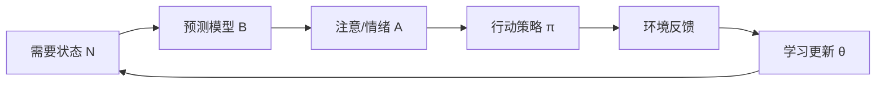
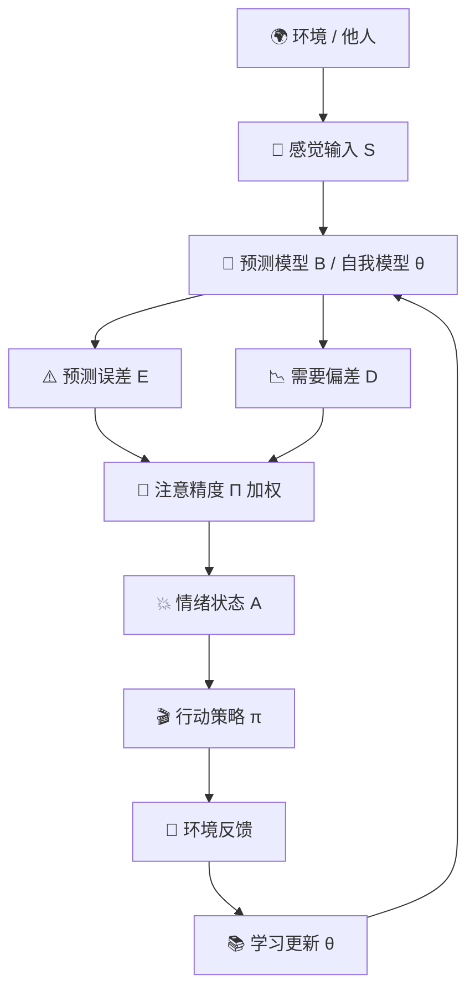

> 当今的心理学有点像法拉第之后、麦克斯韦之前的电磁学——发现了许多原理，但没有人把它们以正确的方式综合起来。

这是我尝试综合的结果。它不是"已被证明的真理"，而是一个**心理学统一模型 v0.1**——把认知、情绪、动机、行为、人格、创伤、社会关系统一成一套最小动力系统。

我给它一个名字：

# 预测—调节统一模型
## Predictive-Regulatory Field Theory (PRFT)

一句话版：

> **人是一个在不确定世界中，通过预测模型、情绪信号、行动策略和社会反馈，持续调节自身需要状态的自组织系统。**

更短：

> 心理 = 预测 + 调节 + 行动 + 学习 + 社会嵌入。

---

# 0. 第一性原理：心理系统到底要解决什么问题？

从最底层看，人不是为了"思考"而思考，也不是为了"快乐"而快乐。

人类心理系统要解决的根本问题是：

> **在资源有限、信息不完整、未来不确定、他人不可完全预测的环境中，让身体、关系和自我维持在可生存、可行动、可成长的范围内。**

心理学的基本单位不应该是单独的"想法""情绪""行为"或"人格特质"，而应该是一个闭环：



也就是：

> 我需要什么？ → 我以为世界是什么样？ → 我应该注意什么？我感觉危险还是有机会？ → 我该怎么行动？ → 行动之后世界怎么回应？ → 我要不要更新我的模型？

---

# 1. 五个公理

## 公理 1：人首先是调节系统

身体、心理、社会身份都需要维持在某个"可承受区间"。当安全感、能量、亲密关系、自主感、胜任感、尊严、归属感、意义感、可预测性、控制感中任何一个变量偏离安全范围，心理系统就会产生压力。

## 公理 2：人活在预测模型里，而不是现实里

大脑不是被动接收世界，而是不断预测：

> 接下来会发生什么？这个人怎么看我？我安全吗？我能控制局面吗？这件事对我意味着什么？

现实输入只是用来修正预测模型的误差信号。

## 公理 3：情绪是调节压力的读数，不是噪音

情绪不是"理性的敌人"。情绪是系统在告诉你：**某个重要需要正在偏离目标区间**。

| 情绪 | 需要偏差 |
|---|---|
| 恐惧 | 安全变量可能失控 |
| 愤怒 | 边界、尊严或资源被侵犯 |
| 羞耻 | 社会价值/归属感受到威胁 |
| 悲伤 | 重要依附、目标或身份结构丧失 |
| 焦虑 | 未来威胁概率高但不可确定 |
| 兴奋 | 高价值机会正在接近 |
| 厌恶 | 系统检测到污染、腐败或道德侵犯 |
| 无聊 | 当前环境学习价值/奖励价值过低 |

## 公理 4：行为是主动控制，不是简单反应

人不是在"刺激→反应"，而是在选择行动策略来降低未来的不确定性、痛苦、失控或需要偏差。即使看似非理性的行为，也常常在短期内服务某种调节目的：

| 行为 | 短期调节收益 | 长期代价 |
|---|---|---|
| 拖延 | 避免失败焦虑 | 压力累积 |
| 讨好 | 避免冲突/抛弃 | 自我消耗 |
| 成瘾 | 快速降低痛苦 | 依赖加深 |
| 回避 | 降低当前威胁 | 能力感下降 |
| 强迫检查 | 降低不确定性 | 强化焦虑回路 |

核心洞察：**很多症状是短期有效、长期有害的调节策略。**

## 公理 5：人格是慢变量，情绪是快变量

人格不是固定标签，而是长期形成的预测参数。比如"世界是否安全？""别人是否可靠？""我是否有价值？""努力是否有用？""亲密是否危险？"

这些慢变量决定了一个人如何解释事件、分配注意、产生情绪、选择行动。

---

# 2. 变量定义

| 符号 | 含义 |
|---|---|
| `N` | 需要状态 Need vector |
| `N*` | 理想/安全需要区间 |
| `B` | 信念模型 Belief model |
| `S` | 感觉输入（外部、身体、社会信号） |
| `E` | 预测误差 Prediction error |
| `Π` | 精度/注意权重 Precision |
| `A` | 情绪/唤醒状态 Affect |
| `π` | 行动策略 Policy |
| `θ` | 长期模型参数（人格、依恋、图式、自我模型） |
| `C` | 行动成本 Cost |
| `G` | 预期未来调节代价 Expected regulatory cost |

核心思想：

> 心理痛苦不是单一变量导致的，而是 **需要偏差 × 预测误差 × 注意权重 × 可控性判断 × 行动策略** 的动态结果。

---

# 3. 六方程

这不是物理定律，而是心理动力学的抽象骨架。

## 方程一：需要偏差方程

```
D = N* - N
```

> 一切心理压力都源于某些重要需要偏离安全区间。

```
安全感不足 → 焦虑
归属感不足 → 孤独
尊严受损 → 愤怒/羞耻
控制感不足 → 无助
意义感不足 → 空虚
```

动态形式：

```
dN/dt = R - C - L
```

- `R` = 补充（睡眠、关系、成功经验、身体恢复）
- `C` = 消耗（压力、冲突、努力、威胁）
- `L` = 泄漏（慢性焦虑、创伤触发、无效环境）

一个人的心理状态不只是"想法问题"，也是资源流动问题。

## 方程二：预测误差方程

```
E = S - P(B)
```

> 人痛苦的核心不只是发生了什么，而是"发生的事"和"我以为会发生什么"之间的差距。

这可以统一解释认知失调、创伤冲击、失恋痛苦、羞耻反应、期待落空——它们都是预测误差的不同变体。

## 方程三：注意精度方程

```
W = Π × E
```

> 不是所有误差都会让人痛苦。只有被系统赋予高精度、高重要性的误差，才会成为强烈心理事件。

同样一句批评：陌生人说你不好也许没事，重要的人说你不好就是巨大痛苦，权威说你不行可能影响自我模型。因为 `Π` 不同。

心理系统真正处理的是：**原始现实 × 主观重要性**，而不是现实本身。

## 方程四：情绪生成方程

```
A = f(D, W, U, T)
```

情绪是需要偏差、预测误差、不确定性和紧迫性的综合读数。可以粗略写成：

```
情绪强度 ≈ 需要重要性 × 偏差程度 × 不确定性 × 紧迫性 ÷ 可控感
```

这解释了为什么小事也会让人崩溃——小事可能击中了高权重需要。"被已读不回"表面是小事，底层可能是：我是不是不重要？我是不是会被抛弃？我是不是不值得被爱？

## 方程五：行动选择方程

```
π* = argmin G(π)
```

> 人会选择一个预期能最小化未来调节代价的行动策略。

展开：

```
G(π) = 未来痛苦 + 不确定性 + 行动成本 - 信息收益 - 需要满足
```

人的行为不是单纯追求快乐，而是在做一种复杂权衡：这个行动能不能让我少痛苦一点？能不能重新获得控制感？能不能降低不确定性？能不能保护自尊？

所以很多"非理性行为"实际上有局部理性。

## 方程六：学习更新方程

```
dθ/dt = η × Π × E × Safety
```

> 人只有在"误差足够明显，但系统仍能承受"的状态下，才会真正更新深层模型。

- 误差太小 → 没有学习
- 误差适中且安全 → 模型更新
- 误差太大且不可控 → 创伤固化

这解释了为什么道理没用：理性信息没有进入高权重情绪模型。一个人不是没听懂道理，而是底层模型没有被安全地更新。

---

# 4. 六方程如何统一心理学流派？

| 流派 | PRFT 对应 |
|---|---|
| 行为主义 | 行动选择 + 学习更新：奖惩是外部反馈改变调节路径 |
| CBT | 预测误差 + 注意精度 + 情绪生成：想法是预测模型，情绪来自调节压力 |
| 精神分析 | 长期模型参数 θ + 注意精度 Π + 行动策略 π：防御是避免高代价误差的策略 |
| 人本主义 | 需要向量的高层维度：从低层生存调节走向自主、胜任、意义 |
| 依恋理论 | 社会预测模型 + 安全感变量：依恋是社会调节系统的初始参数 |
| 创伤理论 | 高强度预测误差在缺乏安全条件下对模型参数的强制改写 |

## 防御机制在 PRFT 中的解释

```
压抑 = 降低某类误差信号的精度
投射 = 把内部冲突解释为外部威胁
合理化 = 用认知模型降低情绪误差
回避 = 通过不接触证据来保护旧模型
```

---

# 5. 用这个模型解释常见心理现象

## 焦虑

```
焦虑 ≈ 威胁预测 × 不确定性 / 控制感
```

焦虑者的问题不只是"想太多"，而是系统认为：**如果我不提前模拟危险，我会失控**。所以焦虑是一种过度预测未来威胁的调节策略。

## 抑郁

```
抑郁 = 低可控性预测 + 低奖赏预测 + 高自我负面模型
```

抑郁不是单纯悲伤，而是系统进入一种"行动不值得、未来不会好、我没有能力、我没有价值"的低能量调节模式。

## 愤怒 vs 恐惧 vs 羞耻

```
愤怒 = 威胁 + 可行动性
恐惧 = 威胁 + 不确定性 + 低控制
羞耻 = 社会价值威胁 + 自我归因
```

如果系统认为还能反击，会愤怒。如果认为不能反击，可能转为羞耻、无助、抑郁、麻木。

## 成瘾

> 成瘾 = 高速短期调节路径绑架长期调节系统

成瘾对象提供快速情绪下降、快速奖赏、快速控制感、快速逃离自我——但长期导致需要状态恶化、自我模型恶化和行动自由度下降。

## 拖延

> 拖延 = 用短期情绪保护，替代长期目标推进

拖延不是懒。拖延通常是在规避失败、羞耻、不确定性、完美主义压力或身份威胁。

---

# 6. 核心洞察

## 洞察一：人不是追求快乐，而是追求可调节性

快乐只是调节成功的一种信号。更底层的是：**我能不能把自己维持在可承受、可预测、可行动的范围内？**

## 洞察二：心理问题常常不是错误，而是过期的适应

```
小时候讨好父母 → 获得安全
成年后继续讨好所有人 → 自我丧失
```

症状不是荒谬的。它们是**旧环境中形成的策略，被带到了新环境**。

## 洞察三：治疗不是说服，而是模型更新

真正的改变不是"听懂一个道理"，而是：

> **在安全状态下经历新的证据，并成功行动。**

旧预测被温和打破，新模型被身体和关系验证。

## 洞察四：情绪是梯度，不是敌人

情绪告诉你：哪里存在需要偏差？哪个预测模型正在失效？哪个行动策略需要调整？

情绪不是要被消灭，而是要被解释、校准和整合。

---

# 7. 系统全景图



---

# 8. 最终浓缩

如果说物理学的统一场是把所有力写进同一组方程，那么这个心理模型的核心是：

> 需要偏差和预测误差互相驱动，并通过注意、情绪、行动和学习形成自我。

再极简一点：

> 需要产生压力。
> 预测组织现实。
> 注意放大误差。
> 情绪标记方向。
> 行为尝试调节。
> 学习改写模型。
> 关系提供边界条件。

---

# 9. 可检验预测

1. **症状替代假说**：如果症状是短期调节策略，直接消除症状会失败，除非替代它的调节功能。比如只叫人别拖延没用，必须处理背后的失败焦虑和羞耻。

2. **改变三要素**：真正的心理改变需要同时满足新证据 + 安全感 + 行动经验。只有认知解释、没有体验更新，改变会很弱。

3. **焦虑的三角**：焦虑不是单纯威胁预测高，而是威胁预测高 × 不确定性高 × 控制感低。提升控制感有时比单纯降低威胁解释更有效。

4. **创伤恢复路径**：创伤恢复不是删除记忆，而是降低威胁精度、增加安全证据、恢复行动能力。

5. **人格改变的本质**：人格改变不是改变标签，而是改变长期预测参数——世界是否安全？我是否有价值？别人是否可靠？行动是否有用？

---

**这就是统一心理学的六方程模型 v0.1。它不是终点，而是一个起点——一个可以被质疑、修正、扩展的最小统一骨架。**
